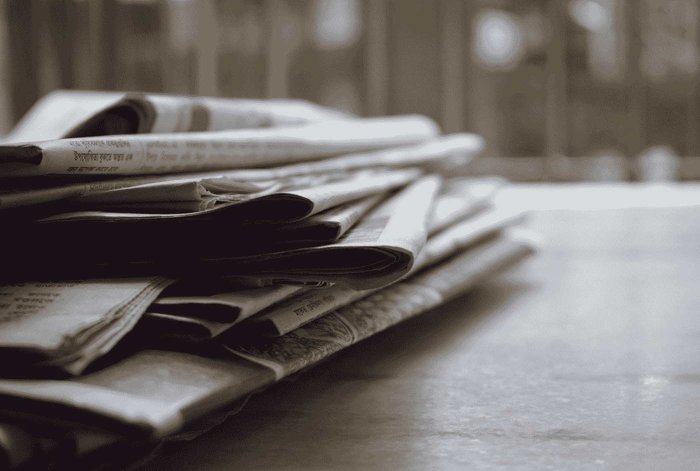

# 化障碍为机遇

> 原文：<https://medium.com/swlh/transforming-obstacles-into-opportunities-207fbf4a7793>

## 来自凯瑟琳·格雷厄姆的教训，这位从家庭主妇转型为高管的人重新定义了 20 世纪的新闻业

1963 年夏天，她的丈夫不幸自杀后，凯瑟琳·格雷厄姆被要求执掌羽翼未丰的《华盛顿邮报》，这是一份 DC 当地的都市报纸，过去 30 年一直由她的家族管理。

很难想象有哪位首席执行官比格雷厄姆更容易失败。

在过去的 20 年里，她一直是全职家庭主妇，没有任何行政或管理经验可言。《邮报》在一个拥挤的市场中竞争，即使在格雷厄姆的前任们经验丰富的管理下，利润也很难获得。

作为一名女性，报社的大多数男性公开质疑她的领导能力。在许多方面，这反映了格雷厄姆自己的自我怀疑。在她的回忆录《个人历史》中，她描述了自己在丈夫去世前对他的完全依赖，她写道，“我真的相信是他创造了我，我完全依赖他，而且我一点也看不到负面影响。”

然而，尽管面临着所有这些挑战——缺乏经验、行业中的性别歧视文化、内部的自我怀疑——格雷厄姆不仅让这份苦苦挣扎的报纸存活了下来，还带领《华盛顿邮报》公司取得了市场主导地位。在她近 30 年的任期内，她建立了一个几乎无与伦比的新闻遗产，通过报道五角大楼文件和水门事件，使该报跃居全国舞台。

此外，她还确立了自己作为一名出色的公司高管的地位。从该公司 1971 年首次公开募股到她 1993 年卸任的 22 年间，华盛顿邮报公司给股东带来了惊人的 22.3%的年回报率。Graham 退休时，在她首次公开募股中投资的 1 美元将会增长到 89 美元，相比之下，如果投资在标准普尔 500，这一数字将会是 5 美元。

这就引出了一个问题——怎么做？

面对如此多的不利条件，Graham 是如何带领《T2 邮报》比《华盛顿星报》等当地竞争对手或《纽约时报》等全国性竞争对手取得更大的增长的？后两者都有更高的品牌认知度和更有经验的领导。

—

近 2000 年前，罗马皇帝马可·奥勒留在他的《T4 沉思录》中写道:

> “我们的行动可能会受到阻碍。。。但是没有什么可以阻碍我们的意图和安排。因为我们能够适应和适应。头脑适应并把我们行动的障碍转化为它自己的目的。行动的障碍推动行动。挡在路上的就成了路。”

这反映了斯多葛主义的一个基本原则，这是当时受过教育的罗马人中流行的一种哲学，即外部障碍本身并不坏，在许多情况下可以转化为优势。

正如当今斯多葛派哲学最著名的倡导者之一瑞安·霍利迪所说，“障碍在于道路。”

这是甘地利用 20 世纪初的被动，通过非暴力抵抗推翻英国。

这是 2008 年的巴拉克·奥巴马，他将他的牧师和长期导师煽动性种族言论的可耻揭露转化为对国家的教学时刻，发表了关于种族和团结重要性的振奋人心的演讲，帮助他的新生竞选活动充满了推动他入主白宫所需的能量。

也许最明显的是，凯瑟琳·格雷厄姆将她面临的大量障碍和不利条件转化为推动《华盛顿邮报》组织达到无法想象的高度的动力。

在她的回忆录《个人历史》中，她也做了同样的评论，写道，“在我看来，毫无疑问，生存斗争对我们是有益的。在商界，你必须知道什么是贫穷、捉襟见肘，以及在逆境中为生存而战。”

她执掌《T2 邮报》的成功证明了在企业界化障碍为优势的力量，并为我们自己如何做到这一点提供了路线图。

# 以初学者的心态将经验转化为机会

可以说，格雷厄姆职业生涯中面临的最大障碍是她缺乏经验。同行报纸的负责人拥有几十年的经验，涉足报纸业务的各个方面，从金融、出版到广告销售，这并不罕见。

然而，随着时间的推移，她能够将这种缺乏经验以及随之而来的不安全感转化为她作为一名领导者的最大优势:思想开放、永不满足的学习和改进欲望，以及从基本原则出发进行思考的能力。

她的竞争对手在智力上执着于传统的报纸运营方式，与他们不同，格雷厄姆的经验不足让她能够以“初学者的思维”看待问题，让她能够从不受几十年经验束缚的全新角度评估决策。对《邮报》表现的回顾性分析显示，在许多情况下，格雷厄姆在雇佣谁或如何运营该报方面最非传统的决定对公司令人难以置信的增长发挥了最大的作用。

例如，考虑一下格雷厄姆雇佣或聘用的顾问。她最早也是最有影响力的举措之一——聘请臭名昭著的傲慢的本·布莱德利，一个在*新闻周刊*(由*邮报*拥有)冉冉升起的新星，作为执行主编(并且避免避开更传统、更有经验的外部候选人)。这一决定在接下来的十年里得到了回报，因为布拉德利通过勇敢报道五角大楼文件泄露和水门丑闻，帮助该报成为全国知名报纸。

格雷厄姆对人的独特评价延伸到了她咨询过的人。当年轻的沃伦·巴菲特购买了她公司超过 10%的股份时，董事会中的许多人担心会遭到恶意收购。格雷厄姆听从董事会的指导，主动向这位新投资者征求建议，并最终延长了他在公司董事会的席位。这个决定命运的决定让她在接下来的 20 年里利用了巴菲特传奇般的商业智慧，为她提供了宝贵的高管指导和训练，这是她非传统背景所没有的。

此外,《初心》让格雷厄姆踏上了终生学习的旅程。在个人历史中，她写道:

> “我一直对构成良好管理的要素感兴趣，无论是在我们的行业内还是行业外。以我攻击许多事物的同样认真的方式，我开始在管理方面做功课。我一定是把我周围的每个人都逼疯了，因为我对每件事都研究得如此深入，但我不得不知道更多。”

在对自己的报纸应该如何运作没有先入为主的想法的情况下，她开始了一次全国巡演，观察不同报纸的运作，以及当时媒体行业以外的成功公司，如施乐和 NCR。

由于这种对学习和成长的承诺，格雷厄姆很快就掌握了《邮报》有效管理的具体细节。然而，即使该报(以及更广泛的华盛顿邮报控股公司)在她的领导下继续发展，她也从未失去初心，并且总是根据一套首要原则来制定决策，而不是接受遵循既定的行业最佳实践。

事实上，在她的职业生涯中，竞争对手的论文是曲折的，格雷厄姆却是曲折的。

在一个并购猖獗的时代，她对公司资金的吝啬是出了名的。她没有不惜一切代价追求增长，而是设定了一个简单的基准——他们收购的任何公司都必须预计在十年内赚取至少 11%的现金。很少有交易符合标准。

或许正是由于这种高标准，《华盛顿邮报》在传统媒体行业之外的*取得了成功，收购了考前教育公司 Kaplan 等利润丰厚的公司。*

也许格雷厄姆在巴菲特的指导下做出的最有争议的决定是在 20 世纪 80 年代进行了一系列积极的股票回购。这在当时是极不寻常的做法。然而，在评估了该职位的价值后，格雷厄姆坚信市场低估了公司的价值，回购了公司超过 40%的股份(违背了董事会其他成员的最初建议)。然而，从长远来看，这样做最终增加了数亿美元的股东价值，因为市场得到了修正，邮报的股价飙升。

从她雇用的人到她做出的决定，格雷厄姆能够利用她最脆弱的地方，即缺乏经验，从不同的角度看待这个行业，使她能够根据首要原则运营，并将公司推向新的高度。

# 通过反抗权力变得强大

格雷厄姆坚信记者的质量和利润是相辅相成的。

正是这种信念有助于解释该报在 20 世纪 70 年代早期对水门事件的顽强报道。回想起来，这似乎是一个勇敢而高尚的决定；当然，我们的国家会因此变得更好。《华盛顿邮报》的结局也更好，因为对丑闻的报道为其赢得了普利策奖，并永久巩固了该报作为顶级新闻媒体的声誉。

然而在当时，对媒体行业的许多人来说，挑战尼克松政府似乎是鲁莽的，甚至是自杀。

从《邮报》开始报道水门事件开始，直到最高法院迫使尼克松公开白宫录音，最终证明他是丑闻的同谋，这花了两年时间。在那两年里，尼克松政府(及其共和党盟友)竭尽全力回击该报，摧毁其继续报道的意愿。

该报已经有过拒绝该报及其记者进入的先例。有一次，尼克松对他的新闻秘书罗恩·齐格勒说了一句著名的话:“华盛顿邮报的任何记者都不得进入白宫”，如果不遵守这条命令，他将被解雇。

但水门事件报道开始后，尼克松政府和连任竞选委员会试图破坏该报的可信度和声誉，从而加剧了对该报的反对。

尼克松的竞选主席克拉克·麦格雷戈(Clark MacGregor)说，“《华盛顿邮报》的竞选活动的特点是虚伪”，并占用了“使用含沙射影、第三人称的道听途说、未经证实的指控、匿名消息来源和巨大的恐吓标题”将政府与水门事件联系起来的文件。

随着格雷厄姆分享了*的个人历史*，读者开始直接给格雷厄姆写信，指责《T4 邮报》“别有用心，糟糕的新闻报道，缺乏爱国主义，以及在我们努力让人们了解新闻的过程中各种各样的背信弃义。”

或许比对该报声誉的攻击更具破坏性的是对格雷厄姆控股公司拥有的广播电台的攻击。在 1972 年冬天的四周时间里，对邮报的两家佛罗里达电视台的广播执照更新提出了三个不同的质疑。其中两项挑战是由与尼克松有联系的组织发起的。碰巧的是，这是那一年佛罗里达州 30 个广播执照中唯一面临的挑战。

据格雷厄姆称，在这些质疑发出后的两周内，《邮报》的股价下跌了 35%。那一年，随着股价从 38 美元的高点跌至 16 美元的低点，他们最终导致公司价值缩水一半以上。

在这两年的攻击中，格雷厄姆本人开始怀疑该报继续报道新丑闻的决定是否正确，尤其是在其他报纸拒绝在自己的报道中效仿的情况下。正如她在*分享的个人历史:*

> “因为独家报道通常只会持续 24 小时左右，然后大家就会争相报道，所以我有时会私下想:如果这是一个如此糟糕的报道，那么其他人在哪里呢？”

然而，她信任她安排的人，在每一步都支持她的编辑和记者。

一旦白宫录音带的公开证实了《邮报》的报道，格雷厄姆发现，尼克松政府多年来对该报施加的压力实际上已经使该报变得更好了。

格雷厄姆写道:“水门事件考验了我们整个组织:我们的才能、我们的技能、我们组织和调动资源来处理长期重大调查，同时还报道每日新闻的能力。”。更重要的是，水门事件使《T4 邮报》T5 在国内和国际上声名鹊起。”

尼克松是一个很少有人有勇气与之较量的对手。但这样做，邮报从那些不太愿意忍受政府愤怒的报纸中脱颖而出，巩固了自己作为国家精英报纸的地位。

# 将内部不和谐转化为卓越运营

在尼克松政府的威胁下，格雷厄姆和她的领导团队几乎没有时间高枕无忧。仅仅一年后，邮报的执行团队和占其劳动力大多数的工会在谈判中陷入僵局。他们面临着大部分员工罢工的潜在威胁，这将要求该报在高管和工会豁免员工的骨干下维持运营。

由于工会拥有巨大的影响力，无论工会的要求有多不合理，《华盛顿邮报》在历史上都会屈从。例如，他们与新闻工作者工会的现有合同赋予了支付复制来自广告商的预先准备好的校样的权利——这是一种重复和浪费的工作，需要邮报将打印机的数量增加一倍，并雇用额外的员工。

格雷厄姆知道，继续默许劳工的要求将会限制该报的发展能力，以及继续投资于世界级新闻业的能力。正因为如此，她决定让工会合同到期，以争取更多的时间来重新谈判一个更公平的劳资协议。

为了表示诚意，记者工会告诉格雷厄姆，他们将在谈判期间继续工作。相反，在合同到期的那天晚上，他们半夜溜进邮局，放火烧打印机，并残忍地殴打试图阻止他们的印刷工人领班。

尽管《华盛顿邮报》第二天无法发行报纸，但他们*却能够在第二天*发送一份报纸，一天又一天，连续 4 个月如此——甚至在罢工的新闻记者与*邮报的*主要竞争对手*华盛顿星报*一起工作的时候，为了帮助养活罢工基金。

他们通过一系列英勇的措施做到了这一点，从在他们修理自己的打印机时通过直升机将印刷品空运到第三方印刷设施，到在打印机修好后让公司高管值夜班来运行他们自己的印刷机。随着时间的推移，该报被迫发现新的印刷方法，以继续其日常发行量，确定了一系列边际改进，使他们能够将操作印刷机所需的印刷工人数量减少近一半。

面对记者们恶意的持续谈判和对 Post 员工的暴力威胁，格雷厄姆和 Post 最终“摧毁”了记者工会，用非工会工人永久取代了他们。

《华盛顿邮报》对罢工的处理提供了一堂如何将逆境转化为优势的大师课。大多数报纸会被媒体最初的破坏弄得元气大伤，并被记者发起罢工时的暴力语气所吓倒。相反,《华盛顿邮报》用这种低级的打击作为一种手段，在冲突中占据道德制高点，帮助维持公众舆论，将发行量损失降至最低。或许更重要的是，正如格雷厄姆在《个人历史》中描述的那样，记者造成的伤害是她的团队说服《邮报》记者和编辑越过纠察线的关键因素之一。

面对不道德的罢工策略和来自当地竞争对手的攻击，格雷厄姆反对工会的立场和她拒绝投降最终有助于在罢工后重新建立劳资关系。展望未来，标准已经确立——该报将成为像《新闻人报》这样的蓝领工作中薪酬最高的报纸之一，但在未来的任何谈判中，他们将坚持自己的立场，反对不合理的要求或不道德的讨价还价策略。

# 从格雷厄姆的成功中吸取教训

格雷厄姆在任职期间的成功证明了化障碍为优势的力量。在她的职业生涯中，她的行动为我们每个人如何做同样的事情提供了路线图。

当我们在生活中遇到障碍时，可以从格雷厄姆那里学到两个重要的经验。

首先，当面对一个障碍或不利条件时，考虑如何引导它带给你的情绪去克服它。例如，格雷厄姆对自己缺乏经验的不安全感是驱使她终生追求学习的主要催化剂。障碍总会让我们生气、沮丧或焦虑。虽然在许多情况下，这些情绪可能会适得其反，但它们可以有效地转化为燃料，激励我们超越看似理性的可能，正如面对尼克松以及后来的记者工会的攻击时,*邮报的*不知疲倦的高管们的反应所示。

第二，把障碍当作成长的催化剂，当作迫使你变得更好的手段。就像肌肉只有在承受压力和紧张时才会生长一样，你的公司、你的团队和你自己也是如此。例如，如果没有印刷工人工会的罢工，邮报可能永远不会发现如何更有效地运行他们的印刷机，这一发现对公司的长期盈利能力产生了重大影响。即使是内部施加的限制，如公司严格的收购资格标准，也迫使该报在核心能力之外进行多元化，从而为其在 80 年代中期和 90 年代初的大部分增长铺平了道路。

这两个教训表明，从广义上讲，障碍可以被用作优势，从这个意义上说，它们实际上是一种祝福。

所以，下次你在工作或生活中遇到这样的障碍时，记住凯瑟琳·格雷厄姆和《华盛顿邮报》的教训，把障碍看成是真正的机遇。

# 潜得更深

[报名参加我们为期一周的免费电子邮件课程](https://artofoutput.lpages.co/office-stoic-leadpage/)，学习如何在工作中运用斯多葛派哲学来减轻压力、提高生产率，并找到一份令人满意的职业。