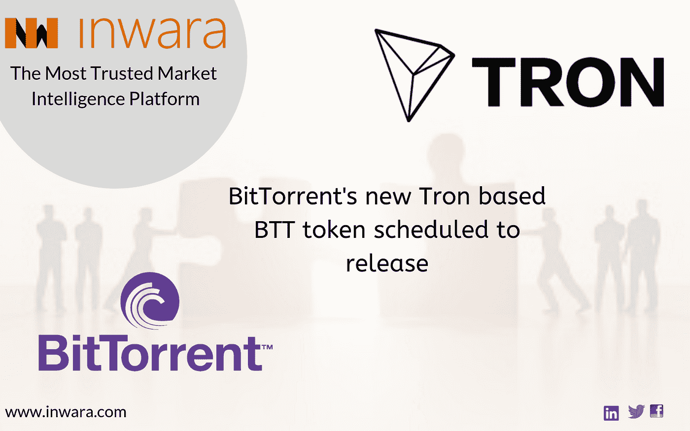

# Tron 收购 BitTorrent，这是利用 BitTorrent 庞大的用户群来采用 BTT 令牌的战略举措吗？

> 原文：<https://medium.com/swlh/tron-acquires-bittorrent-to-captivate-from-bittorrents-massive-user-base-fo-for-theri-btt-token-389da9a07878>

BitTorrent Speed，作为 BitTorrent 的新 BTT 令牌集成平台，计划于今年夏天发布。BTT 令牌运行在 TRC-10 协议上。通过 utorrent 网络与其他用户分享内容的 BitTorrent 用户将获得这种加密货币作为奖励。