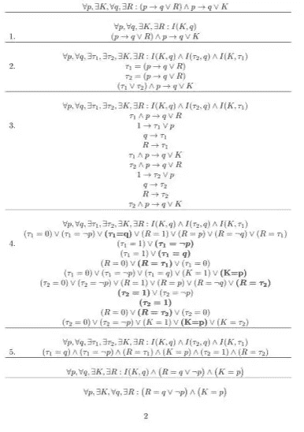

# 不确定多项式时间问题中的真量化布尔公式

> 原文：<https://medium.com/swlh/true-quantified-boolean-formulas-in-non-deterministic-polynomial-time-problems-bb317efe1653>


Photo by [Kaleidico](https://unsplash.com/@kaleidico?utm_source=unsplash&utm_medium=referral&utm_content=creditCopyText) on [Unsplash](https://unsplash.com/search/photos/whiteboard?utm_source=unsplash&utm_medium=referral&utm_content=creditCopyText)

## 理解如何连接它们的第一种方法

想象一下，您有一种机制，即使是手动的，也允许您将任何**量化的布尔表达式**连接到一个没有量词的简单表达式。



[https://archive.org/stream/TQBFInP_201802/TQBF_26FEBJMD#page/n1/mode/2up](https://archive.org/stream/TQBFInP_201802/TQBF_26FEBJMD#page/n1/mode/2up)

此外，想象一下，你合并了允许你在多项式时间内解决任何**布尔表达式**的机制…

[](/swlh/the-boolean-satisfiability-problem-solved-48ceb5550115) [## 布尔可满足性问题，解决了吗？

### 在这里，我展示了一些终极技术来制作逻辑运算的强大工具。

medium.com](/swlh/the-boolean-satisfiability-problem-solved-48ceb5550115) 

但是现在，没人相信你。你有算法，细致的解释…，但你还没有得到正式的否定或接受。

在这篇文章中，我将展示*内核*与 **TQBF** 之间的连接，以参与 **NP** 类。

## TQBF 是什么意思

[真量化布尔公式](https://en.wikipedia.org/wiki/True_quantified_Boolean_formula)是指你有一个**布尔表达式**并且你想知道它的一些变量是否可以表示为一个布尔函数来把整个表达式变成一个重言式。这就好比说:如果一个**布尔表达式**及其**变量**和**参数**是一个定理。比如*ɐp ɐq: p&(p→q)→q*是一个**qbf***ɐp ɐq: p&(p→q)→q = 1*是一个 **TQBF** 。

**TQBF** 是一种问题，这个表达式是否成立，如果所有的变量都属于**ɐ**一类，那就意味着我们正在处理一个可能的重言式。在我们的例子中: *(P → Q) → Q = 1* 是一个重言式，意思是:

*   (ⱻP，ⱻQ : (P & (P → Q) → Q) = 1)

这就像解决一个**TBF**:*(P&(P→Q)→Q)*并对 **TQBF** 问题做出相反的反应。

所以，问题是:我们能对存在主义的表达做些什么，比如:*ɐp ⱻq:(p→q)→p .*

最初应该说，把存在的( *ⱻ)* 放在普遍的(*ɐ)*之前和之后是不一样的。

*   在*ⱻqɐp:(p→q)→p 中，q 不能依赖于 P*
*   在*ɐp ⱻq:(p→q)→p 中，q 是依赖于 p 或不依赖于 p 的布尔表达式*

在第一种情况下， *Q* 只能得到两个可能的值(*真*或*假*)，如果你试图在 Q = *假*中找到一个重言式:

*   (真→假)→假=真→假=假
*   (假→假)→真=真→真=真

所以，如果 Q = *假*，就不是重言式。

如果*问* = *真:*

*   (真→真)→假=真→假=假
*   (假→真)→真=真→真=真

这意味着表达式:*ⱻqɐp:(p→q)→p*不是一个**布尔定理**。

但是如果我们在*ɐp ⱻq:中测试*q*=*p*(p→q)→p，*

*   (真→假)→假=假→假=真
*   (假→真)→真=真→真=真

所以，*ɐp ⱻq:(p→q)→p*是一个**布尔定理**，在 Q = *P，*中我们只能得出一个重言式，你可以这样理解:如果一个表达式指向它的矛盾，那么它就指向表达式的对立面。

你能想象如果我们能找到产生重言式的表达式，我们能做多少应用吗？


# 什么是霍恩条款？

为了更简单，我的建议是使用[霍恩的条款](https://en.wikipedia.org/wiki/Horn_clause)。想象每一个**布尔表达式**都被转换成 *Horn 子句*的乘积:

(A1 + A2 +… + An + B1 + B2 +… + Bn)形式的每一个分句都转换成:(B1 & B2 & … & Bn → A1 + A2 +… + An)形式，这样我们就可以避开否定形式了。

如果我们添加以下形式的子句:

*   (*真* → A1 +… + An)，并且
*   (B1& … & Bn → *假*)

然后，这些子句的乘积将表示每个**布尔表达式**。

现在，是什么让一个同义反复变成了一个喇叭子句？

## ParamClause 实现

我们可以和熊猫一起研究牛角条款。考虑到它对大型数据库的用处。

为了理解它是如何工作的，我们可以从一个*量化的霍恩条款*开始:

*   *ɐx,ɐy,ɐz、ⱻA、ⱻB: A & x → B + y + z*

上面的表达式有两个参数 *A* 、 *B* 和三个变量 *x* 、 *y* 、 *z* 。如果我们考虑公式对于每个参数可能采用的表达式，我们可以说，例如，如果 *A* 为*假*，则整个子句已经是一个重言式。

更具体地说:(A =*False*)+(A =*x*)+(A =*y*)+(A =*z*)，而你可以用一个 3 值逻辑的字符串把这四种可能性表达为*A:“2211”。*表示 1 为*真*，2 为*假*，3 为*未确定*。如果与变量 *x* 相关:1 为 *x* ，2 为 *x* ，3 为*无关*。

所以，想象你可以这样输入公式 *A & x → B + y + z* :

```
>>> ParamClause("22111122", "A", "B")
Clause of 2 params.
   A  B
0  2  1
1  2  1
2  1  2
3  1  2
```

在这个版本中没有提到变量 *x* 、 *y* 、 *z* 而是 1、2、3；这是代码:

```
from pandas import DataFrame
class ParamClause:
    'Clauses of at least one parameter recognized'
    def __init__(self, body, *params):
        self.body = DataFrame({params[j] : X \
            for j, X in enumerate(
                ParamClause.sequence(body, len(params)))})
    @staticmethod
    def sequence(body, nParams):
        body = [3 if not x in '12' else int(x) for x in body]
        n = len(body)//nParams       
        return  [body[i * n: (i + 1) * n] for i in range(nParams)]
    def __repr__(self):
        return 'Clause of '\
               +repr(self.body.shape[1]) + ' params.\n' \
               + repr(self.body)
```

从这一点，你可以很容易地想象如何将问题转化为一个布尔表达式的可满足性问题。因为，如果你有两个 *Horn 子句*，那么 **ParamClause** 对象必须共享参数和变量，在这一点上，你必须使用第三个值(3)来避免变量与子句或参数的任何关系。

使用这种方法:

```
def required(self):
        return [(I, J) for I in self.body.columns \
                for J in self.body.index if self.body[I][J]<3]
```

你可以达到每一个布尔变量来满足像:

```
>>> ParamClause("22111122", "A", "B").required()
[('A', 0), ('A', 1), ('A', 2), ('A', 3), ('B', 0), ('B', 1), ('B', 2), ('B', 3)]
```

对(列，行)编码一个布尔变量**有时在不同的子句中收缩，因此它生成一个公式。**

## 旧版本

在 [quantifiers31.py](https://archive.org/download/TheTwoExactPhilosophiesFiles) 中你可以到达一个完整的代码，而不是在 *pandas* 中，生成最后的**布尔公式**。

在这个版本中，您可以使用一个包含一系列 *QTuple* 对象( *ParamClause* 对象)的对象，在满足公式后，它会生成一个 *QTuple* 解决方案来获得所有重言式的情况。

在我们的类中，我们需要实现这些方法:

```
def notNulledParams(self):
        return [X for X in self.body.columns \
                if (self.body[X] == 3).sum() < self.body.shape[0]]def compatiblesInParam(self, other, param):
        return (self.body[param] \
                & other.body[param] == 0).sum() == 0
```

这对熊猫来说很容易。目前，我还没有完整的版本，但是如果这个帖子被认为是有趣的，我可以用*熊猫*来结束这个课程。

当然，你可以分享或尝试这个公共领域代码中的一切。