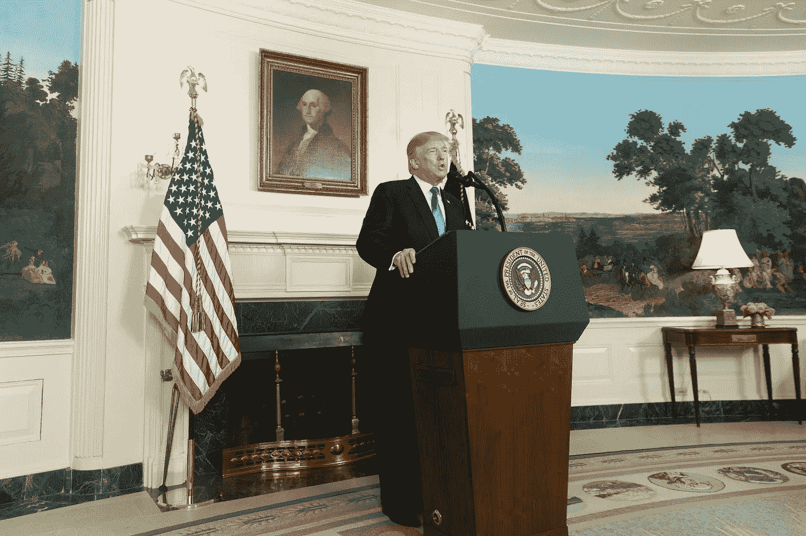

# 特朗普正在修正美国对伊朗的外交政策

> 原文：<https://medium.com/swlh/trump-is-course-correcting-u-s-foreign-policy-on-iran-56caa861fbdc>

“In this effort, we stand in total solidarity with the Iranian regime’s longest-suffering victims: its own people.” President Trump delivers a speech signaling a harder line on Iran. October 13, 2017.((Official White House Photo by D. Myles Cullen)

> 伊朗政权通过掠夺本国人民的财富来资助其长期的混乱和恐怖统治—美国总统唐纳德·特朗普

回想起来，任何一个扶手椅型的四分卫都可以看出，美国前总统巴拉克·奥巴马虽然擅长很多事情，但并没有…