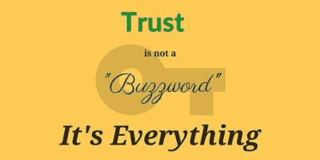

# 信任、真实性和真正的数字领导力

> 原文：<https://medium.com/swlh/trust-authenticity-and-genuine-digital-leadership-4bfa13c768e1>

在过去的几年里，我目睹了“教育推特”的变化，或许还有权力下放，我发现自己在思考领导力中的真实性这个概念。我开始密切关注我所看到的由“教育领导者”发布的许多内容，我不禁感到有些失望。你看，没有听起来过于挑剔，我有这种感觉，许多在网络空间的大师(其中一些我有过现实生活中的互动)可能有真实性的问题。事情是这样的，我们当前(非常有用的)积极思考的文化看不起任何类似“消极”的东西，然而，如果我们在批判性地思考，我们不能简单地接受扔给我们的一切；这与我们必须教给学生的数字素养有着完美的联系:提防不诚实的个人；不要因为受欢迎的人碰巧受欢迎就“买所有受欢迎的人卖的东西”,并且永远永远为自己着想。现在，听起来可能有点讽刺，在教育界，我发现许多人的领导力和影响力根本经不起我在这里描述的那种分析；我认为这是一种普遍适用于我们职业中的领导层(不仅仅是管理人员或其他人)的现象。

那么，我到底想说什么？首先也是最重要的一点，无论是面对面还是在网上，那些决定影响他人的人，那些决定领导他人的人，即使只是通过接受一个特定的职位，也有义务赢得他们希望领导的人的尊重和信任。领导是困难的——我当然承认这一点！—但领导力的第一步，也很可能是最重要的一步，是赢得那些你想积极影响的人的信任。

那么，我们如何才能(是的，我确实认为我们所有人都有能力在我们的职业中产生积极的影响)赢得那些我们希望影响的人的信任呢？

在关注“教育界领袖”的推文和其他社交媒体帖子时，我最大的担忧源于这样一个事实，即我不禁想知道这些大师们是否总是“言出必行”，这不是因为我不认为他们是专家，而是因为他们通常不会花时间评估他们发布的内容，或者彻底思考他们分享或转发的内容的质量和/或观点。我也不喜欢“转发不是一种认可”的免责声明，这种声明已经出现在一些个人资料中；一旦你分享了，你就影响了别人。

我没有简单地列出一个问题，而是提出了四个建议来帮助潜在的影响者避免我注意到的信任和真实性问题:

彻底阅读你发布的所有内容！

你有没有朋友分享过那些错误的脸书帖子？你知道，比如那些用捏造的数据攻击非营利组织和慈善机构的人？领导者不能犯发布错误信息的错误:要么你的声誉受损，要么跟随你的人会被误导——这两种选择对你或这个职业都没有好结果。

当人们与你交流时，要做出回应！

但愿不会有志同道合的专业人士试图通过社交媒体与你联系！拥有大量追随者的有影响力的人可能必须非常节约他们的“回复时间”，这是有道理的，但我不认为这给了任何人成为“抱歉，太多追随者，太重要”的人的许可。即使是“喜欢”一个回复或评论，对于试图与你互动的人来说，也可能是足够的认可。

**动员起来！**

一些权威人士似乎常常只是坐在办公桌前，在几个选择的网站上点击分享按钮，可能一周有几天——这可能不是数字领导的最佳例子。我们不必粘在我们的智能手机上，但知识的移动化正是我们的社会和整个教育的发展方向；那些寻求领导和影响该行业的人应该模拟这一现实(当然，在合理的范围内)。

**创建您自己的内容！**

我不是说在这里发一张你家庭晚餐的照片(尽管你当然可以！).我的意思是，有影响力的人会很好地创造一些与其角色相关的内容，而不仅仅是分享其他人的伟大思想(我并不否认其价值)。“你自己的内容”可以包括广泛的项目，包括博客、照片、思考、课程计划和任何其他相关的、可分享的内容。大多数有影响力的人在这一点上做得相当不错。

总而言之，我们都有能力影响我们的专业，我们可以使用的数字工具为我们提供了一个论坛，以接触到愿意倾听和受影响的教育工作者观众。如果我们的同事在听我们说话，我们最好确保自己是真诚的。我们这些处于领导地位的人(可以说是我们所有人！)应该努力赢得我们可能有影响力的专业人士的信任，这四点提供了一些影响，我希望会有所帮助。