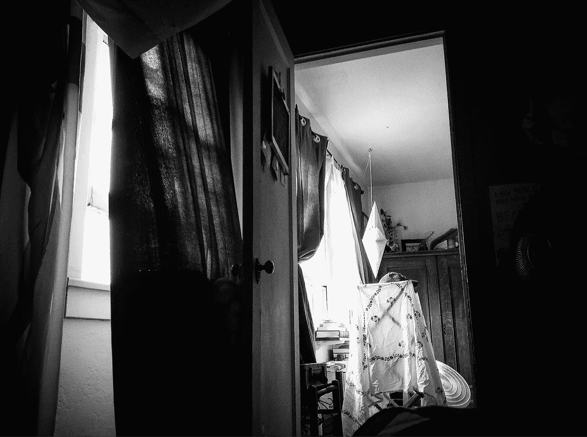

# 相信好心情

> 原文：<https://medium.com/swlh/trusting-the-good-mood-4222e398e86e>

## 又一个心理健康难题

昨天，我很高兴有机会和一些朋友一起唱歌。[我在我的教堂唱歌。](http://www.allsoulsparish.org)作为一名音乐家，这不是我最好的一次外出，但它很有趣，与他人一起在唱诗班唱歌时伴随的内啡肽是一个受欢迎的喘息，让我从长达一周的精神过山车中解脱出来。朋友们的拥抱和善意的话语也是如此。