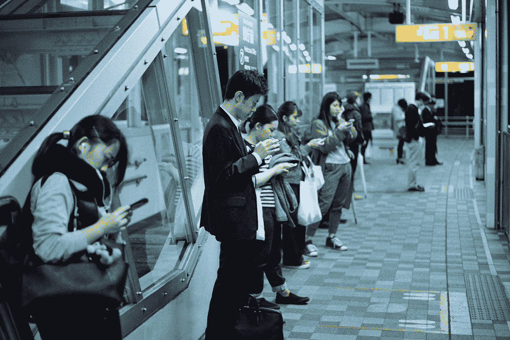

# 关掉你的手机

> 原文：<https://medium.com/swlh/turn-off-your-phone-62dd0fbfda6c>

Photo by [Jens Johnsson](https://unsplash.com/@jens_johnsson?utm_source=medium&utm_medium=referral) on [Unsplash](https://unsplash.com?utm_source=medium&utm_medium=referral)

本世纪增长最快的依赖

“什么！！“你好大的胆子，我听见你说了。“我没有对手机上瘾”

> [什么是智能手机成瘾？](http://What is smartphone addiction? Smartphone addiction, sometimes colloquially known as “nomophobia” (fear of being without a mobile phone), is often fueled by an Internet overuse problem or Internet addiction disorder. After all, it’s rarely the phone or tablet itself that creates the compulsion, but rather the games, apps, and online worlds it connects us to.)
> 
> 智能手机成瘾，有时俗称“无手机恐惧症”(害怕没有手机)，通常是由互联网过度使用问题或互联网成瘾障碍引发的。毕竟，很少是手机或平板电脑…