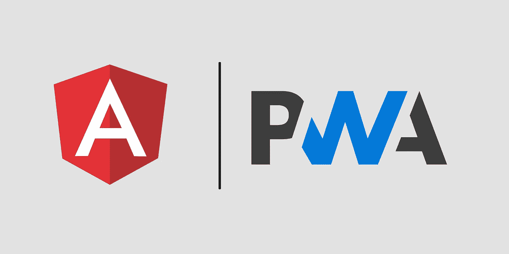

# 将 Angular 应用程序转变为 PWA

> 原文：<https://medium.com/swlh/turning-an-angular-app-into-a-pwa-957010736699>

渐进式网络应用(PWAs)是旨在提供类似于本地已安装应用的体验的网络应用。他们使用服务人员来缓存前端文件和后端信息，以便他们能够更快地运行，甚至离线工作(至少部分离线)，添加 web 清单以允许用户像安装任何其他应用程序一样在他们的设备上安装前端，甚至实施推送通知，所有这些都是为了提供更接近于…