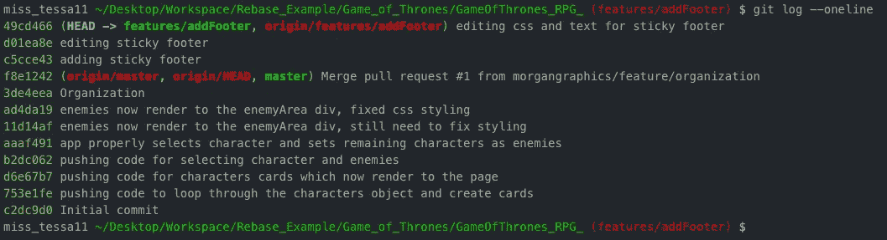
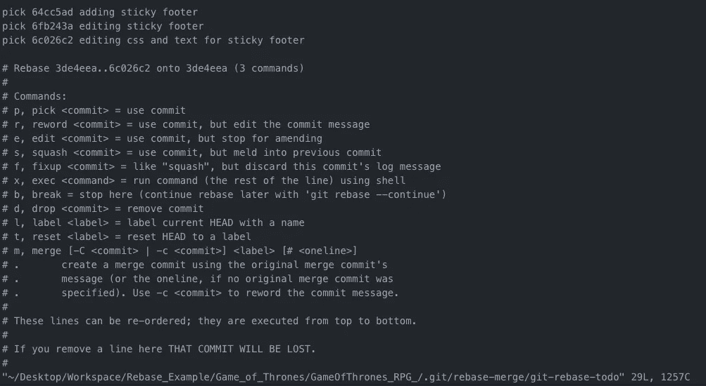
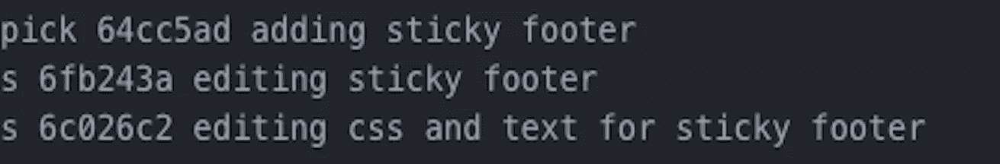
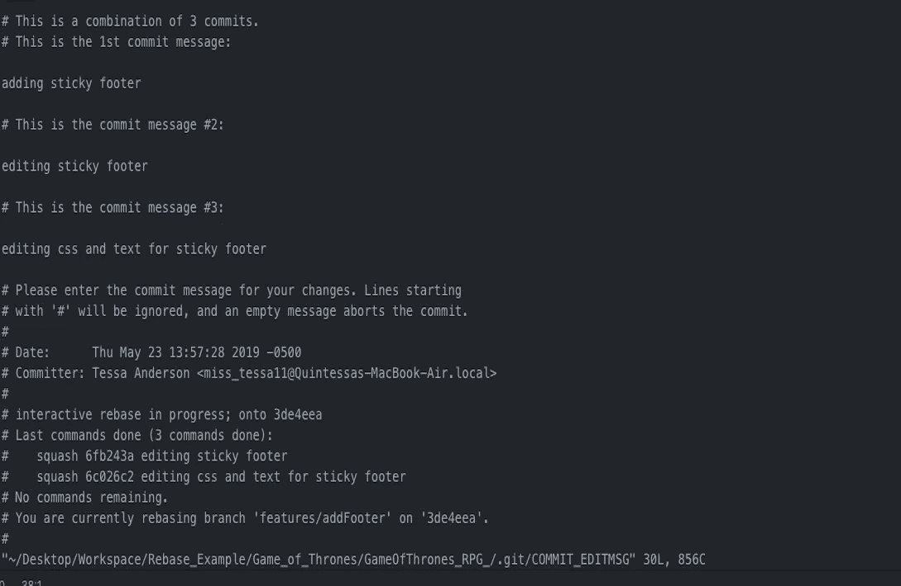
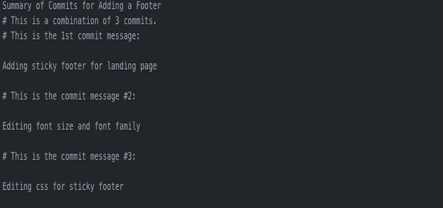
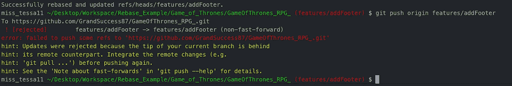
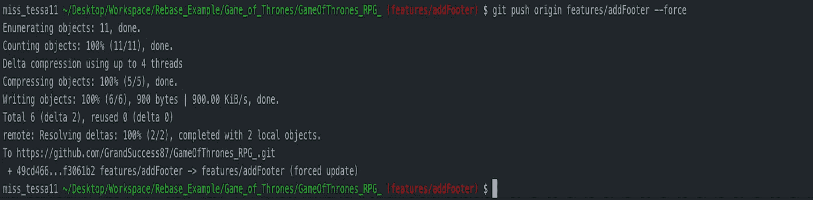
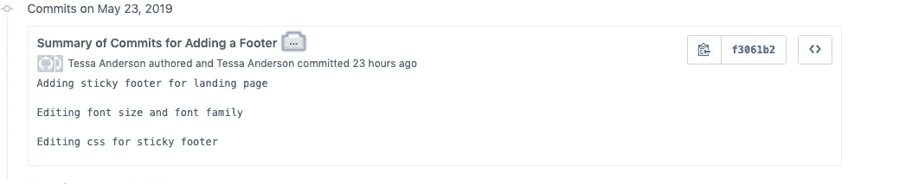

# 交互式重置基础教程

> 原文：<https://medium.com/swlh/tutorial-on-interactive-rebasing-e3f49505b2ce>

## 如何执行交互式重置基础

Photo by [Andrew Neel](https://www.pexels.com/@andrewtneel?utm_content=attributionCopyText&utm_medium=referral&utm_source=pexels) from [Pexels](https://www.pexels.com/photo/white-flag-2330507/?utm_content=attributionCopyText&utm_medium=referral&utm_source=pexels)

# **简介**

让我们面对现实吧，“git 可以*变得*真的很快”。在一次关于如何使用 git 命令的谈话中，我的一位导师重复了这些话。

目前，我正在学习如何在我的本地分支上重新设置我的提交消息，以便我有一个线性提交历史，并希望与您分享我迄今为止的经验。

## **目标受众**

本教程面向任何 git 新手、想要了解 rebase 命令的人以及任何想要学习如何使用 Vim 更改提交历史的人。

## **什么是 Git？**

简而言之，git 是一个超级有用的工具，用于管理应用程序内部随着时间的推移所做的更改。它是为协调程序员之间的工作而设计的，但它也可以用来跟踪软件开发过程中任何一组文件的变化。

有很多我已经熟悉的命令，比如 *git status、git add、git commit、git checkout -b、git checkout、git push、*和 *git pull。*我不太熟悉的一个命令是 rebase 命令，我将在下面讨论它。

## 什么是 Git Rebase？

在 git 中，rebase 命令将一个分支的更改集成到另一个分支中。它是更广为人知的*合并*命令的替代命令。然而，*合并*命令实际上将两个分支整合成一个分支。

> *“那么 git rebase 和 git merge 的区别是什么？”*

我记得问过我的导师这个问题，因为这两个命令从定义上看非常相似。这两个命令的目的相同，都是将多个分支中的变更集成到一个分支中。这两个命令的区别在于实现的过程。例如， *git rebase* 将重写提交历史以产生一个直接的线性提交历史。相反， *git merge* 将保持提交的 git 历史并按时间顺序排列。然而，与**合并**不同的是，**重置**将使提交历史变平，并将已完成的工作从一个分支转移到另一个分支。

## 如何在 Vim 中使用 Git Rebase

接下来，我们将讨论如何使用 VIM 接口将一个特性分支转换成主分支。您还可以使用自动化的重新基础化来重新基础化您的提交，但是，交互式的重新基础化有助于简化这个过程，从而减少混淆。它使您可以完全控制功能分支的提交历史。

首先，打开终端，导航到项目的根目录，并键入:

`git checkout name-of-feature-branch`

要查看该分支及其所有分支的过去提交消息的打印列表，请键入:

`git log --oneline`

这将打印出如下所示的内容:

在这个例子中，我们将重新定义与`features/addFooter`分支相关的提交。

黄色的一系列数字和字母是 SSH 密钥。我们将使用这些键来执行我们的 rebase。为了检索功能分支类型的所有提交:

`git rebase -i f8e1242`

这个 SSH 密钥(f8e1242)不返回它本身或它之前的任何内容，而是返回它上面的所有提交。

或者

`git rebase -i HEAD~3`

从特征分支的头部开始，有 3 个提交与该分支相关联。

接下来，您应该会看到交互式控制台，在其中您可以简单地按“I”进入插入模式，然后执行下面列出的任何命令。

在这种情况下，我们将挤压我们的提交，这样我们就可以有线性提交历史。重要的是要知道，在 VIM 中，提交的顺序是相反的。另外，顶部的 commit 消息不能被挤压，但是下面的可以使用 squash (s)命令。简单地用`squash`代替进程`pick`，或者你可以用`s`来简化它。

要退出插入模式，只需按下`esc`然后按下`:wq`或`:w`然后按下`:q` 即可进入该屏幕。

进入插入模式后，我们可以更改消息，添加消息，甚至忽略它们。

对所做的更改感到满意后，您会注意到当您尝试将更改推送到要素分支时会出现错误。

因为我们正在重写提交历史，所以我们必须用`--f`标记我们的推送

`git push features/addFooter --force`

因此 git 知道这是正确的提交历史，现在将与这个分支相关联。

当我们在 Github 上查看提交历史时，我们会看到我们的提交历史现在是统一的，并且更加集中。

现在你知道了！你刚刚表演了你的第一个 rebase！恭喜你！

# **结论**

如果你发现你卡住了，试着再看一遍这个教程。在您的特性分支上，有不止一种方法来对您的提交进行重定基础，交互式重定基础只是其中的一种。假设在这个例子中，我们只是重定了一些提交的基础，当你有一个相对长的提交历史时，重定基础可以被证明是更有效的。我发现交互式重置基础对我来说是最用户友好的，因为我学会了这个过程，我希望你也一样！

如果你遇到困难，我在下面提供了一些有用的资源:

 [## Git 中的交互式基础介绍和定制 Vim 首选项

### 这对于一些人来说已经是旧闻了，但是我总是被告知要写你希望在开始时就写的博客文章…

medium.com](/@lucaspenzeymoog/intro-to-interactive-rebasing-in-git-and-customizing-vim-preferences-b6e2f0309e31)  [## Git merge 和 rebase 简介:它们是什么，以及如何使用它们

### 作为一名开发人员，我们中的许多人不得不在合并和重建基础之间做出选择。通过我们从互联网上获得的所有参考资料…

medium.freecodecamp.org](https://medium.freecodecamp.org/an-introduction-to-git-merge-and-rebase-what-they-are-and-how-to-use-them-131b863785f)  [## 改变风格:如何定制 Vim 首选项

### 这是我几天前在 Git 帖子中介绍交互式重定基础的延续，所以如果你想的话，可以从这里开始…

medium.com](/@lucaspenzeymoog/rebasing-in-style-how-to-customize-vim-preferences-3457c034b5e0)  [## 我希望我有 Git Rebase 介绍

### 在我的新工作中，最重要的(也是最令人困惑的)git 特性之一是重定基础。现在回想起来，最糟糕的部分是…

开发到](https://dev.to/maxwell_dev/the-git-rebase-introduction-i-wish-id-had)