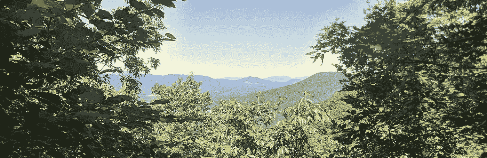
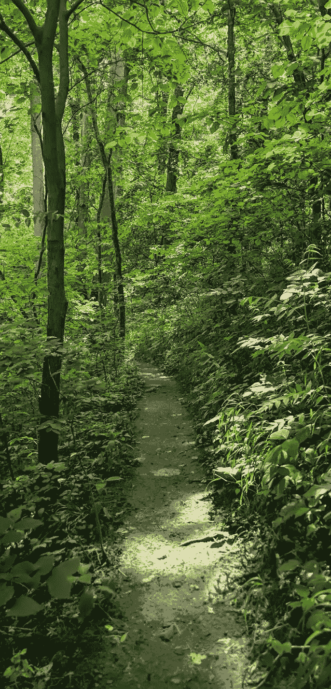

# 来自道路的二十七课

> 原文：<https://medium.com/swlh/twenty-seven-lessons-from-the-path-72b49de46a07>

The Appalachian Trail near McAfee Knob

我放下工作，去我的老朋友 A-T 徒步旅行。一边走，我一边意识到我的日常行为受到了一生的旅行、露营和探险的影响。这些教训符合徒步旅行的日常需求，但它们也有着远远超出的含义。有些粘得很快。有些我不断练习。其他的直接互相矛盾，但都有用。

1.  如果你不踏上旅程，你不会遇到艰难困苦，但你也永远不会有所发现。
2.  尽全力准备。你不可能提前想到所有的事情。
3.  如果你带的太少，你可能不够。如果你带太多，你可能无法继续。
4.  处理好基本问题。你可以暂时没有住所、水或食物，但不是无限期的。当你变得更累、更热、更冷、更饿或更渴时，你的身体和大脑都会变得更加笨拙。相应调整。在某个时候可能是个好主意的东西，在另一个时候可能是致命的。
5.  通常，一条令人惊叹的道路的起点看起来并不怎么样。最好的可能真的很难找到。也许只是穿过一些灌木的一个小切口，或者路边的一条小路。坚持下去，这只是开始。
6.  在不同的日子或和不同的人走同一条路是一种不同的体验。
7.  不是每个人都去同一个地方。帮助人们到达目的地是善良的。让他们来找你不是。
8.  我们可以独自行走，也可以分享旅程；带一个人或多人一起旅行；一起迈出一小步，或者走上千里。有时我们分开，然后又一起回来。这些选择没有对错之分。但这是你和你的同伴的选择。
9.  你会超越别人，别人也会超越你。有些人会在你之前离开。其他人会跟着来。有些人想去你曾经去过的地方，有些人从一个完全不同的地方朝着一个完全不同的方向前进。这不是一场比赛。
10.  这条路有时布满岩石，有时平坦，有时潮湿，有时干燥。学会安全地驾驶它们。
11.  你可以一边走一边改变主意；无论是同伴，踪迹，还是目的地都无关紧要。你不会把时间追回来，但你会保留你的功课。有时候，教训就是做出改变。
12.  注意你正前方的东西。否则，你可能会以不好的方式结束。
13.  你会摔倒的。确保你没有严重受伤，然后继续前进。
14.  学习如何护理轻伤。这会阻止他们成为少校。
15.  抬起你的头，注意看风景。否则有什么意义？
16.  如果你太专注于目的地，你就会错过自己的位置。
17.  如果你迷路了，就往回走，找到你偏离路线的地方。这仍然是你旅程的一部分。
18.  开辟一条新路是一项艰苦的工作。并不总是必要的。但是如果你能找到的路径不在你需要去的地方，这是唯一的方法。如果你做得很好，人们会比你更容易去新的地方。如果你在你的位置上是明智的，它将打开新的路线。人们会沿着你的路建造小径。你可能不会被人记住，但踪迹会一直存在。
19.  保持踪迹帮助那些跟随的人。如果每个人都这样做，工作就很少了。如果没人做，就有一大堆。
20.  找到一个你能维持的配速。不同的日子会不一样。
21.  有时候最好的决定是停下来休息一夜。有时它会推动完成。
22.  休息日和推日一样重要。
23.  上升比下降更难。
24.  景色令人惊叹。好好享受吧。如果你不对付那座山，你就不会得到它。
25.  下行比上行更难受。你还是得下来。
26.  你可能会永久受伤或死亡。即使是最好的计划和最警觉的旅行者也会被不断变化的条件、隐藏的陷阱、当地的动物，甚至只是一根树根吓一跳。但是，如果你根本不离开，你也很容易受伤或死亡。
27.  冒险总是在等待。有时候它会来找你。通常你不得不离开你所习惯的，并且在你舒适的地方找到它。如果你足够幸运听到了召唤，那就去吧。

特别喜欢这些吗？你自己有吗？请分享！

Late spring in the Appalachian Mountains