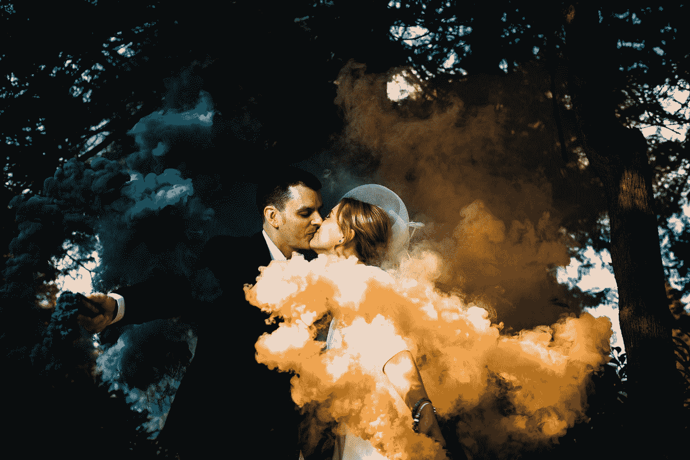

# 探戈之二:面对关系中的影子自我

> 原文：<https://medium.com/swlh/two-to-tango-confronting-our-shadow-selves-in-relationships-63b0f5e60076>

Photo by [Sam Barber](https://unsplash.com/@milltownphotography?utm_source=medium&utm_medium=referral) on [Unsplash](https://unsplash.com?utm_source=medium&utm_medium=referral)

很少人，如果有的话，像完全打开的书一样进入爱情和关系，更多的是遗憾。我们害怕看见(自己)和被看见。我们害怕，如果我们把自己的影子抽出来，我们爱的机会就会离开。

有时候，我们甚至不知道自己的影子在那里。我们认为我们是我们所说的那个人，直到发生了错误的关系…