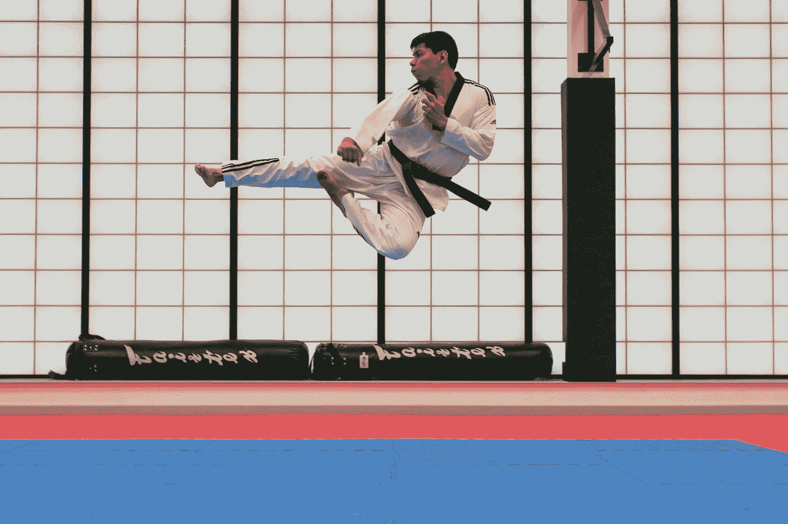

# 两种宝贵的资产——身体和精神。

> 原文：<https://medium.com/swlh/two-valuable-assets-the-body-and-the-mind-9d0cb55f5502>

## 管理好它们有助于我们充分利用生活

每个人都有两大财富，除了时间，谁也拿不走。一个是肉身，一个是相伴的心。可能存在个体差异，但没有什么能阻止每个人最大限度地发挥其特定身心单位的潜力。一个…