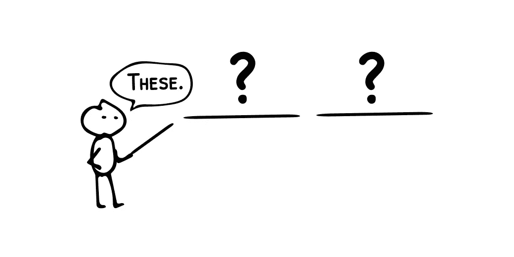
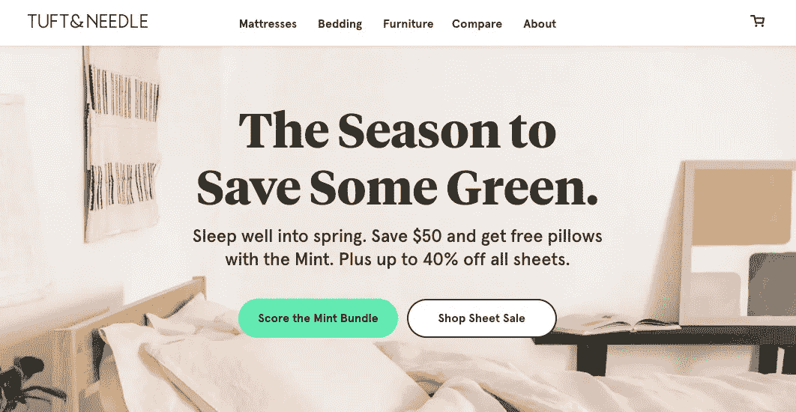

# 让好的营销信息变得伟大的两个词

> 原文：<https://medium.com/swlh/two-words-that-make-good-marketing-messages-great-a45ea678ecd8>

谈到信息传递，公司犯的最大错误是过于关注自己。在直觉层面上，很容易认为你的信息应该回答一个简单的问题。

**“我们做什么”**

如果你能给出一个明确的答案，那么有人能决定他们是否对你的业务感兴趣就很有意义了。

问题是这是一种以自我为中心的方法。它强调对你的产品、服务或特点的描述。

但这不是你的客户感兴趣的。

他们真正关心的是你提供给他们的利益。

如果你的企业不知道如何满足客户的基本需求，那么它就不会有长期的成功。

这就是为什么每个企业在营销信息中应该关注的两个词是:

***为客户***

换句话说:

**我们为客户做什么**

***更好的方法是从客户的角度提出一个问题。***

*****你为我做了什么 ***？********

*****这听起来可能很明显，但事实是许多公司并不这样传递信息。*****

*****我的咨询公司 Map & Fire 做了一个大型研究项目，分析了 600 家公司的营销信息。我们观察了他们关键信息的风格、长度和用词。*****

*****我们发现，99%表现最好的公司都使用以利益为中心的标题。在表现最差的公司中，只有 35%使用了关注利益的标题。另外 65%的低绩效者传达的是功能性的、描述性的、用户至上的信息。*****

*****你可以在这里下载完整的研究报告。*****

**********

*****[Download the study here](https://getstratpack.com/marketing-messages-research-and-best-practices/?utm_source=blog&utm_medium=article&utm_campaign=two-words)*****

*****顶级公司明白他们的客户不应该做繁重的工作。*****

*****当一个企业只把信息集中在“我们做什么”上时，那么就要由客户来决定如何帮助他们。*****

*****这不仅对客户来说是更多的脑力劳动，而且他们也可能得不到正确的结论。对于为什么业务对他们有价值，有更多的误解或误解的空间。*****

*****当一家企业专注于“我们为你做了什么*”时，它会绕过这一额外的步骤，直奔主题。******

******这并不意味着客户会想要这些好处，但它让他们专注于正确的问题。换句话说，如果你只能吸引某人几秒钟的注意力，最好把时间花在“这对我的生活有好处吗？”，相对于“这是什么东西？”。******

******为了突出方法的不同，让我们看一个特定行业的例子。******

# ******为更好的睡眠而战******

******在过去的 10 年里，床垫行业经历了一些重大的变革。随着时间的推移，床在盒子里的家庭分娩过程已经爆炸。******

******因此，许多公司都投入了大量资金，争夺想要睡个好觉的顾客。******

******以下是该领域一些顶级品牌使用的关键营销信息:******

************

********美国睡眠:“一个非常舒适的床垫”********

******就营销信息而言，这是最基本、最实用的了。没有迹象表明这有什么独特之处，或者有什么好处。******

******我不是床垫专家，但我猜大多数消费者会说一张“舒适”的床垫充其量只是一张桌子。******

******这里没有任何东西可以让公司与众不同，或者帮助客户理解为什么 Amerisleep 对他们来说是完美的。******

************

********Leesa:“收回您休息的权利——床垫九折优惠，外加一个免费记忆泡沫枕头”********

******对于一个充满混乱的行业来说，看到他们退回到作为旧床垫行业基石的折扣竞争中是很有趣的。******

************

******省钱是一种好处，但从定位的角度来看，这完全是表面的。它把焦点从产品本身的差异化上移开，把所有的焦点放在价格上。******

******如果价格成为顾客关注的焦点，那么这就变成了一场谁能提供更大折扣的战争。从战略上来说，这被称为“[底层竞争](https://www.amazon.com/Understanding-Michael-Porter-Essential-Competition/dp/1422160599)”。******

************

********簇&针:“季节要留点绿。”********

******大约 3 年前，我买了一个簇绒针床垫，并且非常喜欢它。我相信他们的质量，他们的客户服务，以及创始人的故事。******

******可悲的是，这个当前的信息与我们在上面的 Leesa 上看到的没有什么区别。******

******为什么我要选择其中一个？同样，他们提供的主要原因是关注价格和赠品。******

******如果储蓄的百分比看起来更糟，我会选择其他人。******

******如果你想在竞争中脱颖而出，就必须有一个更好的故事来讲述。******

************

********卡斯帕:“崇拜。值得信任。广受好评。是的，我们在谈论床垫。”********

******Casper 在这一点上更接近利益焦点。他们的角度是利用社会证明作为市场领导者。好处是你可以对购买有信心，因为很多其他人也在做同样的事情。******

******这比专注于折扣要好得多，但它仍然有点像旁门左道。他们没有展示产品的好处，而是专注于信任他们过往记录的好处。******

******从“别人这样”到“我也会喜欢”并不是一个巨大的飞跃。但是如果顾客在想“为什么这会改善我的睡眠？”他们不知道为什么卡斯珀会是他们的选择。******

************

******紫色:“科学已经说话了。看看为什么你在紫色床垫上睡得更好"******

******是啊！最后，我们有了一家直击 it 核心的公司。******

******为什么紫色会帮助我睡得更好？科学。我为什么要选择他们而不是竞争对手？科学。为什么我会记得他们？科学。******

******现在，你必须观看视频来了解这些好处的细节，但重点是清楚的。紫色是一种更好的产品，因为他们已经开发出一种独特的方法来制作他们的床垫，这种方法是基于，等等…科学。******

******“科学”当然是他们团队多年研发工作的简称。不过重要的是，它向用户传达了这种好处，并创造了一个强大的差异化点。******

******紫色也有一个奇妙的基调与他们的品牌，他们用幽默，使科学的好处可消化。******

******这里可以看，这里可以看，这里可以看。******

# ******这不是你的问题，是他们的问题******

******很难写出好的信息。它必须以多种不同的方式服务于您的业务。找出最能打动听众的词语组合需要时间和测试。******

******但是最重要的是，不仅要描述你做了什么，还要描述你的客户希望完成什么。******

******为您的客户做最重要的事情。让他们少花点时间去理解你提供的东西，多花点时间在你如何改善他们的生活上。******

******如果你能做到这一点，你将吸引更多的客户，并在他们心目中建立更强的地位。******

******如果您需要帮助制作您的关键信息，请在下面注册，获取 7 张免费工作表，以便更好地了解您的客户想要什么，以及如何最好地与他们沟通。******

# ******如果你读到这里，请在下面给这个故事一些掌声:)******

************

*******原载于 2019 年 4 月 10 日*[*mapandfire.com*](https://mapandfire.com/blog/two-words-that-make-good-marketing-messages-great/)*。*******

************

## ******这篇文章发表在 [The Startup](https://medium.com/swlh) 上，这是 Medium 最大的创业刊物，拥有+442，678 名读者。******

## ******在这里订阅接收[我们的头条新闻](https://growthsupply.com/the-startup-newsletter/)。******

************