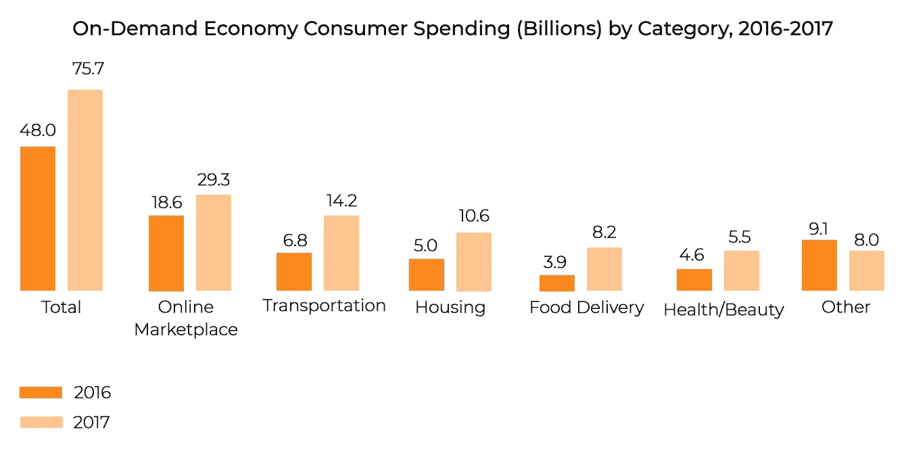
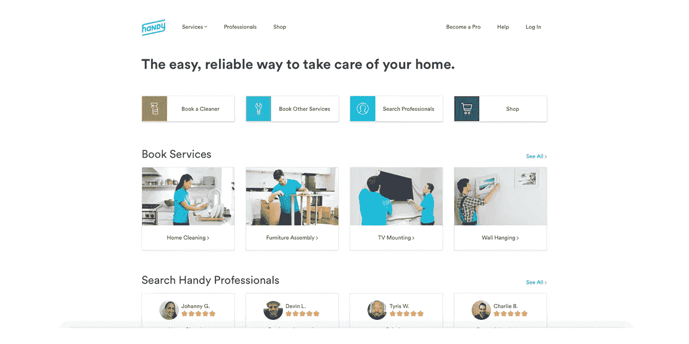

# 按需交付应用的类型

> 原文：<https://medium.com/swlh/types-of-on-demand-delivery-apps-bd5d8d917b02>

你想让披萨送到你家门口吗？或者一瓶酒？或者营养学家设计的健康餐？有一个应用程序可以做到这一点！许多人喜欢按需送货公司提供的可能性。从送餐到洗衣和家庭护理服务，专用的按需交付应用程序使我们的生活比以往任何时候都更方便。

每年，越来越多的消费者被按需交付应用程序所吸引。根据 2017 年 11 月进行的美国 [NTRST 研究](https://rockresearch.com/on-demand-economy-continues-to-grow/)显示，从 2016 年到 2017 年，按需服务的使用量大幅增加——从 2016 年的 2490 万客户增加到 2017 年的 4150 万。2017 年，消费者在按需服务上的总支出达到 757 亿美元，而 2016 年为 480 亿美元。这项研究中确定的最受欢迎的按需服务类别是在线市场服务、交通、住房和食品配送。

Source: [rockresearch.com](https://rockresearch.com/on-demand-economy-continues-to-grow/)

按需服务是现代生活不可或缺的一部分。它们的好处显而易见。他们为提供商和客户提供了双赢的解决方案。

[已经开发了大量的按需应用](https://steelkiwi.com/projects/?industry=on-demand-solution)，SteelKiwi 对它们的核心优势、用例以及必备功能有了新的见解。让我们仔细看看。

# 按需应用的主要优势

按需交付应用对其用户大有裨益，因为它们:

## 快的

按需服务为消费者提供了一个瞬间下单的绝佳机会。搜索、预订/安排、支付和查看订单可以在一个应用程序中处理。只需点击一个按钮，就能得到你需要的东西。

## 便宜的

每种按需交付服务都有不同的价格和时间，因此企业主和客户都可以选择符合他们预算的服务。从客户的角度来看，按需应用每天都提供热门交易和特别促销。企业主可以通过这些应用程序节省资金，因为他们不必投资物流、车辆和全职快递员来交付产品。随需应变的服务会照顾它。按需模式主要基于独立承包商使用自己的运输工具。根据[彭博](https://www.bloomberg.com/news/articles/2010-04-22/the-irs-targets-independent-contractorsbusinessweek-business-news-stock-market-and-financial-advice)的说法，这为企业主节省了很多钱，因为他们不需要支付工资税、保险、休假时间、病假等等。

## 方便的

按需应用的便利不仅仅在于交付。这种类型的应用程序在服务交付的每个阶段都很方便，为用户提供即时智能搜索、实时跟踪、合适的支付方式以及方便快捷的交付。

## 透明的

对客户透明有助于建立信任。为了确保透明度和建立信任，按需交付应用程序配备了反馈系统。反馈系统还能让供应商发现他们表现中的差距并加以弥补。

# 按需交付应用的类型

## 按需交付应用的用户

所有按需交付应用程序都面向服务提供商和客户。为了让服务与这两个用户群完美地合作，按需应用程序开发人员通常会为他们中的每一个构建单独的应用程序。

除了提供商和客户，零工经济工作者也是所有点播应用用户的重要组成部分。这些工人是独立承包人(如司机、自行车快递员)，他们兼职工作，自己决定工作时间。Gig 工作者充当服务提供商和客户之间的中介。根据英国商业、能源和工业战略部的数据，他们提供的最常见的按需服务是快递服务、运输和食品配送。许多零工经济工作者为高需求服务的公司工作，如(18%的人从事过零工经济工作)、 [PeoplePerHour](https://www.peopleperhour.com/) (12%)、 [Deliveroo](https://deliveroo.co.uk/) (12%)和 [Fiverr](https://www.fiverr.com/?&utm_source=google&utm_medium=cpc-brand&utm_campaign=G_OTHER-EN_Brand&utm_term=one-fiverr_%28exact%29&utm_content=AdID%5e129610568348%5eKeyword%5efiverr%5ePlacement%5e%5eDevice%5ec&lpcat=br_general&caid=%7bcampaign_id%7d&agid=40778574428&ad_id=129610568348&kw=fiverr&gclid=EAIaIQobChMIgKfeyqn23QIVBomyCh2dewrpEAAYASAAEgJJZ_D_BwE&gclsrc=aw.ds) (10%)。

## 按需经济商业模式

根据提供服务的用户，按需应用程序可以分为三种类型:

## 企业对个人(E2P) /企业对消费者(B2C)

B2C 应用程序促进了供应商和客户之间的商品或服务交易。麦当劳外卖、【Booking.com】T2 和[星巴克](https://www.starbucks.com/coffeehouse/mobile-apps)都是 B2C 应用的例子。星巴克应用程序是一个在线自助服务应用程序，让用户跳过排队，提前订购和支付，或者让他们最喜欢的咖啡直接送到家门口。

## 企业对企业(E2E) /企业对企业(B2B)

B2B 应用程序是为连接企业而创建的移动解决方案。这些应用程序支持全球交易。 [Cargomatic](https://www.cargomatic.com/) 、 [Eventio](https://steelkiwi.com/projects/building-the-airbnb-for-event-spaces/?industry=marketplace) 和 [Catalant](https://gocatalant.com/) 是 B2B 应用的好例子。例如，Eventio 是一个按需应用程序，可以帮助企业和个人找到任何级别的活动场地。该应用程序为其用户提供了可用位置的列表。一旦顾客选择了一个地方，他们可以寻找补充服务，如安全，餐饮，清洁服务，和 DJ/乐队。受邀嘉宾或公众可以通过该应用程序购买门票。

根据平台内容的性质，B2B 应用程序可以分为:

*   纵向服务于单一行业领域
*   横向服务于多个行业领域。

## 个人对个人(P2P) /消费者对消费者(C2C)

这些应用程序使平台用户能够交换产品或服务。客户可以通过 C2C 应用向其他客户销售或购买。在这些应用中，所有用户都有相同的权利，不被视为企业家。这类应用程序越来越受欢迎，因为它们省钱。使用这种模式的成功平台有 [BlaBlaCar](https://www.blablacar.com.ua/) 、[易贝](https://www.ebay.com/)和 [Etsy](https://www.etsy.com/) 。例如，BlaBlaCar 帮助其用户寻找同路人。用户可以通过提供出发地点、到达地点和旅行日期的详细信息，在线查找或提供乘车服务。一旦搭车者找到了完美的搭车方式，他们就可以预订座位，司机会得到他们的同路人的联系信息来安排细节。

# 按需交付用例及示例

按需交付应用程序是当地企业的绝佳解决方案。尽管存在竞争，但对于那些正在创业的人以及那些已经上市但没有应用程序的人来说，按需应用程序是相关的。为了更好地匹配市场需求，你应该考虑按需经济所涉及的顶级行业。

## 食物

随时随地送货上门并不是什么新鲜事。最好的送餐应用包括 Uber Eats、Instacart、Grubhub 和 Doordash。这些送餐应用为顾客和餐馆提供了多重好处。餐馆老板获得更多订单，可以有效地管理它们。反过来，用户可以轻松访问用户友好的菜单。

食品行业是按需交付市场的主要细分市场，该市场提供许多解决方案，包括餐厅和杂货店交付应用程序开发、披萨交付应用程序开发和酒类交付应用程序开发服务。

Source: [instacart.com](https://www.instacart.com/store/metropolitan-market/storefront)

说到美食应用，我们还需要提到 Postmates。它与我们刚刚提到的其他平台有很大不同。Postmates 提供了一个应用程序，你可以订购任何东西，并获得从家具交付到牛奶交付的送货上门服务。

## 卫生保健

按需医疗应用将患者与医生联系起来。[按需医生](https://www.doctorondemand.com/)是按需移动医疗应用的一个很好的例子。该应用程序使用户能够随时随地使用移动设备与医生进行一对一的交流。就像医生亲自出诊一样，在移动咨询中，医生会进行检查并提出建议。而且这些服务是全天候的，很方便。

Source: [doctorondemand.com](https://www.doctorondemand.com/)

除了医生点播应用程序，还有药品配送应用程序开发服务，让用户直接将药物送到家门口。很好的例子有[1 毫克](https://www.1mg.com/)、[药明康德](https://pharmeasy.in/)、[迈拉](https://myramed.in/)和 [NowRx](https://www.nowrx.com/) 。

## 运输和物流

如今，按需物流服务得到了极大的增强。这些服务很受欢迎，因为它们提供:

*   按需运输；
*   实时跟踪；
*   客户和供应商之间的应用内消息传递；
*   快速付款；
*   透明定价。

运输应用的一个很好的例子是[优步货运](https://www.uberfreight.com/)，这是一个帮助客户完美运输货物的应用。另一项优步包裹递送服务是 UberDELIVER。它允许顾客随时随地递送包裹。

Source: [uberfreight.com](https://www.uberfreight.com/)

## 出租车服务

如今，按需出租车服务应用非常有用，因为它们提供了:

*   GPS 和地图导航，让用户赶上附近的出租车，节省时间；
*   司机和客户之间的应用内交流；
*   反馈系统，以便司机和客户可以共享评级和审查。

优步一直是这个领域的主要参与者。然而，有很多公司提供类似优步的服务，包括 [Lyft](https://www.lyft.com/) 、 [Juno](https://gojuno.com/) 和[飞轮出租车](http://flywheeltaxi.com/)。

Source: [lyft.com](https://www.lyft.com/)

## 家庭服务

在市场需求的推动下，房屋清洁和维修应用现在比以往任何时候都更受欢迎。这是一个完美的解决方案，为那些谁想要清洁帮助或任何其他援助，只需点击一下。在这个小众领域获得人气的应用包括 [TaskRabbit](https://www.taskrabbit.com/) 、 [Handy](https://www.handy.com/) 、 [Merry Maids](https://www.merrymaids.com/) 、 [Homejoy](http://www.homejoy.com/) 和 [Slate](https://www.slatenyc.com/) 。

Source: [handy.com](https://www.handy.com/)

## 汽车租赁服务

如果你急需一辆车却没有，那就不再是问题。感谢租车服务，如 [Turo](https://turo.com/) 、 [Avis 租车](https://www.avis.com.ua/en/)、 [Zipcar](https://www.zipcar.com/) 和 [easyCar](https://www.easycar.com/) ，您可以:

*   从众多选择中选一辆车；
*   按小时或天预订汽车；
*   全天候获得道路救援；
*   请求接送。

Source: [turo.com](https://turo.com/)

## 鲜花和礼物

没时间买礼物或者忘记了你妻子的生日？它发生了。但是解决这个问题的方法很简单。像优步鲜花、 [UrbanStems](https://urbanstems.com/) 、 [Gyft](https://www.gyft.com/) 和 [Giftagram](https://www.giftagram.com/) 这样的应用程序提供了各种各样送到收件人家门口的礼物。

如今，送花 app 开发是进入点播市场的解决方案之一。这些应用程序吸引用户的原因在于它们的功能，包括:

*   有多种产品可供选择；
*   优选递送时隙的调度；
*   上门服务。

Source: giftagram.com

# 按需送餐应用

食品是受按需经济影响最大的行业。每年，越来越多的初创公司进入这个市场，试图提供优步食物的替代品。

要了解美食应用程序是如何工作的，你首先应该知道不同的类型。所有按需送餐应用都属于以下三个类别之一:

1.  **聚合器**。这些应用程序充当餐厅和客户之间的中间人，为用户提供轻松访问菜单、用户友好的界面、一键支付和实时跟踪。
2.  **新送球员**。这些应用程序为没有自己送货服务的现有餐厅提供物流支持。一个新的交付应用程序提供了与聚合器相同的功能。区别在于交付过程。
3.  **全栈送餐应用。提供这些应用的公司管理从烹饪到物流的整个过程。**

# 按需交付应用的必备功能

由于一些快递公司决定为每个用户(客户、快递员和企业主)创建单独的应用程序，我们将分别强调每个应用程序的功能。

# 客户应用功能

## 注册/登录页面

用户的旅程从这里开始。因此，用户注册界面的吸引力和易用性至关重要。为了方便起见，您可以让客户使用社交媒体帐户登录。这大大简化了登录过程。

## 轮廓

当用户创建了一个帐户，他们需要访问他们的个人资料。该配置文件可以包括个人数据、关于喜爱的地方、服务或项目的信息、订单历史记录和保存的支付选项。

## 搜索

搜索无疑是一个重要的元素。搜索结果应该包括详细的产品或服务信息、价格、地址和评论。

## 下单

一旦用户决定了他们想要的产品或服务，他们应该能够将该产品或服务添加到购物车中。他们还应该可以选择从购物车中删除商品或添加更多商品。还应该向用户显示购物车中商品的总价格。

## 行程安排

这包括安排递送的能力，以便它在用户需要时到达。

## 支付

按需交付应用程序应该为用户提供不同的支付选项。用户应该能够通过信用卡或借记卡支付。

## 地理定位

此功能允许您获取用户的位置，以便提供服务。地理定位还能帮助顾客找到附近的餐馆和商店。

## 实时跟踪

客户应该能够跟踪一个项目的当前位置。

## 应用内消息

通过内置的信息功能，客户可以与快递员交流。

## 推送通知

推送通知是一个很有价值的工具，因为它们为用户提供了关于交付状态、交付剩余时间和快递位置的信息。

## 评级和审查系统

用户应该能够留下对服务或送货人员的反馈。留下评论和评级有助于建立对平台的信任。

# 管理应用程序功能

## 内容管理

此功能是为管理员设计的，这样他们可以向客户提供价格、工作时间和联系方式等信息。服务提供商也应该能够删除任何项目或改变其价格。

## 订单管理

该功能实时跟踪订单。该页面可以包括关于产品或服务的一些信息，例如其数量和任何附加细节。

## 客户支持模块

这是最重要的工具之一，有助于管理员使用实时聊天来管理和跟踪客户关注的问题和请求。它使管理员能够接收用户的问题，并在几秒钟内回答他们。

## 会计模块

管理应用程序的目标之一是确保对财务信息(付款细节)的全面访问。

# 快递应用程序功能

## 个人账户

个人账户应该包括快递员的个人信息和评级。

## 订单管理

该功能允许送货工人查看和接受订单。

## 应用内消息

信息传递允许快递员与客户交流。

## GPS 支持

每天派送大量包裹时，重要的是不要迷路。这就是 GPS 支持意义重大的原因。通过应用程序中的 GPS 跟踪功能，快递员能够获得客户的坐标。

# 一个本地配送 app 开发要多少钱？

你准备好开发像 Postmates 这样的本地交付应用程序了吗？或者你可能对优步式的送货服务更感兴趣，但不知道要花多少钱？让我们帮助你。

我们最近建立了一个名为 [Hello Barber](https://steelkiwi.com/projects/an-on-demand-home-services-marketplace-for-hair-styling/) 的点播平台。这款应用可以帮助理发师和理发师与顾客取得联系。该应用程序总共花费了我们 2，825 个小时:

*   后端开发:745 小时；
*   iOS 开发:509 小时；
*   安卓开发:870 小时；
*   UI 设计:237 小时；
*   UX 设计:81 小时；
*   测试:385 小时。

由于我们面临着与支持四个不同时区和自动支付相关的挑战，该应用程序花费的时间比计划的长。尽管如此，我们的团队还是为这些挑战找到了完美的解决方案，现在[你好理发师](https://steelkiwi.com/projects/an-on-demand-home-services-marketplace-for-hair-styling/)已经全面投入使用。

[Hello Barber](https://steelkiwi.com/projects/an-on-demand-home-services-marketplace-for-hair-styling/)

[你的客厅训练器](https://steelkiwi.com/projects/an-mvp-for-an-online-personal-training-platform/?industry=booking-and-scheduling)是我们开发的点播平台的另一个例子。该应用程序允许用户随时随地使用实时视频聊天与教练一起锻炼。我们花了 935 个小时创造它。

*   线框:70 小时；
*   要求:30 小时；
*   设计:130 小时；
*   后端开发:309 小时；
*   前端开发:299 小时；
*   测试:100 小时。

为了让应用程序满足提供商和客户的所有需求，我们实施了以下工具:

*   [Twilio Video](https://www.twilio.com/video) 用于视频聊天；
*   [谷歌 ReCaptcha](https://www.google.com/recaptcha/intro/v3beta.html) 安全；
*   [条纹连接](https://stripe.com/connect)进行支付；
*   [谷歌分析](https://analytics.google.com/analytics/web/provision/?authuser=0#provision/SignUp/)用于衡量应用性能。

# 立即开始开发您的按需应用程序！

各种按需交付应用允许您为任何可想象的需求提供解决方案。有了随需应变的应用程序，你可以接触到更广泛的受众，让你的品牌家喻户晓。

如果您对开发任何类型的按需应用程序感兴趣，我们的团队将非常乐意帮助您实现您的想法。如果您有任何问题，请不要犹豫[联系我们](https://steelkiwi.com/contacts/?from_page=/blog/development-mobile-taxi-booking-app-uber/)。

## 这篇文章发表在 [The Startup](https://medium.com/swlh) 上，这是 Medium 最大的创业刊物，有+421，678 人关注。

## 订阅接收[我们的头条新闻](https://growthsupply.com/the-startup-newsletter/)。

