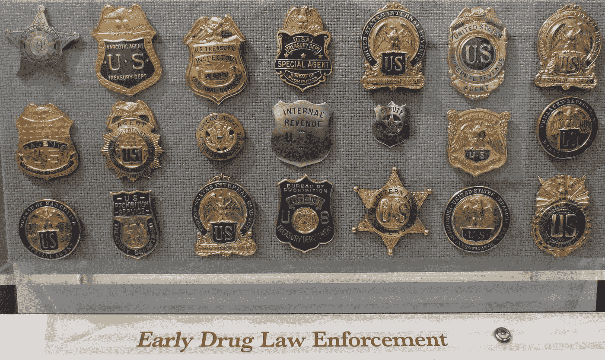

# 美国司法部从毒品贩子 Reckitt -Benckiser 手中缴获了美国历史上最大一笔阿片类药物

> 原文：<https://medium.com/swlh/u-s-dept-of-justice-claims-they-just-nabbed-largest-opioid-settlement-in-u-s-history-from-suboxone-cb0953f95d6f>

Joe Loong from Reston, USA [CC BY-SA 2.0 ([https://creativecommons.org/licenses/by-sa/2.0](https://creativecommons.org/licenses/by-sa/2.0))]

## DOJ 指控 Suboxone 制造商 Reckitt-Benckiser“故意促进 Suboxone 的销售和使用——转用于缺乏合法医疗目的的用途”