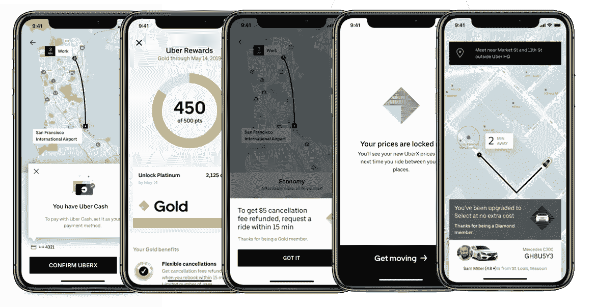
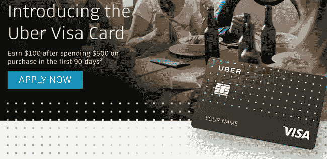
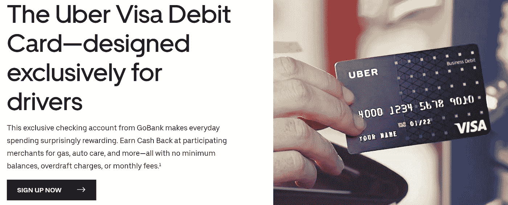
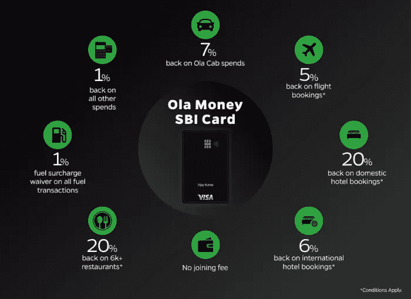
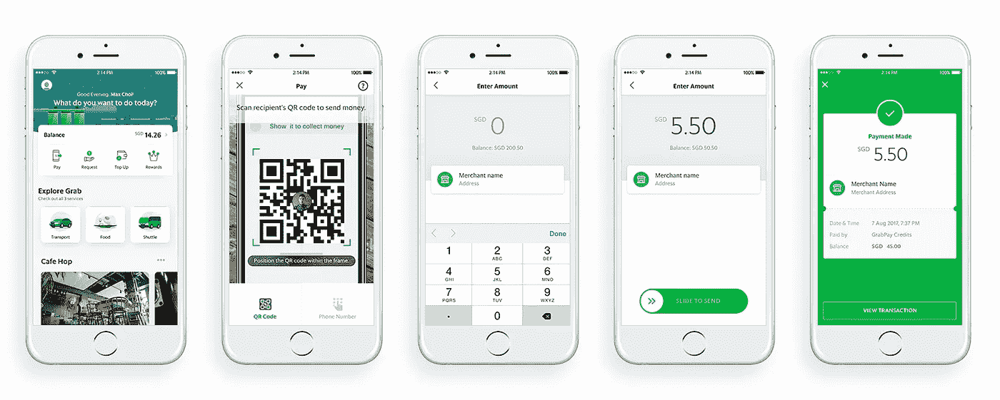
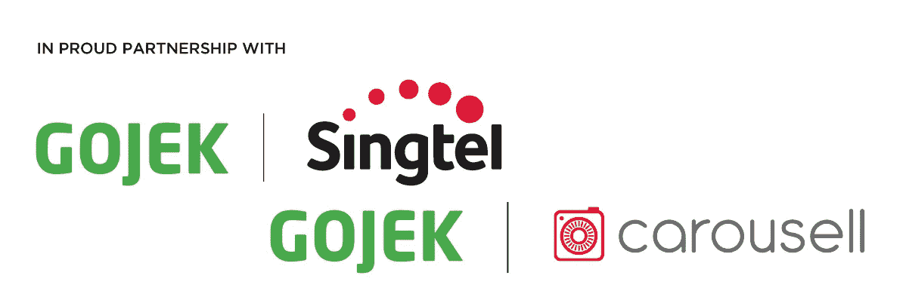
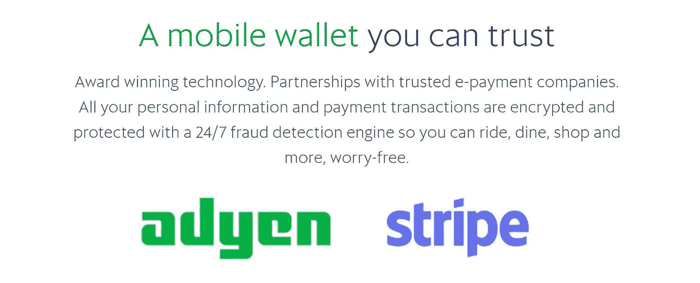
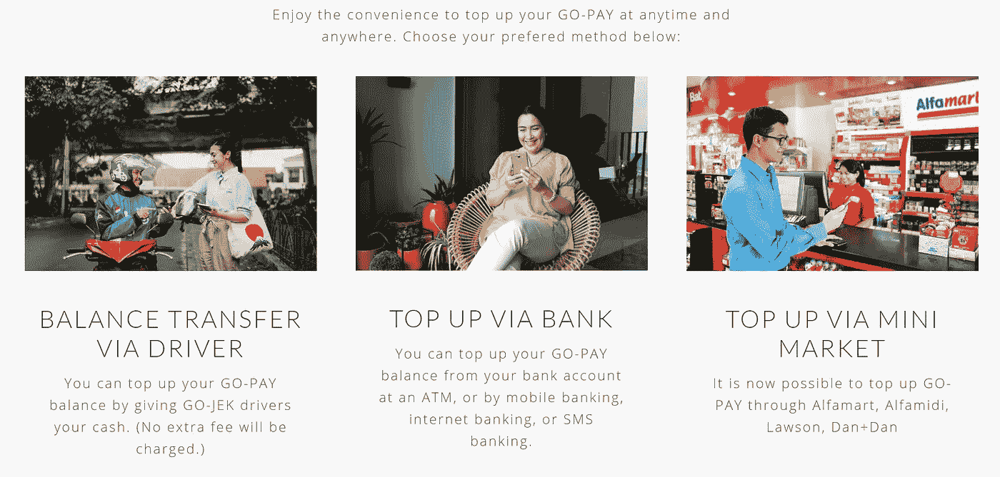

# 优步:支付和盈利能力

> 原文：<https://medium.com/swlh/uber-payments-profitability-dc171ef10b80>

## 金融服务的未来

## 优步将何去何从，未来将会如何，这对支付生态系统和盈利能力意味着什么

> 优步最近的 IPO 和随后的股价表现吸引了人们对该公司盈利潜力的关注。回顾优步的第一天，至少我们不要忘记支付体验在他们故事的成功和改变消费者习惯和行为中发挥了多大的作用。耐心的风险投资让已经发展了十年的优步有时间策划下一步行动。优步现在正准备进一步增强他们的应用程序，以创造我们都花更多时间并从中获得更多价值的“东西”。反过来，该公司将寻求获得更多的经济和支付服务，金融服务将发挥越来越重要的作用。

> 优步能成为比银行更好的银行吗——下面的证据表明答案是肯定的！

当优步开始时，它解决了两个关键问题；低成本按需运输和无摩擦支付。随着前者成为运转良好的机器，焦点变成了后者。随着许多关于盈利能力的问题被提出，这一商业模式的关键部分为节省开支和增加收入提供了巨大的潜力。

[*最近的 IPO 申请*](https://www.sec.gov/Archives/edgar/data/1543151/000119312519103850/d647752ds1.htm) 为目前的机会提供了一些理想的色彩，但我们只需要运用我们的想象力(并放眼亚洲)来猜测优步可能会变成什么样子，谁会继续存在，这对现有的参与者有什么影响。

> 根据 IPO 申请，2018 年 87%的总预订量是通过信用卡或借记卡支付的

2018 年总预订量接近 500 亿美元，其中 87%转化为 435 亿美元的处理卡量。根据 IPO 文件，优步在 2017 年支付了 7.49 亿美元的信用卡处理费。这是基于 344 亿美元的总预订量，这表明信用卡处理成本约为 2.2%。

> 反过来，我们可以猜测**优步去年支付了>10 亿美元来处理卡支付—** [**说什么！**](https://www.youtube.com/watch?v=YcfZItJTy_A)

同样，虽然优步没有指名道姓，但另一方的人并没有采取同样的方法。反过来，我们知道 PayPal 的[*brain tree*](https://www.braintreepayments.com/learn/braintree-merchants/uber)*与该公司密切合作，同样如此的还有 [*Stripe*](https://stripe.com/gb/customers) 和 [*Adyen*](https://www.adyen.com/press-and-media/2019/adyen-selected-by-uber-as-a-global-3d-secure-solution-provider) 。此外，关于上述 SEC 文件中的支付合作伙伴，我们了解了优步的方法，“*因为我们将支付集成到了我们的技术堆栈中，所以我们可以不断创新以满足平台用户的需求。*“这种即插即用型型号表明优步能够轻松集成第三方功能。同样，我们可以预计他们可以轻松地删除没有问题。*

****那么接下来呢？*** 随着优步成为“随需应变”概念的代名词，公司继续增加选中此项的服务似乎是明智之举。这就变成了引诱和激励用户在 上花更多的 ***时间，在*** 应用上花更多的 ***钱。****

**

> ***往里看***

*优步显然有着超越拥有交通工具的野心；其本身现在也包括自行车、滑板车和按需租车。Uber Eats 可以被视为某种程度上的自然发展，但回到优步现在和一直坐拥支付帝国的想法，正是商业模式的这一方面产生了一些最容易实现的结果。*

*最近的几个发展表明了支付的推进。“*”优步现金似乎旨在通过让用户将现金存入一种混合电子钱包来解决交易的支付处理问题。虽然该公司仍然必须支付押金的交换费(例如，从你的美国运通)，类似于 Venmo 模式(此处需要注意 PayPal 合作关系)，但它允许优步在内部转移现金，即从乘客到司机，减少(或最好不处理)交易。接下来的计划是增加用户的现金余额，并将更多的“现金”留在优步的生态系统中。都是为了减少第三方交易的数量和需求。**

**看看另一个金融服务的坚定支持者查尔斯·施瓦布，他们在客户的交易账户中的干粉左偶像上赚钱。由于他们的证券账户基本上反映了经纪现金余额，即交易账户中持有的现金未投资于证券，我们知道该公司在 2019 年第一季度能够获得 2.74%的回报。同样，在真正的优步时尚中，经济学还没有意义，但随着时间的推移，你可以理解这是如何工作的。举个例子， ***今天，优步将给你 100 美元的优步现钞，而你只需花 95 美元*** 。**

****

**作为另一个推动优步与同行相比使用增加的微妙举措，该公司最近推出了“ ***【优步奖励】*** ”。英国一家不太知名的出租车运营商 Addison Lee 向用户提供了一个类似的程序。注意到当优步 2009 年在伦敦推出时，Addison Lee 是优步在“高端黑色轿车”方面的核心竞争对手每一层都有额外的好处，除此之外，每累积 500 点可获得 5 美元的基本现金奖励。显著的好处包括价格保护、优先提货、灵活取消等。**

**“ ***优步信用卡*** ”是由美国巴克莱银行发行的相当标准的联名卡。简而言之，优步可以增加他们的钱包份额，提高品牌忠诚度，同时获取所有重要的消费数据。巴克莱银行和联名卡一样，受益于独特且规模可观的发起渠道。这两家公司之间也可能会分享一些收入，毫无疑问，优步有很多方法可以引导客户重新购买优步的应用。然而，该卡为餐馆提供了更多的奖励，因为他们试图了解更多关于顾客消费习惯的信息，以此为 Uber Eats 服务；4%用于餐馆和餐饮(包括 Uber Eats)，3%用于机票和酒店(很可能也是出于类似的原因)，只有 2%用于优步旅游。**

****

**最后是绿点银行签发的“ ***优步签证借方*** ”。该产品和合作伙伴关系巩固了 [*即时支付服务*](https://www.uber.com/info/instant-pay/) ，该服务允许司机每天获得高达 5 倍的支付，是优步迄今为止最接近传统银行业务的服务。**

********

> ****向东看****

**亚洲领先的金融服务提供商转向金融服务，为优步未来的发展提供了完美的代表。不可否认，电子钱包和超级应用在 APAC 地区的大规模采用在很大程度上是由最近远离现金的举动推动的(相对于美国和欧洲)。利用智能手机拥有量的长期增长，该地区已经能够跨越目前阻碍更多“发达”市场的高延迟技术。然而，真正具有革命性的是对无银行账户人群的关注。**

****

**优步确实在 APAC 有所作为，但去年 [*Grab 收购了优步*](https://techcrunch.com/2018/03/25/gruber-official/) 的业务，这让优步拥有了宝贵的 27.5%的股份，Grab 的竞争对手来自一个之前意想不到的来源——印尼的 GO-JEK。至于优步崇拜的模式，我们还必须考虑腾讯资助的滴滴出行和印度的 Ola。根据左边的图片，真正吸引客户的想法来自于排他性——也就是说，为客户提供全渠道的体验，而不受如何花钱和在哪里花钱的限制。这种情况下的激励无疑也有帮助。在这种情况下，签证——在向新进入者提供服务方面保持相关性，例如 [*最近发布的 Ola Money——SBI 信用卡*](https://techcrunch.com/2019/05/15/indias-ride-hailing-firm-ola-is-now-in-the-credit-card-business-too/) 。**

**具体看 Grab 除了运输和食品配送等明显的垂直领域，他们已经开始利用这种模式的支付方面。GrabPay 现已被东南亚绝大多数商家所接受，Grab Financial 与第三方合作提供中小企业贷款、保险和跨境转账等产品和服务，在这方面更进了一步。据信，除了提高盈利能力，Grab 进军金融服务领域也是一种策略，让他们的应用对用户来说“更有吸引力”。**

**二维码在 APAC 随处可见。下面是一个 [*的例子，说明 Grab 如何让从 app 离线支付*](https://www.grab.com/sg/grabpay/) 商家成为可能:**

****

**考虑到仍然大量使用现金，印尼可能不是最值得关注的市场，但是根据亚马逊最近的*捕捉地下和非银行消费的举动，印尼有值得吸取的教训。毕竟，所有这些公司都在寻求获得新客户。最近部署的一个战术是 ***创造*** 新客户。***

**在金融服务方面，印尼的围棋 JEK 重新发明了轮子；为商家、承包商/司机和消费者提供一个包容性的生态系统，让他们能够在其中开展大部分日常生活。对于 GO-JEK 来说，它建立在最初捕捉无银行账户者的基础上，以多种方式创建了一个移动银行出纳员车队(允许司机接受现金存款)，并提供了一个个人财务管理(PFM)平台。**

****

**不可否认的是，从运营的角度来看，将优步与 JEK 进行比较远非完全相同，但它确实为事情的发展提供了一个路线图。使用现金和/或其他奖励已被证明是传统信用卡发行商的成功策略。GO-JEK 公司(通过他们的 GO-PAY 平台)利用印尼人对泡泡茶的喜爱获得了认可。事实证明，在全国范围内提供促销和折扣是改变消费者消费习惯的一个好方法。这是对使用 GO-PAY 支付 Go-JEK 乘车和送货的奖励和折扣的补充。然后，他们求助于许多合作伙伴，这些合作伙伴带来了非凡的增长，并为许多人甚至不知道存在的问题提供了不断创新的解决方案。**

**Grab and GO-JEK 在交通领域领先，并向支付和金融服务倾斜。总而言之，正是他们获得的所有数据让这些公司的未来如此令人兴奋。在许多方面类似于 Square 的基础商业案例，即使用安抚性数据来更好地定价风险和承保信贷。**

> ***Grab Financial 制定了明确的目标，即在 2019 年成为该地区最大的支付和金融服务平台；旨在成为该地区最大的商户网络之一，拥有最大的保险科技保单提供商和最大的金融科技贷款机构，所有这些都在一个平台内。***

**再说一次，JEK 的 Grab and GO 这样的公司的另一个重点是将现金存入应用程序并保存在那里。更好的方法是让客户使用该应用程序(电子钱包)作为他们在商户和转账/汇款时的首选支付方式。创建这个收集和支付点的网络使这些公司得以扩大规模。解决关键市场中许多人仍然喜欢现金，但同样希望进入数字世界的问题。**

****

**基于对金融服务的投资，这就变成了交易量的问题。在 Grab 的案例中，他们寻求提供保险等补充产品和服务(如前所述)，同时还对经济型酒店运营商 Oyo *进行了引人注目的 [*投资。*这里的趋势越来越明显；交通、支付、旅行、折扣/激励、奖励、忠诚度、PFM 等。与行业领导者(当然也包括新进入者)合作似乎也是一种策略，有助于提高 UX/CX 等的质量:](https://skift.com/2018/12/10/grabs-100-million-investment-in-budget-hotel-chain-oyo-reveals-softbanks-firm-hand/)***

*类似于牡蛎卡如何在伦敦获得非接触式无现金旅行的巨大吸引力(你可以在新闻代理和超级市场充值)，如下所示，GO-PAY 在帮助任何用户创造包容和无摩擦的体验方面也取得了类似的成功:*

**

> *有了平台和网络，焦点就转向了数量，而且是大量的数量！*

**

> ***向外看***

*据《美国消费者新闻与商业频道》 上周的 [*报道，优步正寻求“*通过在纽约州建立一个新的金融科技前哨来加速金融产品的创造，”*“寻求建立”*支付体验，“*同时”*帮助承包商管理他们赚取的资金。*“从表面上看，简单地想一想优步仅仅通过保留司机在平台上赚取的现金就能获得的价值？*](https://www.cnbc.com/2019/06/10/uber-is-making-a-push-in-financial-products-with-new-york-hiring-spree.html)*

*另一件要考虑的事情是在手机上运行的平台的突出优势之一，GPS(全球定位系统——我们不是经常忘记基础吗？).地理围栏已经被许多人谈论了一段时间(特别是移动钱包和信用卡公司)，但收效甚微。*

*首先，知道“东西”在哪里是优步核心商业模式的基础。将所说的“事物”彼此联系起来是优步(和同行)的核心价值主张。网络的双方即乘客和司机/汽车是锦上添花。一旦你在多块蛋糕(或者在这种情况下是产品和服务)上覆盖了糖衣，你就有了顶部的樱桃。 ***你拥有消费者的关注和参与。****

*根据最近的倡议“[*Visa Local Offers*](https://www.uber.com/c/visa-local-offers/)”，这似乎是努力提供基于位置的实时报价并利用大量客户数据的第一步(链接，说明为什么 PayPal 这些天如此接近)。*

*优步还被指寻求增加*的应用内内容，并寻求在乘车期间成为 [*有针对性的广告平台*](https://techcrunch.com/2018/12/10/uber-ads/) (如果获得适当的许可，可能会超越乘车期间)。**

**还是向东看，但是稍微远一点，举中国的例子；微信和滴滴已经成功做到了这一点，在一个所谓的“超级应用”内聚合了几乎所有的产品和服务。这包括所有金融服务——支付、储蓄、投资、财富管理和保险。这就是为什么中国拼车公司滴滴看起来更像蚂蚁金服和腾讯的微信。这就是优步收购中东竞争对手 Careem 的原因，Careem 长期以来一直表示希望抓住该地区数百万未存入银行的人，但他们现在已经接入了数字网络。**

**然而，为了扩大规模，优步不太可能单干，因此他们必须寻找最有价值的合作伙伴，就像他们在许多情况下已经做的那样。为了确保我们的想法不会偏离关注优步在支付和金融服务领域可以做什么的重点太远，他们当然可以寻求为合作伙伴增加业务量(正如全球其他地方已经做的那样)，如酒店预订网站和航空公司。此外，不要忘记，在 Grab 和新加坡航空公司的案例中，Adyen 也是这两家公司的合作伙伴( ***NB 这里看到了由新进入者*** 组成的生态系统的出现)。**

****

**其中一个有创意的例子是，优步与 Relatient 合作“*增加获得医疗保健的机会*”。Per Retalient 首席执行官:**

***“失约导致可以避免的风险。根据国家预防优先委员会的数据，每年有 10 万人死于缺乏预防保健服务，如高血压、胆固醇和某些癌症的筛查。***

**优步的可能性似乎是无穷无尽的，甚至在上面的 ESG 框中打勾。他们的“商务”部门让雇主有更多的理由使用他们进行商务旅行(认为美国运通 GBT 的客户群可能会及时被优步夺走)，最近与企业 T & E 管理技术公司 Fraedom 的合作就证明了这一点，合作的基础是简化用户的费用管理流程。**

**假设优步可以在其平台中添加增量用例，扩展其产品，在内部支付*和*实际上在交易中赚钱(通过类似于今天的发卡机构的交换)，盈利能力的担忧应该很快就会被抛在脑后，除此之外， ***这个生态系统的未来看起来非常惊人！*****

**更进一步说，最近关于创建银行账户的讨论来了又去。围绕试图完全摆脱中间商最终意味着什么，人们一直在争论。如上所述，与各自领域的许多专家合作并选择更多的伙伴关系模式，已被证明是成功的。此外，美国已经有 6000 多家银行获得了特许，监管机构在发放新牌照，特别是向“金融科技公司”发放新牌照方面立场坚定。**

**对于那些关心的人来说，Varo Money 是第一家获得 OCC 批准成立全新国家银行的全移动国家银行。然而“ ***租赁银行牌照*** ”的想法已经变得更容易理解了。许多已经获得特许的银行正在幕后默默为众所周知的颠覆者工作，如 [*Robinhood*](https://www.bankrate.com/banking/robinhood-charter-fdic-application/) 和 [*Square*](https://www.reuters.com/article/us-square-banking/payments-company-square-to-re-apply-for-a-bank-license-idUSKCN1OI283) ，这两家银行尚未说服监管机构向它们发放银行牌照。这些银行(**

**看看亚马逊，正如在评论优步时总是出现的情况一样，据报道，他们已经与一些最大的银行合作，探索这种" ***租赁银行牌照*** " 的概念，因此，如果有的话，人们会期待优步探索类似的战略。随着苹果与高盛和 [*T-Mobile 合作，在 BankMobile 的*](https://www.bankrate.com/banking/checking/t-mobile-launching-checking-account-service/) (客户银行的一个分支)框架之上提供产品，以提供市场上最好的支票利率(4% APY)，至少在美国，这似乎将是一条出路。**

**[*每最近一次报告由* ***贝恩***](https://www.paymentsjournal.com/amazon-give-banks-a-run-for-their-money/) :**

> **“对美国零售银行客户的争夺正在加剧，因为亚马逊预计将与一家银行合作，提供一种联合品牌、移动友好、类似支票账户的产品，最初针对年轻人。”**

**通过提供第三方服务和许可证来伪装的科技公司将成为常态，并期待优步以任何可能的方式参与进来，以最大限度地提高相关性和数据采集，同时最大限度地降低成本。随着时间的推移，更重要的是任何平台的整体价值主张，同时还要确保数据的安全性。人工智能和人工智能在混音器中加入一些额外的流行语，也将在成功故事和盈利能力中发挥关键作用。**

****

> ****结论——一切都与数据有关****

**退一步说，人们很容易忘记优步最初的产品提供中的无摩擦支付体验对该应用的大规模采用产生了多大的催化作用。虽然该公司随后开始专注于运输(或看起来如此)，并稳步进入免费垂直市场，如食品配送，但现在很明显，最终目标远不止于此。**

**虽然优步在“更发达”的市场运营面临障碍，而超级应用已经在亚洲获得了如此大的吸引力，但一个合法的战略正在兴起，它反映了 Grab、GO-JEK 和其他公司的情况。在许多方面，优步的未来看起来也与传统银行业相似；与主要参与者合作，为日常商品和服务创建市场。此外，通过创建一个让消费者愿意花更多时间(因为他们受到激励)的应用，优步可以寻求更独立、更具成本效益地运营支付生态系统。**

**如上所述，优步似乎比最初看到的要多得多。他们有很大的空间来增加新的合作伙伴和能力，这反过来将推动数量的增加。例如，前面提到的医疗保健例子并不是一个明显的举措。同时，他们也在关注社交活动——这绝不是一件坏事。**

**蛋糕上的樱桃将是可以从支付和金融服务中获得的数据——更不用说偶像现金余额的创收潜力和/或从线下和应用外消费中获取交换的潜力。当谈到个人理财以及优步应该如何帮助你管理在优步的支出时，社交因素再次出现。与我们在前瞻性思维银行看到的类似，拥有关系并寻求为客户服务，而不是拥有客户，将是未来十年的制胜战略。**

**作为一家银行，优步能比其他银行做得更好吗——以上证据表明答案是肯定的！**

****