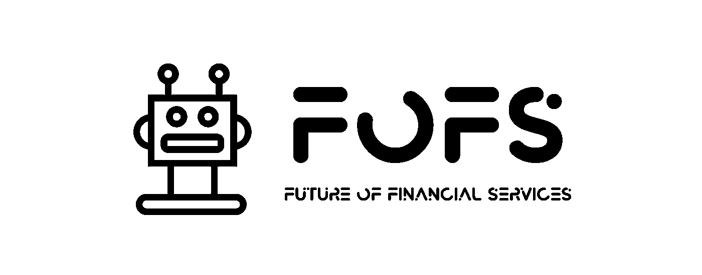

# 优步:贝宝合作伙伴

> 原文：<https://medium.com/swlh/uber-paypal-partnership-3324bb91d7e2>

## 金融服务的未来

## PayPal 投资优步的原因及其对双方和行业的意义

> PayPal 最近进行了一些有趣的投资。尽管 PayPal 是首批纯粹的金融科技公司之一，但它正面临越来越激烈的竞争，竞争对手包括拥有更好技术的新兴公司，以及那些希望从支付领域分得更多蛋糕的公司。

PayPal 在优步的 5 亿美元上市前投资 吸引了很多关注，在支付领域，这是值得剖析的事情。

要想知道 PayPal 在做什么，有必要强调一下他们已经进行的其他战略投资；印度的 [*松拉拉的*](https://techcrunch.com/2018/05/31/paypal-temasek-pine-labs/)*；*韩国的 [*共和国万岁*](https://www.bankingtech.com/2018/12/paypal-gives-a-toss-about-viva-republicas-80m-funding/)*；*在欧洲，初创公司如储蓄公司 [*葡萄干*](https://venturebeat.com/2019/02/05/raisin-raises-114-million-from-paypal-index-others-to-grow-european-savings-marketplace/)*；*总部位于英国的跨境支付创业公司[*PPRO*](https://www.ppro.com/news/ppro-group-accelerates-global-expansion-with-50m-usd-investment-round/)*；*更值得一提的是投资 7.5 亿美元的阿根廷**。**

*回想一下，PayPal 诞生于易贝。优步显然有创造市场型解决方案的雄心。MercadoLibre 是拉丁美洲的易贝，类似于阿里巴巴用支付宝镜像贝宝，MercadoLibre 通过他们自己的支付平台 MercadoPago 将购买和销售的整个过程商业化。*

*在 1Q 的财报电话会议上，PayPal 的首席执行官提到了公司“投资或收购推进其战略议程的公司的意愿”毕竟，完全避开那些最初让你成长的人是很难的。FWIW 这是我们看到的银行部署的类似策略，即合作伙伴 vs. protect。*

*对于已知的全球市场领导者来说，PayPal 的合作伙伴选择似乎已经不多了；阿里巴巴拥有支付宝，易贝正在单干，并与 Adyen 和亚马逊合作，已经成为 PayPal 的主要竞争对手。事实证明，沃尔玛是一个不懈努力的友好盟友，在 2018 年 10 月， [*宣布与贝宝*](https://news.walmart.com/2018/10/11/walmart-and-paypal-collaborate-on-strategic-products-to-help-joint-customers) 建立战略合作伙伴关系。还记得 [*沃尔玛持有 Flipkart*](https://techcrunch.com/2018/08/20/walmart-flipkart-deal-done/) *，*印度大众市场电子商务的答案。*

*就目前情况来看，PayPal 是优步在美国和澳大利亚的领先支付提供商，其目标是在全球范围内推广这项服务。优步还与 PayPal 的竞争对手 Adyen 密切合作，最近与他们合作，通过整合最新版本的 EMVCo 的[*3-D-Secure authentic ation*](https://www.emvco.com/emv-technologies/3d-secure/)*(用于身份审查)，确保 PSD2 合规。除此之外，PayPal 很可能热衷于在提供支付和管理交易方面帮助优步的内部努力。同样值得参考的是 PayPal 在 2015 年对 Paydiant 的收购，以及 PayPal 在白标钱包解决方案方面的专业知识。综合来看，这一切听起来有些熟悉；你似乎有优步寻求看起来像旧的贝宝/易贝组合。**

**上面提到的所有活动部件， ***然后，你必须识别出将它们连接在一起的胶水*** 。这也可能是与贝宝的关系所在。然后我们就有了接受的想法。后者引出了贝宝和优步合作的第三种方式…**

**如今，PayPal 平台上有 2200 万商家，通过优步现金和优步卡与优步的整合可能成为商家接触客户的另一个机会，也就是说，就像人们现在可以通过 PayPal 按钮/应用程序在线支付一样，一个正在考虑的想法是如何扩展优步现金网络，让人们不仅可以支付优步乘车和优步用餐。想想看，优步-Pay 是在贝宝基础设施的白标版本上运行的。**

> ****结论****

**我们在这里 详细描述了优步在支付和金融服务领域寻求实现的目标。随着 PSD2 等法规以及全球范围内新的首选支付方式给现有参与者带来越来越大的压力，PayPal 可以被视为处于危险之中，尽管没有传统银行等那么大。**

**然而，人们可能经常忘记，PayPal 拥有大量交易数据，通过智能收购，如前面提到的 Paydient，PayPal 还为合作伙伴提供了无与伦比的支付专业知识。有趣的是，鉴于不断变化的形势，最近的战略投资对象可能是最有可能取代该公司的人。**

**通过与优步合作并投资于该公司，PayPal 在改变消费者交易方式的所有努力中占据了前列，同时受益于该平台的优势，并通过帮助构建金融服务的未来而保持相关性，而优步将不可避免地在其中发挥关键作用。**

****