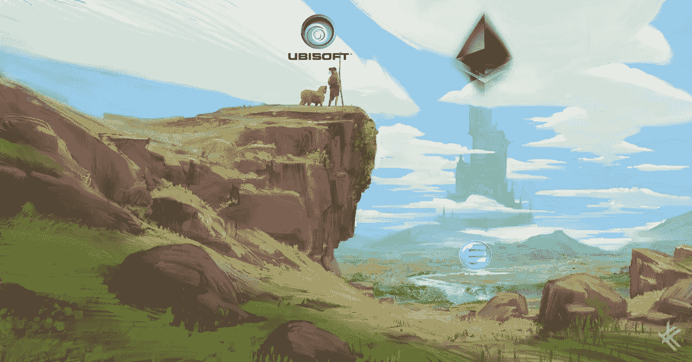

# 育碧想在以太坊上放物品，但是他们晚了吗？

> 原文：<https://medium.com/swlh/ubisoft-wants-to-put-items-on-ethereum-but-are-they-too-late-cbb6084ea1f8>

今天，阿明这个词变得越来越宽泛。千禧一代是伴随着任天堂或第一代 PlayStation 等原创游戏机长大的。
他们后来过渡到 PC 游戏，随着技术和我们(包括我)的成长，PC 游戏变得越来越好。
如今，电脑游戏不再像过去那样处于前沿。
手机游戏正在接管这个行业。人们…