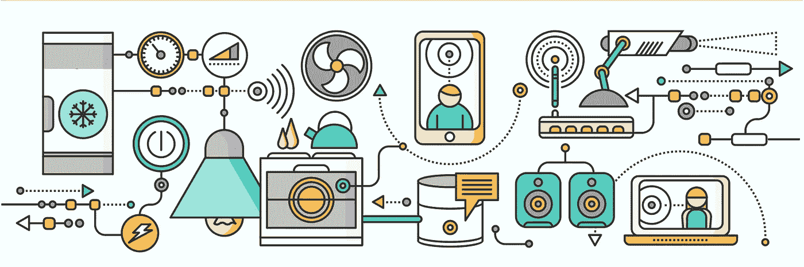

# 啊哦。是(不安全)物联网。

> 原文：<https://medium.com/swlh/uh-oh-its-the-internet-of-insecure-things-10108055c11e>

> **连接。**

一个简单的词。

我们渴望它。

我们喜欢它。

我们渴望它。

但是我们如何解渴呢？简单:

*物联网* (IoT)。

物联网由各种联网的数字设备组成，通常被称为*智能* …