# UI 作为实现细节

> 原文：<https://medium.com/swlh/ui-as-an-implementation-detail-7fb9f952fb43>

你如何建立一个用户界面？你总是从一个组件开始吗？在实现 state 之前做造型吗？服务器所需的数据呢？你是直接在组件中使用 fetch 还是把它放在其他地方？我们应对这些挑战的方式可能会有很大不同。在这篇文章中，我们将从一个不同的角度来构建用户界面…通过根本不构建它们。

# 应用程序的组成部分

要创建 web 应用程序，您需要以下组件:

*   **State** 描述应用程序的当前状态
*   **特效**与外界对话
*   **逻辑**运行特效并改变状态
*   **Html** 作为状态的产物
*   **样式**用 CSS 或内联样式配置布局和装饰 html 元素，通常是状态的产物

当前流行的完成所有这些的抽象是我们所说的**组件**。这是一个强大的抽象，因为它允许我们通过构建组件树来构建无限复杂的用户界面。

但是这种力量也抓住了不同的关注点。毫无疑问，组件应该关注消费状态，并基于该状态生成 html 和样式。但是国家本身呢？效果和逻辑？组件应该关心这些吗？如果我们将消费状态与管理该状态所需的 UI、效果和逻辑严格分离，会发生什么？

“但是，嘿…把 UI 和逻辑分开是我们已经做了很久的事情了”。是的，我们有，现在也有。这篇文章试图传达的是重新思考**组件**的责任，因为它们模糊了 UI 和构建 UI 所需的状态、效果和逻辑之间的界限。如果我们让组件只关心 html 和样式的实际生产，我们可以用我们的开发经验做什么？

# 创建没有用户界面的应用程序

有没有想过 html 和样式的开发工具有多高明？浏览器让你真正深刻地了解到你在屏幕上看到的是什么。你甚至可以操纵它。但是我们为应用程序编写的状态、效果和逻辑呢？我们在浏览器中拥有的唯一工具是 Javascript 运行时调试器。当然必须这样，因为应用程序状态、效果和我们编写的管理它们的逻辑不是一套 API，它不是一个标准。由于我们现在想远离 html 和样式，浏览器可能不是开发我们应用程序的好工具。让我们看看我们如何以不同的方式做这件事。

如果您没有启动浏览器并连接到 *localhost:3000，*而是启动了如下内容，会怎么样呢:

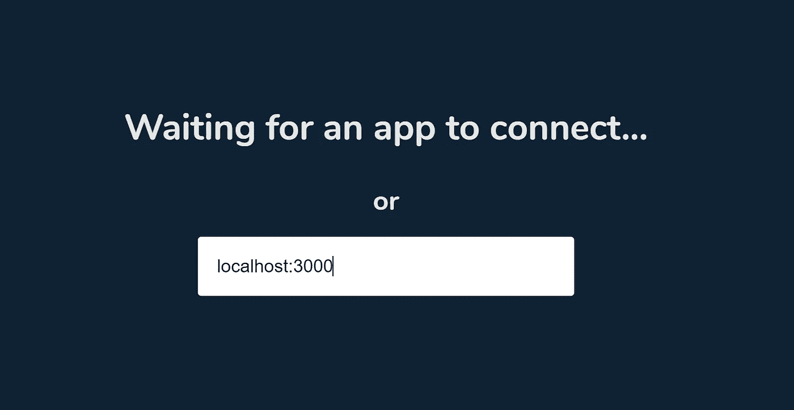

就像浏览器连接到正在运行的应用程序，但不是显示白色空白屏幕，而是得到一个空对象:

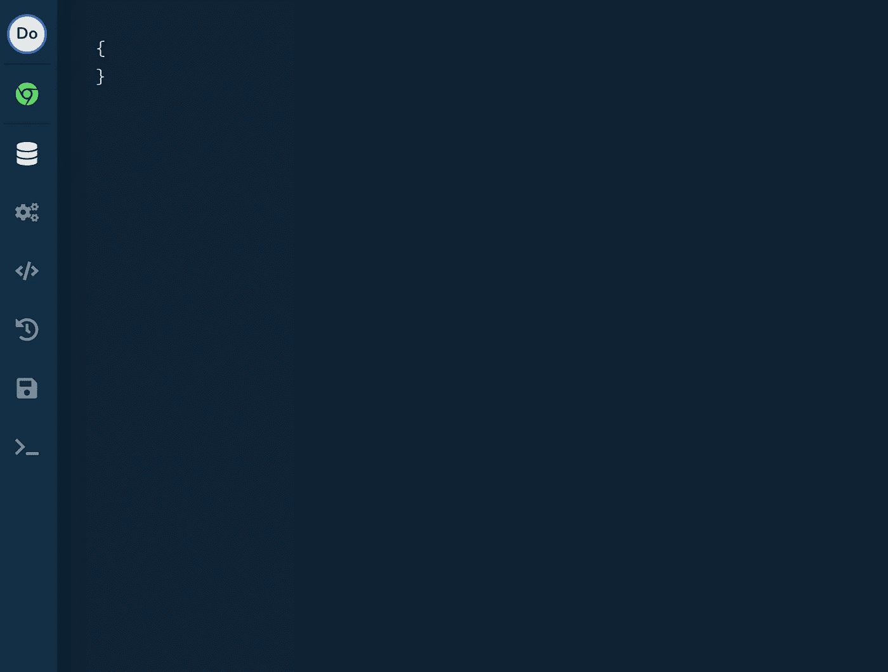

该对象表示应用程序的状态，目前尚未定义。让我们看一看一个我们都知道并喜爱的应用程序，并开始定义该应用程序所需的状态:

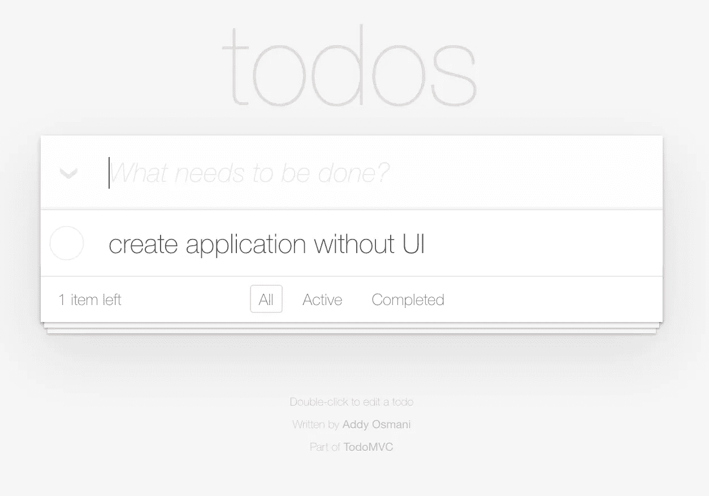

但是等等…我们刚刚说过我们不会关心 html 和样式，这正是我们所关注的。让我们讨论一下这个问题。典型的开发过程使用设计模拟。设计模拟有多种用途。一件事是讨论整体用户体验，另一件事是讨论组件边界。但是您也可以使用 mock 来讨论交互，以及交互工作需要呈现什么状态。这就是我们在这里所做的。我们剖析了模拟，以找出需要呈现什么状态、效果和逻辑来处理交互。理想情况下，我们会有几个模拟，但这也行。

我们在代码中定义状态，现在开发工具为我们提供:

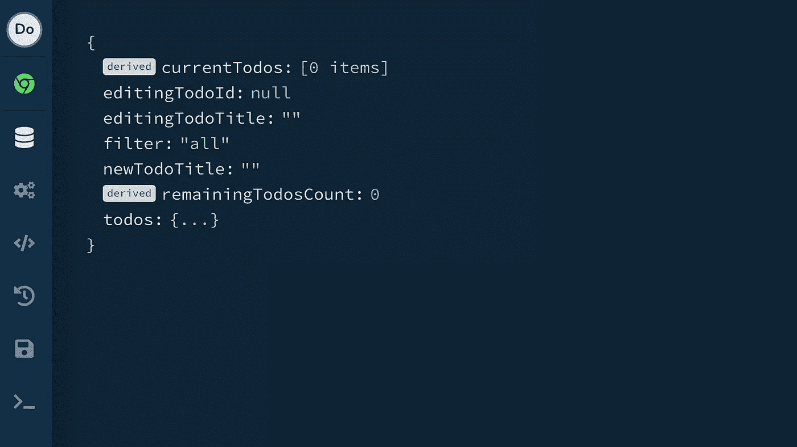

如你所见，剩余的**和当前的**都有一个来自的*标签。这意味着有逻辑推导出该状态，而不是显式设置。具体来说，他们派生出 **todos** 和**过滤器**。*****

现在我们已经准备好了我们的状态，让我们继续一些逻辑来改变这个状态。我们的 TodoMvc 应用程序需要完成以下工作:

*   更改新待办事项的标题
*   提交新的待办事项
*   更换过滤器
*   删除现有待办事项
*   在编辑状态下设置待办事项
*   更改已编辑待办事项的标题
*   在待办事项上提交编辑过的标题
*   取消待办事项的编辑状态
*   切换待办事项完成

现在让我们实现一个**动作**，它允许应用程序更改一个新 todo 的标题。我们在开发工具中使用一些文本启动它，我们确实可以看到状态正在如预期的那样发生变化:

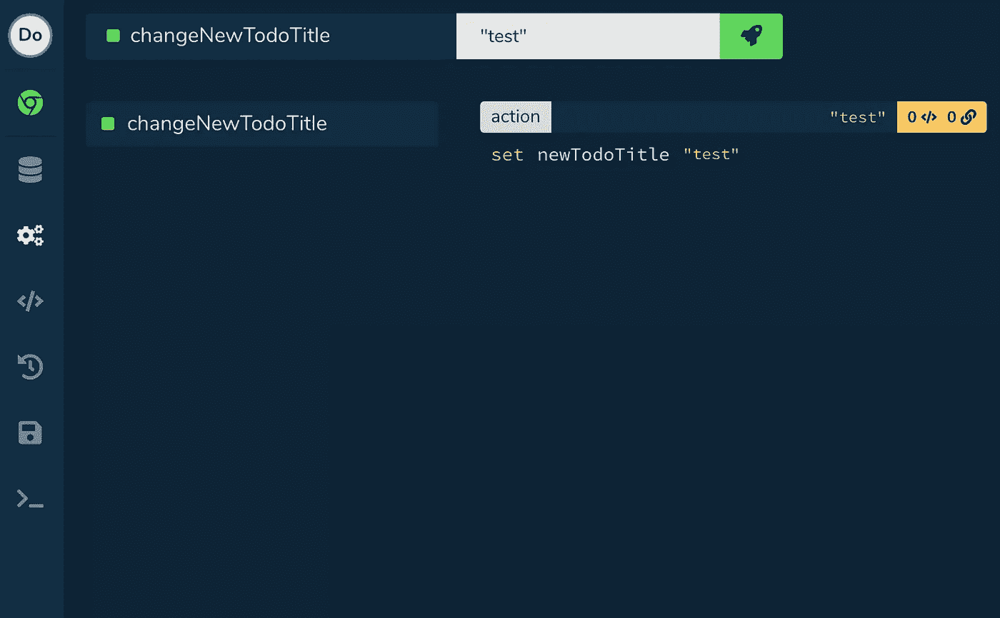

现在让我们添加另一个动作，它使用**new dotitle**状态向 todos 添加一个新的 todo。由于我们在应用程序中使用了热重装，因此会保留之前更改的状态，我们可以运行新的操作:

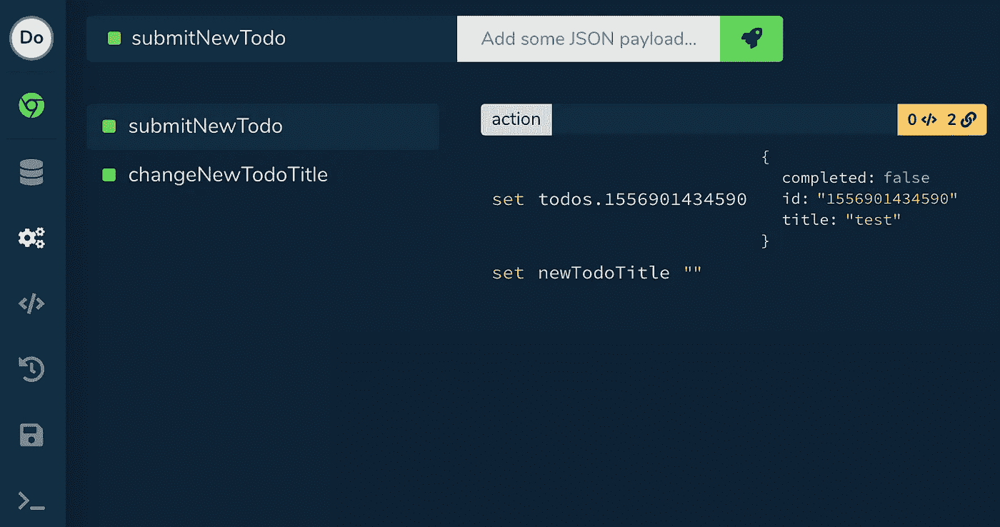

正如我们所看到的，一个新的待办事项确实被添加到了**待办事项**中，我们还清空了我们的**新待办事项标题**。现在特别有趣的是，我们有一个指示，告诉我们两个派生的状态值受到了更改的影响。如果我们现在回到我们的状态，我们可以看到**剩余时间计数**和**当前时间计数**状态都已经改变:

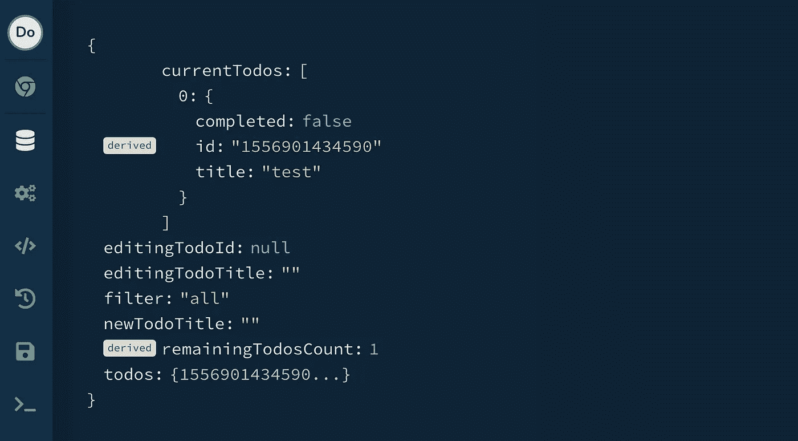

现在让我们实现 **changeFilter** 动作，启动它，再次看到派生的状态值已经改变。

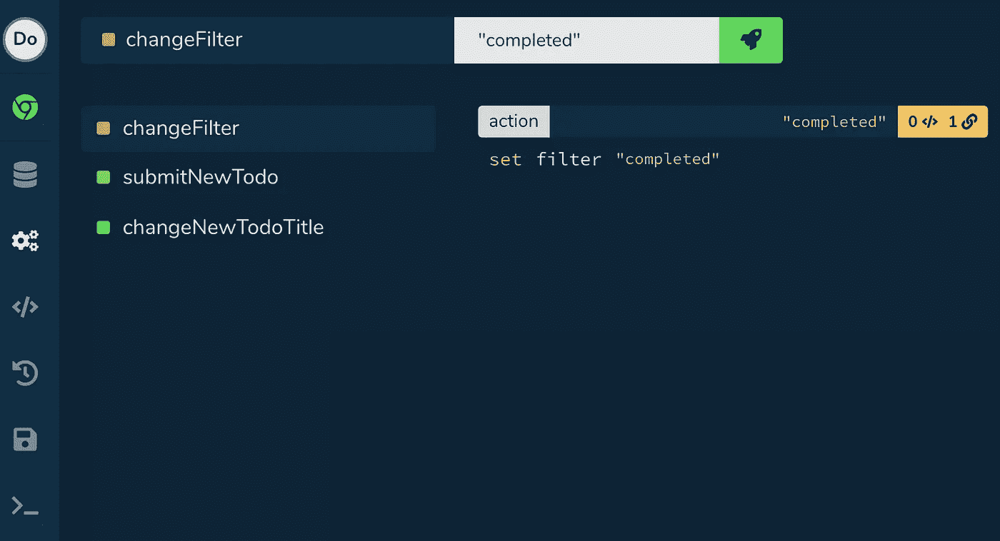

现在**当前待办事项**为空，因为过滤器与待办事项的状态不匹配。

现在你已经开始看到当我们以不同的方式思考问题时会有什么样的结果。当没有用户界面时，我们不会考虑我们定义的是哪一类状态。我们只是描述应用程序运行所需的东西。什么最终会消耗状态并在以后触发我们的逻辑并不重要。

# UI 状态呢？

你现在可能会想，我们正在混合 UI 状态，例如**newdotitle**和其他状态，如**过滤器**和 **todos** 。这是一个很难讨论的话题。什么是 UI 状态，什么不是？它是由状态的来源定义的吗，比如来自 UI 元素还是服务器？它是状态的边界吗，比如它只包含在一个组件中还是在组件之间共享？也许与 html 属性和样式相关的状态被认为是 UI 状态？

我认为这种困惑的根源往往在于关注什么会消耗国家。如果我们在一个组件中定义了**newdotitle**，我们可能会把它命名为**newdoinput**或者与哪个 UI 实际上消耗了那个状态更相关的名称。但是我们现在不使用任何 UI。我们从思考 UI 状态中解放出来。一切都只是状态。需要为应用程序的运行定义一些东西…没有用户界面。

对我个人来说，这是一种开发应用程序的自由。我不关心什么消耗国家，在哪里消耗。重要的是在应用程序的域中定义状态，并在需要的任何地方使其可用，而不必考虑性能等问题，以及它对 UI 的哪些部分的可用性。您还可以避免在安装和卸载的 UI 之间构建状态、效果和逻辑的复杂性。

# 与世界对话

大多数应用程序依赖于来自环境和/或其他工具的 API。例如，每当我们添加、删除或更改 todo 时，我们的 TodoMvc 应用程序都希望将 todo 存储在本地存储中。让我们在我们的应用程序中实现一个**效果**来做到这一点。我们将其命名为 **localStorage** ，并添加了方法 **getTodos** 和 **setTodos** 。当应用程序启动时，我们从本地存储中获取 todos，并将其填充为初始状态:

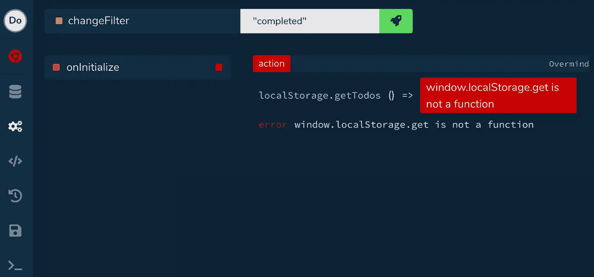

行动。我似乎犯了一个错误。浏览器的 localStorage API 上没有名为 **get** 的方法。让我们来解决这个问题:

我们看到我们正在使用我们的效果，我们设置了 todos 初始状态。让我们添加一个新的 todo 并查看它的存储情况:

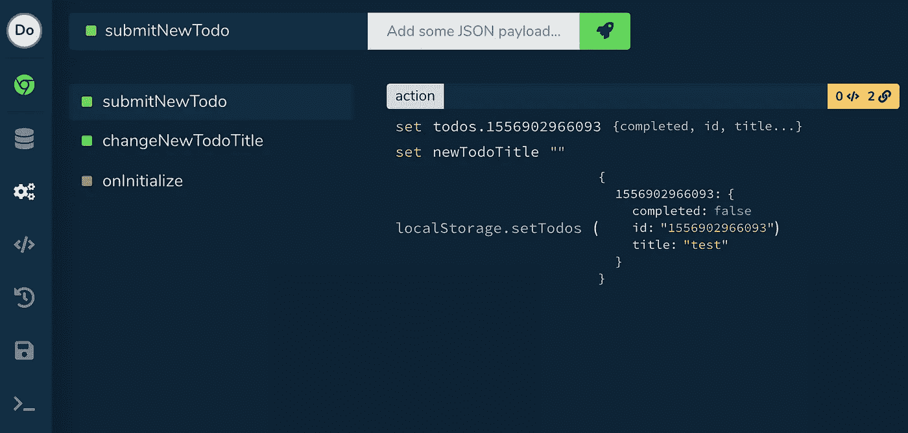

如你所见，我们的 **localStorage** 效果不符合浏览器的 API。效果是您的领域特定的 API，是为它们的目的定制的。我们这样做的原因如下:

1.  其他 API 不知道应用程序的领域，因此传递给这些方法的方法名和参数本质上是通用的，降低了应用程序逻辑的可读性。通过定义应用程序和其他 API 之间的效果，您可以保持特定的逻辑域。如示例所示
2.  这些工具的 API 很少能完全满足您的需求。您可能希望将多个 API 结合起来用于一个目的，或者做一些额外的工作。上面的效果就是一个例子，它对 JSON 进行字符串化和解析，将 todos 存储在本地存储中
3.  现在，您可以很容易地模拟出与测试相关的影响，或者当您实现逻辑时，访问点是否准备好/可用
4.  您可以在需要时轻松延迟加载效果，从而减少应用程序的初始负载
5.  效果的执行可以被追踪，给你更多的洞察力
6.  这些效应可以改变它的行为，这取决于它们所处的环境
7.  如果你使用了 Typescript，你就确保了你的效果需要类型化，并且避免了必须类型化通用 API 调用，比如:*axios . get<User>(…)*

正如你所看到的，有一个**效应**的概念只有好处。

# 我们将何去何从？

现在我们的应用程序已经有了它的状态、逻辑和效果，我们可以开始考虑实现 UI 了。我们可以直接将状态暴露给需要它的组件，并触发动作来改变它，但是让我们在这里考虑得更大一些。为了对本文中的关注点进行透视，让我们离开状态、效果和逻辑的世界，只考虑 UI。

一个名为 [Storybook](https://storybook.js.org/) 的项目允许你独立于你的应用程序来构建和设计你的组件。这允许您从不同的角度考虑您的应用程序。以前，我们使用 TodoMvc 应用程序的图像来确定应用程序工作所需的状态、动作和效果，并使用定制的环境来实现这一点。现在，我们将确定需要哪些组件来产生应用程序的视觉风格。Storybook 是一个专门为此设计的环境。

这里有一个 TodoListItem 的例子，我们在不同的州展示它。

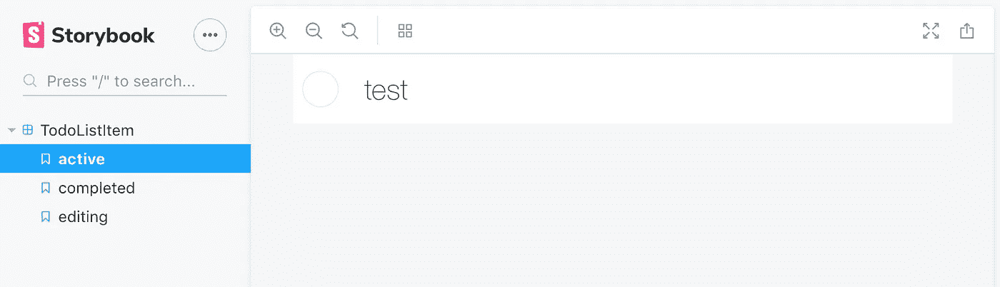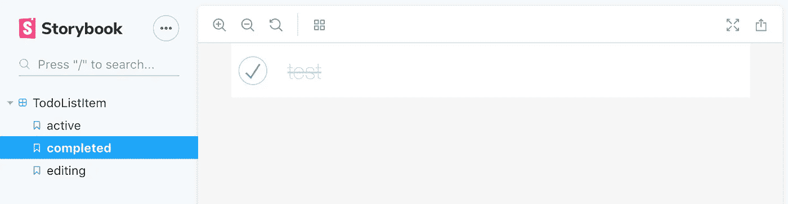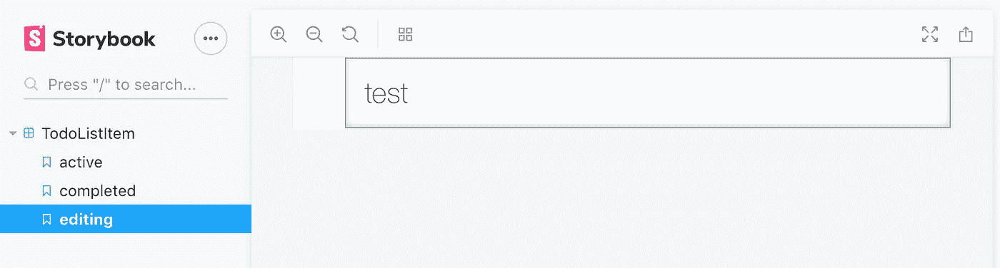

这里重要的是，这个组件没有任何内部状态。例如，将组件置于编辑状态实际上是从外部传递的属性。我们可以在组件内部引入状态来实现这一点，但是这会降低它的灵活性。例如，通过从外部管理状态，您可以决定是否允许同时编辑多个待办事项。当发生其他交互时，例如更改过滤器，您可以停止编辑待办事项。当组件没有内部状态时，它们会更灵活；当您将状态定义为与 UI 无关时，它们会更灵活。

# 将这一切结合在一起

现在，我们已经运行了应用程序并定义了组件。这意味着当您启动应用程序将在其中运行的实际环境时，您实际上只需要关心布局，在需要的地方公开状态，并将事件从组件绑定到动作。

在我的职业生涯中，我参与了很多项目，根据我的经验，开发应用程序的典型方式是按功能开发。一个开发人员抓住一个特性，在同一时间、同一环境中钻研它的所有方面。Html，样式，状态，效果和逻辑。这些是我发现最明显的后果:

*   这是令人沮丧的，因为你总是在不同的关注点之间移动。尤其是当你花 10 倍于实现逻辑的时间在设计上的时候
*   项目的所有权在特性而不是实现上被分割。让多个开发人员参与到一个特性中总是好的，即使他们实现了这个特性的不同部分
*   设计师模仿变成了“设计交接”。它应该是多个开发者和设计者之间讨论的参考
*   您经常会遇到这样的情况:您希望为单个组件实现状态、逻辑和效果，但是发现自己在为状态、效果和逻辑的不同组件工作，因为它们需要共享

分离构建应用程序的关注点，并为其生成 UI，为我们提供了构建新工具的视角。可以帮助我们改善开发人员创建应用程序体验的工具，甚至可以改善开发应用程序的流程。

# 摘要

你刚刚看到的工具是 [Overmind](https://overmindjs.org) 开发者体验的一部分，我们才刚刚开始。就像 Storybook 消除了状态、效果和逻辑的复杂性一样，我们可以使用 Overmind devtools 来消除生成 html 和样式的复杂性。感谢您的阅读，我希望这至少是对您当前关于如何创建应用程序的假设的一个友好的戳。