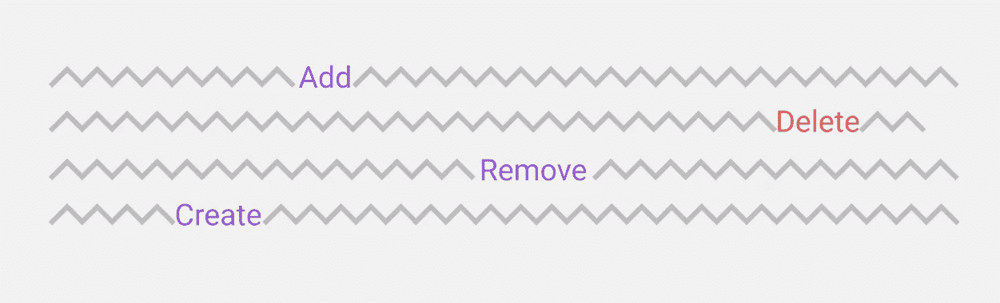

# UI 复制:移除与删除

> 原文：<https://medium.com/swlh/ui-copy-remove-vs-delete-33c58ce16d9b>

上周末清理我的谷歌文档时，我注意到一些有趣的事情——它与 UI 复制有关。

我正试图摆脱一个文档，看到一个**移除**选项**，**，然而它还伴随着一个垃圾桶图标。我想到的第一件事是垃圾桶是用来*删除…* 的，但我也是这个领域的新手，所以我知道什么？