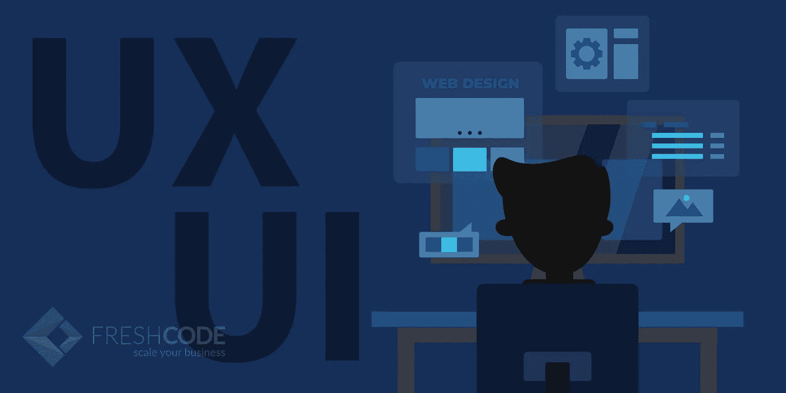
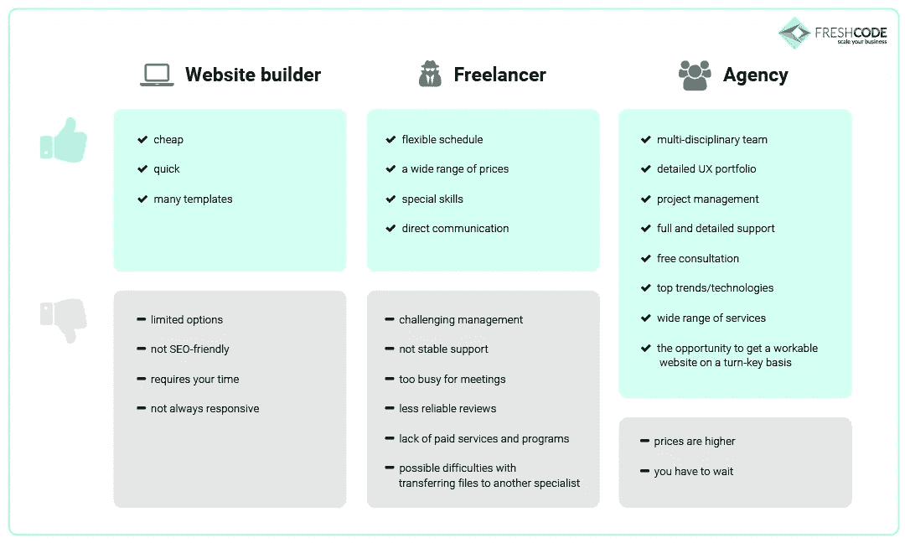
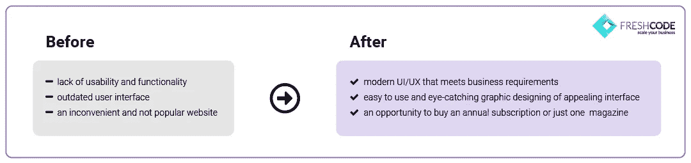
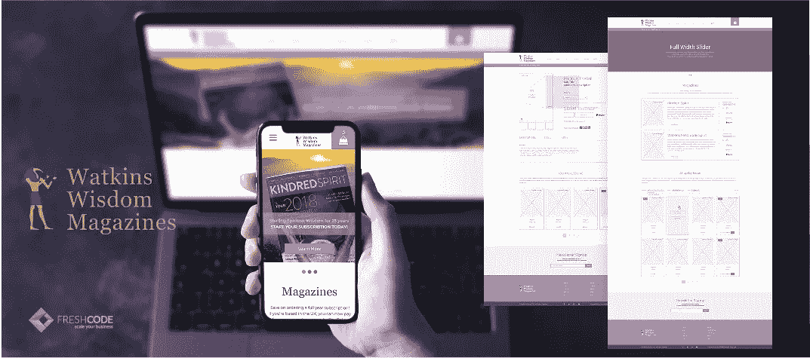
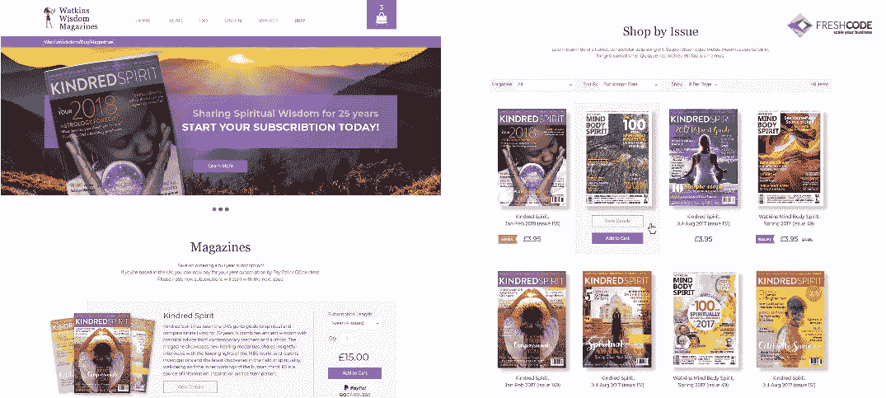

# 商务用户界面\UX:您需要了解和关注的内容

> 原文：<https://medium.com/swlh/ui-ux-for-business-what-you-need-to-know-and-focus-on-5a5beed65c8c>

想象一下，你有一个商业想法或者一个线下公司需要一个网站。你将带着这个项目去哪里？内部和海外工作室，自由职业者和模板服务提供了数以千计的网页设计领域。这种多样性让许多企业主感到困惑。网站建设的成本并不低，他们每个人都希望以可承受的价格获得高质量的结果。其实最好的选择取决于你的经营策略。

# 为你的企业创建网站的 3 种方法

面对在线展示的必要性，许多企业主选择了一种不适合他们的网页设计风格。如果你想得到一个有利可图的结果，时间和金钱的花费必须合理。本文将帮助您了解哪种网站建设方法适合您的项目。此外，您将学习设计的主要步骤、常见错误以及如何避免这些错误。

## № 1 在线/离线网站建设者

由于现代技术的发展，创建个人或公司网站的最便宜的选择已经变得流行。像 Tilda、Wix、Squarespace 或 Weebly 这样的服务允许每个人建立一个网站。他们不需要任何专业技能。你只需要一台电脑和一些时间来检查他们的工具。

布局和一般设计给出了固定的价格。因此，您将只通过一些视觉元素和内容来定制您的在线状态。网页的结构会很标准。它可以节省你的钱，但降低了创造力的可能性。使用有限的模板选项很难展示独特业务的所有优势。

## № 2 自由网页设计师

许多网页设计师都是自由职业者。你可以在专门的网站、论坛、平台上找到。与自由职业者合作有几个好处。首先，他们在时间上非常灵活，你可以随时讨论价格。其次，许多自由职业者专门从事特定类型的服务。这很方便，如果你只需要一个标志，或者，例如，一个新的商品系列的横幅。

另一方面，想象你想从零开始建立一个网站。在这种情况下，你需要一个用户界面/UX 设计师，网页开发人员和其他专家。您必须协调它们，但是由于不同的时间表和时区，这样的管理可能具有挑战性。此外，大多数自由职业者同时参与几个项目，所以他们可能会忙得没有时间参加你的在线会议。最后就是很多自由职业者不提供推荐。所以，你可以自担风险和他们合作。

## № 3 一家网页设计机构

申请设计公司最重要的好处就是信誉好。这意味着你可以确定你的网站是由一个技术娴熟的专家团队制作的。代理公司通常有大量不同类型的项目组合。经验丰富的内部成员团队提供来自各种角色的意见和专业知识。

由于持续的项目，设计师能够使用最新的技术和高质量的工具。这意味着他们可以获得现代设计的授权软件和专业付费服务。此外，你可以始终依靠专业支持，忘记项目管理问题。你会节省大量的时间和精力，但你的网站成本会更高。此外，费率是固定的，工作流程也不是很灵活。但这个要看具体代理机构。

# 定制设计是奢侈品还是必需品？

如果你使用模板，你会得到一个普通的网站。同时，最后两个变体提供了一个定制的解决方案。当他们更有利可图的时候？你应该考虑一下在线展示对你的公司意味着什么。一个网站是你生意的**工具**，还是仅仅是**的补充**？

例如，你有一个美发厅，不能为你的客户提供任何在线服务。然后，您可以使用一个简单的登录页面模板来放置一些信息和联系人。你的名片可以帮助客户在网上找到你。另一方面，你可能有一个在线商店、货币化社交网络、目录或其他应用程序的想法。然后，最好投资一个好的网站设计，提供强大的数字体验。因为它是你业务发展的主要工具，所以这些花费是值得的。

## 选择自定义网站的原因

*   有效和搜索引擎友好的解决方案
*   基于业务需求的 UX 设计
*   具体特征和独特风格
*   所有现代设备中都有
*   网站设计机构的支持

# 创建独家网站设计，谁值得信任？

无论你想成为自由职业者，还是设计公司，这都是你的决定。你应该采取负责任的态度来选择承包商。重要的是要考虑 4 个方面:

1.  投资组合表明一个专家是否能应付你的项目。
2.  **风格**展示了设计师的艺术才华和观点。
3.  **经验**表明他/她有什么实际技能和知识。
4.  **公司或自由职业者的**费率。

也可以申请免费咨询，或者问一些澄清性的问题，看你是真的在和一个高水平的专业人士打交道。

# 创建优秀网页设计的 5 个步骤

我们相信“设计是科学和艺术的平衡点”。因此，我们的团队将外形和功能都考虑在内。应用发展用户体验的现代趋势，营销分析可以加入到这个著名的公式中。如果你想你的网页设计满足客户的需求，你应该了解目标受众的一切。用户研究是建立定制网站的第一步。让我们看看整个工作流程。

## 1.讨论业务目标

"网页设计必须通过你整个企业的视角来看待，否则它会失败."这就是为什么，设计师从项目经理那里得到技术任务并仔细检查。理解你的网站的主要目的是很重要的，不管它是应该告知用户还是娱乐用户，是销售还是推广产品。你也可以与设计师团队领导讨论你的所有问题，以便更好地了解彼此的想法。

## 2.创建网站地图和线框

在表明目标后，UX 设计师创建网站地图和不同页面的线框。我们使用专业工具，如 Moqups 或 Axure。UX 过程的主要目的是提供高水平的可用性，使环境对访问者来说直观清晰，没有无用的元素和混乱的工作流程。

## 3.主页的批准

之后，用户界面设计师准备主页的两个选项。这个专家选择调色板，考虑视觉元素和图形设计的细节。一个新颖而有品位的用户界面是给人留下好的第一印象并引起公司兴趣的最简单的方法。这一步包括批准主页和更正。

## 4.绘制附加页面并提供用户界面指南

根据主页的设计创建内页和外页。例如，“关于”、“PLP”、“PDP”、“新闻”、“404”、“购物车”、“博客”和其他页面。在 Photoshop、Sketch、Figma、Illustrator 或其他图形设计工具中创建 UI 后，项目将在 Vision 中演示。如果企业主喜欢这个结果，设计师会为 web 开发人员准备 UI 指南。

## 5.完成所有布局的审批

在最后一步，专家最后检查所有需要的修改，并创建所需页面的移动和平板电脑版本。还为他们提供了 UI 指南。然后，我们把文件交给开发者(DEV 文件)，等待新网站的测试版。

# 改善商业用户界面\UX 的有用技巧

即使你有一个定制的网站，它也可能会过时，不赚钱。你怎么能打败它呢？只是重新设计。

## 1.最初的印象必须是完美的

受众的信任不仅取决于有意义的内容，还取决于视觉传达。你应该避免花哨的颜色，额外的元素，很长的文字或使用超过 3 种字体。

## 2.关注可用性

改进网页设计最简单的方法就是降低复杂性。记住这个由来已久的原则:[“尽可能少的设计”](https://en.wikipedia.org/wiki/Dieter_Rams)。你应该摆脱沉重的图像和文件，提供一个逻辑层次的内容。

现在许多块是标准化的，网站访问者已经习惯了。比如你想直观的知道站点搜索在哪里，或者如何找到购买按钮。你应该记住这一点:“在低价的甜蜜被遗忘后，劣质的苦涩仍会长久存在”。因此，设计应该容易理解，现代，简单的图标。想看看它是怎么工作的吗？让我们看一个创建有效的 UI/UX 设计的例子。

# 成功电子商务网站设计的实践案例

英国杂志销售商“沃特金斯智慧”需要一个新的电子商务网站。你可以看看[线框，以及我们团队为这个项目创建的 UI 指南](https://freshcodeit.com/portfolio-cases/watkins-wisdom-magazines)。

Freshcode 专家构建了网站的区块，创建了一个新的颜色概念，添加了时尚的横幅和促销，月/年订阅的有用按钮。由于最新的设计，该公司获得了许多满意的客户，并开始产生可观的利润。

# 好消息:你可以帮助改进设计

如果我们在没有首先澄清我们的信息的情况下就给一家设计公司付了一大笔钱，我们还不如拿一个扩音器对着一只猴子。潜在客户听到的唯一声音就是噪音。这意味着，要获得成功的设计，你能做的最好的事情就是提供关于你的业务的详细信息。设计师应该知道你所有的偏好、需求和要求。你给出的答案越全面，你得到的结果就越好。

与[优秀的设计机构](https://freshcodeit.com/services/ui-ux-design)合作可以节省你的时间和金钱。您可以获得全天候的技术支持，不用担心最后期限。专门的团队利用最新的技术，并提供完整的服务来提供以客户为中心的体验。你准备好联系我们了吗？让我们一起来讨论你的想法吧！

*原创文章*[*UI \商务 UX:你需要了解和关注的*](https://freshcodeit.com/freshcode-post/ui-ux-for-business-what-you-need-to-know-and-focus-on) *发布于*[*【freshcodit.com】*](https://freshcodeit.com)*。*

## 这篇文章发表在 [The Startup](https://medium.com/swlh) 上，这是 Medium 最大的创业刊物，拥有+428，678 名读者。

## 订阅接收[我们的头条新闻](https://growthsupply.com/the-startup-newsletter/)。

