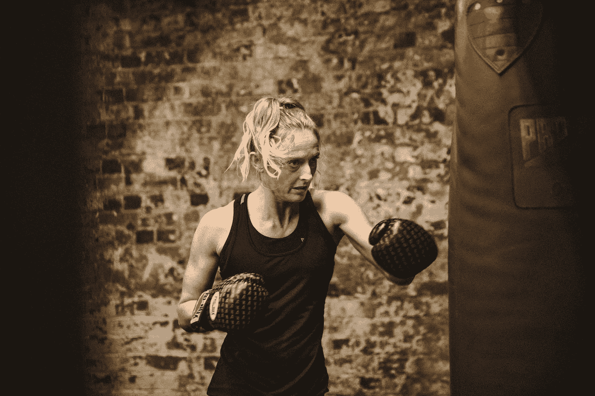
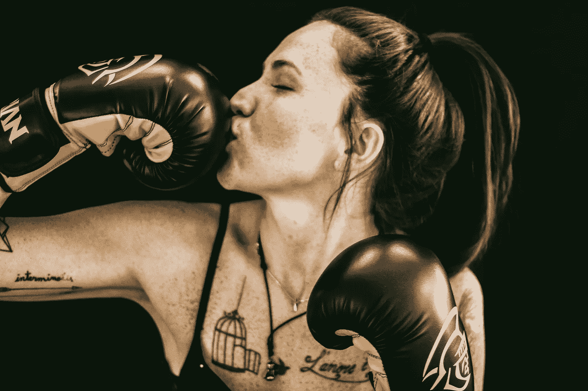

# 没有动力？你今天可以打脸了

> 原文：<https://medium.com/swlh/un-motivated-you-can-punch-today-in-the-face-b005453245ad>

# 说真的。你可以。

Photo by [Virgyl Sowah](https://unsplash.com/@virgyl?utm_source=unsplash&utm_medium=referral&utm_content=creditCopyText) on [Unsplash](https://unsplash.com/search/photos/boxing-gloves?utm_source=unsplash&utm_medium=referral&utm_content=creditCopyText)

激励是一个已经被使用、使用和过度使用的词。

它被定义为“某人做某事的普遍愿望或意愿”,但我更愿意把它理解为推动某事的核心。

有时我们知道我们应该做 x，y 或 z 的所有原因。我们的愿望在那里，我们的意愿也在那里，但我们似乎不能拖拖拉拉地去做。

我们通过使用社交媒体或做手头任何其他不重要的事情来避免。后来，我们感到内疚，我们因为没有简单地做这件事而自责。

我再也不想赢了。

我会大声清晰地说:**我已经厌倦了那些胜利的日子。**

我已经厌倦了想做某件事却没有足够的动力去做。

我受够了为没有完成我真正应该做的事情而感到内疚，然后吞下这种内疚。

事情是这样的:那些日子总会到来。我会有一个生病的孩子打乱我的常规，我会有一个项目的下一步让我害怕得不敢动，我只是不想动。但是从现在开始。**我在打那些日子的脸。**

你和我在一起吗？这就是我们将要做的。

# **第一步:回到内心**

最初是什么驱使你开始的？是什么激发了你的热情？你为什么的内心原因是什么？

我开始写作是因为我渴望写作。我需要。我有话要说，我想让全世界都听到。我真诚地相信，我的作品可以帮助另一个人克服生活中的障碍，成为他们一直想成为的人。它在我心中点燃了火花。一个激励我坐下来写作的火花，即使我不知道我要说什么。

这就是我的原因。

> 你有一个为什么。
> 
> 如果你不这样做，那就不值得。

我有一个为什么，当我早上起床时，我有一个为什么我吃什么，我有一个为什么我如何与我的孩子互动，我有一个为什么健身，我有一个为什么探索自然。

在我所做的事情的核心，每件事都有一个为什么。

我越是明白为什么，就越是被无情地驱使着去行动。

记住你的为什么。

# 第二步:关掉手机

说真的，把它设置成飞行模式或者干脆关掉。接下来的一个小时是一块砖。

当你关掉手机时，你的心态会开始感受到一股新的能量。

这一步对你的成功至关重要。

你手机的通知、电话和干扰会让你偏离轨道。

他们**会**阻碍你预期的结果(今天打脸)。

# 第三步:做第一步

深呼吸，吸气，呼气。重复三次，每次吸入更多的空气，每次呼出更慢的空气。

喝一大口水。

向后拉肩，挺胸，固定姿势，潜移默化地增强自信。

径直走向你一直回避的任务，完成第一步。

给你的博客写标题。

*收拾好你的运动包。*

*叠一件衣服。*

把一件东西移到它该放的地方。

给客户起草第一句话。

**第一步创造动力。**

# **#4 乘势而上**

你已经迈出了第一步。

第一步总是最难的:但现在已经完成了。

做下一步。

下一个。

下一个。

每次一小步。

当你创造和获得动力时，拍拍自己的背，小声鼓励自己。

> 动力是一块会疲劳的肌肉——但是当你有动力时，你不再需要动力来推动你前进。
> 
> 动量为你推动。

一旦你开始滚动，继续推动汽车就容易多了。

# 四个快速提示:

1.  无论你是否感觉自己像个废物，你都有能力去做你正在努力开始的事情。
2.  在一天的每一部分开始时，读一些你觉得鼓舞人心的东西。
3.  发现你害怕什么——承认害怕这个简单的行为可以让我们前进。
4.  尊重你自然的 90 分钟高能量到低能量的循环，努力补充能量。

# 结论

你能行的！

你——也只有你——可以带着决心和决心前进。

你有能力让自己大吃一惊，给自己留下深刻印象。

一步一步来，直到你的一天被正式打在脸上。

Photo by [Matheus Ferrero](https://unsplash.com/@matheusferrero?utm_source=unsplash&utm_medium=referral&utm_content=creditCopyText) on [Unsplash](https://unsplash.com/search/photos/boxing-gloves?utm_source=unsplash&utm_medium=referral&utm_content=creditCopyText)