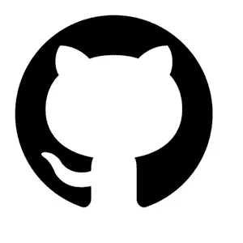

# 从头开始理解基本的 Webpack

> 原文：<https://medium.com/swlh/understand-basic-webpack-from-scratch-6a1976565ae0>


# 从头开始理解 Webpack 的基础知识

我第一次听到有人谈论 Webpack，甚至是 bundler，对我来说就像听到一种外星语言，一种抽象的东西，它正在做一些神奇的事情。


但由于我喜欢挑战，我决定探索 Webpack，看看我们是否能成为朋友，或者，就像最好的爱情故事一样，忽略对方。

## 我是如何处理的

对我来说，最有效的方法是从头开始创建一个简单的 javascript repo，然后尝试将 Webpack 应用到它上面，当然，在需要的时候 Google 并阅读 Webpack 文档，因为它们是水(或者一个好的 prosecco！)

我们现在将从头开始创建一个简单的回购，并使用 Webpack 玩一次，以了解其基本原理。

## 我在这个项目中使用的

[node . js](【https://nodejs.org/en/】T2)，

【纱线】(【https://yarnpkg.com/lang/en/】T4)

## 开始吧！


# 文件夹和包. json

*   创建一个名为 **basic-webpack-bundle** 的文件夹
*   在其中创建 package.json，运行命令

```
 npm init -y 
```

*   安装 Webpack

对于本教程，我使用了 Webpack 4 和 Webpack-cli 3。
**参考这些包的版本来跟随本教程:** [package.json 项目](https://github.com/Vanals/medium-basic-webpack-bundle/blob/master/package.json)。

即使我们在这里没有使用 Webpack 5，这仍然是理解 Webpack 如何工作的一个很好的教程！
最后，Webpack4 仍然被充分使用！

```
yarn add webpack@4.32.2
yarn add webpack-cli@3.3.2
```

## 创建 Webpack 配置文件

[Webpack doc]([https://webpack.js.org/](https://webpack.js.org/))。

> 开箱即用，webpack 不会要求您使用配置文件。然而，它将假设您的项目的入口点是`*src/index.js*`，并将结果输出到`*dist/main.js*`中，为生产进行缩小和优化。

一旦安装了 Webpack 基本包**在根文件夹中创建**
**web pack . config . js**，顾名思义，这就是我们亲爱的 bundler 的配置。

创建后，添加以下代码

```
const path = require(‘path’);module.exports = {
  entry: ‘./src/index.js’,
  output: {
    path: path.resolve(__dirname, ‘dist’),
    filename: ‘bundle.js’
  }
};
```

好吧！现在让我们深呼吸，一起看看这里发生了什么。


在第一行，我们是*要求***路径*其中自带 NodeJs。*

*路径模块提供了处理文件和目录路径的工具。
例如，用于解析项目根目录的绝对路径(通常是 webpack.config.js 所在的位置)*

*然后，我们将导出我们的模块，该模块目前只包含两个密钥。
**条目** **指向**，这是 Webpack 将运行以创建我们的包的文件。
**输出**包含设置我们的最终包文件的名称和放置位置。*

*现在我们知道了这些基本行在做什么，让我们创建我们需要的东西，这是我们的入口点文件 index.js。*

*   *手动或简单地使用鼠标创建一个源文件夹和 index.js*

```
 *mkdir src
touch src/index.js* 
```

*   *然后添加一些简单的代码，让它执行一项任务*

```
 *window.onload = function() {
 console.log(‘Thanks Marco Vanali!’)
};* 
```

# *创建并发布我们的第一个捆绑包*

*酷！现在让我们看看如何通过 Webpack 捆绑简单的 index.js 文件。*

*现在，让我们通过运行以下命令，针对我们已经创建的配置文件运行 Webpack*

```
 *yarn webpack --config ./webpack.config.js*
```

*结果，我们将看到一个名为 **dist** 的新文件夹，其中包含我们的 bundle.js。*

*bundle.js 将是一个包含所有压缩 javascript 的文件。*

## ***PS:**
为了简单起见，因为我们是好人，所以让我们直接在 package.json 中创建一个脚本；这样，我们将只运行*yarn bundle*而不必记住这一行可爱的代码。*

*   *在 package.json 中，用以下内容替换脚本对象*

```
 *“scripts”: {
  “bundle”: “yarn webpack --config ./webpack.config.js”
},* 
```

*标记`— config '允许我们指定 Webpack 配置文件的名称。在这种情况下，我们甚至不需要它，因为 webpack.config.js 是默认使用的。 ***—如果您想为不同的脚本使用不同的配置文件，config 非常有用。****

# *发动*

*时间快到了，我们现在要启动我们的回购，并查看 index.js 文件的结果。*

**

*到目前为止，我们已经有了一个包含我们的逻辑的 javascript 文件，但是在一个基本的网站项目中，除了 javascript，我们还需要什么呢？*

*一个 HTML 文件来托管它！*

*   *在**根文件夹**中创建一个 Html 文件，并在那里需要我们的 bundle.js*

*默认情况下，Webpack 在根文件夹中寻找 index.html 文件，当然，它可能不在我们想要的位置，但是我们将在下面看到如何确定它的位置。*

**

*   *在 index.html 文件中导入 bundle.js 文件*

```
*<!DOCTYPE html>
<html lang="en" dir="ltr">
  <head>
    <meta charset="utf-8">
    <title></title>
  </head>
  <body>
    <h1> Well done learning more about Webpack </h1>
    <script type="text/javascript" src="./dist/bundle.js"></script></body>
</html>*
```

*此时，我们想要运行我们的应用程序。
我们可以简单地打开我们的 index.html，但我们可能会在一些浏览器中出现 [CORS](https://developer.mozilla.org/en-US/docs/Web/HTTP/CORS) 错误，所以这不是理想的方法，但我们真正想要的是使用 Webpack 的功能，通过[**web pack-dev-server**](https://webpack.js.org/configuration/dev-server/)**定制我们的服务器。***

*让我们安装它*

```
 *yarn add webpack-dev-server -D*
```

*现在，在我们的 **package.json** 中，我们可以添加第二个脚本。一个用于构建我们的包，另一个用于在浏览器中启动我们的应用程序。*

*像这样:*

```
 *“scripts”: {
 “start”: “yarn webpack-dev-server --config ./webpack.config.js”,
 “build”: “yarn webpack --config ./webpack.config.js”
},* 
```

*因此，运行 **yarn start** 我们将使用[**web pack-dev-server**](https://webpack.js.org/configuration/dev-server/)运行我们的应用程序。*

*但是我们仍然需要为它编写配置。猜猜在哪里？*

**

# *配置开发服务器并移动 index.html*

*如果我们想要配置设置，比如运行应用程序的端口、从哪里获取内容、执行定制中间件等，该怎么办？*

*正如我们所说的 **webpack-dev-server** 将使用放在根目录中的 index.html 文件*服务*我们的 bundle.js。为了对其进行配置，我们必须转到 webpack.config.js，并在**模块**对象中添加 **devServer** 键和以下基本属性:*

```
 *const path = require(‘path’);module.exports = {
  entry: ‘./src/app.js’,
  output: {
    path: path.resolve(__dirname, ‘dist’),
    filename: ‘bundle.js’
  },
 **devServer: {
    contentBase: path.join(process.cwd(), ‘dist’),
    compress: true,
    port: 8050
  }**
};* 
```

***port =** 指定运行服务器的端口
**contentBase** =指定 webpack dev 服务器将在其中找到所有必要文件(index.html 和捆绑包)的路径。js)。*

*现在，我们正在使用 **webpack-dev-server** 并获得对我们应用程序的更多控制，我们将遇到一个小问题*

*如果我们现在进行回购:*

```
 *yarn start*
```

*不会再有用了。*

**

## *为什么？*

*这是因为，默认情况下， **webpack-dev-server** 会在 dist 文件夹中寻找我们的 index.html，而不是其他地方。*

****为了解决这个问题，*** 一旦完成了对我们的 HTML 文件的操作，我们就可以创建它的副本，并手动将其粘贴到 dist 文件夹中。
对吗？
明显没有！*

**

*这意味着我们每次修改时都必须手动复制 index.html。是的，但是我可以把它留在区里，在那里工作！那就更惨了！您不应该在您的 dist 文件夹中工作。)*

*会有什么选择？**那么，从根目录开始，在 dist 文件夹中包含 index HTML 的构建是什么样的呢？***

*这样，一切都将是自动的，人类将不再是必要的。*

**

*好吧，也许这是有点太多，但给了一个想法！*

# *Html Webpack 插件*

> *Webpack 主要通过插件和加载器工作，所以如果你知道如何使用它们，你就处于一个非常有利的位置:*
> 
> *[https://stack overflow . com/questions/37452402/web pack-loaders-vs-plugins-what-the-difference](https://stackoverflow.com/questions/37452402/webpack-loaders-vs-plugins-whats-the-difference)*

*为了实现我们的目标，我们可以使用一个名为[的插件 HtmlWebpackPlugin](https://webpack.js.org/plugins/html-webpack-plugin/)*

*   *安装插件*

```
 *yarn add html-webpack-plugin -D* 
```

*   *在我们的 webpack.config.js 中添加插件，现在看起来应该是这样的*

```
 *const path = require(‘path’);
var HtmlWebpackPlugin = require(‘html-webpack-plugin’);module.exports = {
  entry: ‘./src/app.js’,
  output: {
    path: path.resolve(__dirname, ‘dist’),
    filename: ‘bundle.js’
  },
  devServer: {
    contentBase: path.join(process.cwd(), ‘dist’),
    compress: true,
    port: 8050
  },
  plugins: [new HtmlWebpackPlugin({
    filename: ‘index.html’,
    template: ‘./index.html’
  })]
};* 
```

*正如你所看到的，我们在模块中创建了一个名为**插件的新键。***

*它的值是一个**数组，**其中每一项都是一个插件。如您所见，我们正在初始化 **HtmlWebpackPlugin** ，然后将我们的规范作为参数传递:*

*   *要创建的文件的名称，**文件名**，*
*   *而 HTML 文件要用作**的一个模板**，才能复制。*

*现在**将 index.html 文件**从 dist 文件夹移动到根文件夹
根路径就是我们在模板键中写的目标路径。*

*在尝试之前，在 HTML 文件中添加一些文本更改，并删除我们用来导入 bundle.js 的脚本。*

*为什么我们要移除它？因为我们的 HTML 插件也会解决这个问题！将自动添加在 webpack.config.js 文件的入口点键中指定的文件的导入。*

## *让我们现在就开始建造吧！*

```
*yarn build*
```

**

*哇哦。看那里！我们的分布文件夹现在有我们的 index.html 文件！
而且看起来跟我们在根部的一模一样！*

*现在*

```
*yarn start*
```

*并转到[http://localhost:8050/](http://localhost:8050/)
Wuala，我们的 bundle，放在 dist 文件夹里就服了。*

**

*我们可以将许多改进和配置添加到我们的 Webpack 配置文件和 repo 中。但我希望这个小练习能帮助你减少对它的恐惧并理解它。*

*结局并不坏，不是吗？！我其实挺喜欢的！*

**

# *奖金，有人说 SCSS 和装载机？*

*让我们快速做最后一件事，以加强我们的理解。*

**

*   *在 src 文件夹中，创建另一个名为 style 的文件夹，并在其中创建一个名为 main.scss 的文件*

```
 *mkdir src/styles
touch src/styles/main.scss* 
```

*   *在 scss 文件中添加以下代码:*

```
 *body {
 background: tomato;
 margin: 0;
 padding: 0;
}* 
```

*   *将 SCSS 文件导入到 src 文件夹中的 index.js 文件中*

```
 *import ‘./styles/main.scss’* 
```

*酷！现在我们有了导入的样式，所以一切都会好的，对吗？*

*如果你现在尝试构建应用程序，Webpack 会告诉你到底需要什么。*

> *您可能需要一个合适的加载程序来处理这种文件类型。*

**

*你需要一台装载机。这是因为默认情况下【Webpack 只能捆绑 js 文件，在这种情况下，我们需要先将 scss 转换成 css，然后再将 css 转换成 js！*

**

*SCSS becoming JS*

## *sass-loader*

*我们将使用的装载机是 [sass-loader](https://github.com/webpack-contrib/sass-loader) 。*

*   *正如它的文档所说，让我们安装下面的包*

```
*yarn add style-loader css-loader sass-loader node-sass -D*
```

*   *在配置文件的**模块中添加加载程序。导出对象**，添加一个名为**模块的新键，并进行如下设置。***

```
*module: {
  rules: [{
   test: /**\.**scss$/,
   use: [
  "style-loader", // creates style nodes from JS strings
  "css-loader", // translates CSS into CommonJS
  "sass-loader" // compiles Sass to CSS, using Node Sass by default
   ]
  }]
}*
```

> *配置文件中的模块键是我们通常添加加载器的地方。*

*酷！大部分已经完成了。现在再跑一次*

```
*yarn build*
```

*现在，如果你打开 bundle.js，查找单词 **tomato** (我们在 scss 文件中选择的背景颜色)，我们会在那里找到它！*

*这是个好兆头，不是吗？*

**

*   *现在快跑*

```
*yarn start*
```

*   *去…*

```
*[http://localhost:8050/](http://localhost:8050/)*
```

*享受番茄的背景！我们做到了！干得好！*

**

*我再次希望这有助于理解 Webpack 的基本工作原理！如果您有任何问题，请随时**发表评论**和**关注我**了解更多内容。*

*在互联网上，有很多资源可以让你更深入地理解 Webpack，看看你还能用它做些什么惊人的事情！*

**

*你可以在我的 GitHub:
[https://github.com/Vanals/medium-basic-webpack-bundle](https://github.com/Vanals/medium-basic-webpack-bundle)中找到**这个项目的回购***

# *个人:*

## *跟着我*

*[领英](https://www.linkedin.com/in/marco-vanali/)*

*[推特](https://twitter.com/vanali_marco%20Linkedin:%20https://www.linkedin.com/in/marco-vanali/)*

*你想知道更多关于我的事吗？**阅读我是如何成为一名开发人员的**[https://medium . com/@ marcovanali/a-journey-from-nursing-to-web-developing-34 aa 44 a 153 AE](/@marcovanali/a-journey-from-nursing-to-web-developing-34aa44a153ae)*