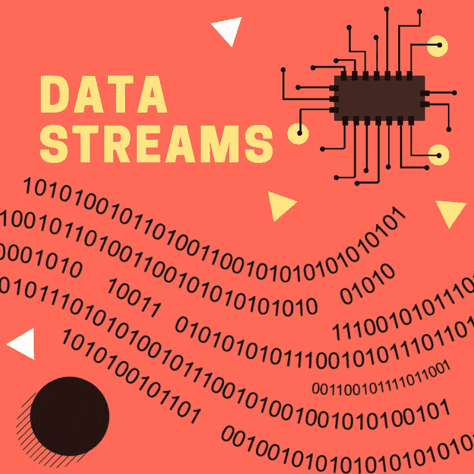

# 理解计算机网络中的数据流

> 原文：<https://medium.com/swlh/understanding-data-streams-in-computer-networking-7d7ebf9ba162>

这篇文章将建立在我的上一篇文章[理解计算机网络中的套接字](/swlh/understanding-socket-connections-in-computer-networking-bac304812b5c)的基础上，因为我将继续写我用 Java 构建 HTTP 服务器的经历。

对于套接字的完整(介绍性)故事，只需阅读上一篇文章，但总而言之，计算机网络中的套接字是两个软件程序之间的连接点。但是到底是怎么回事…