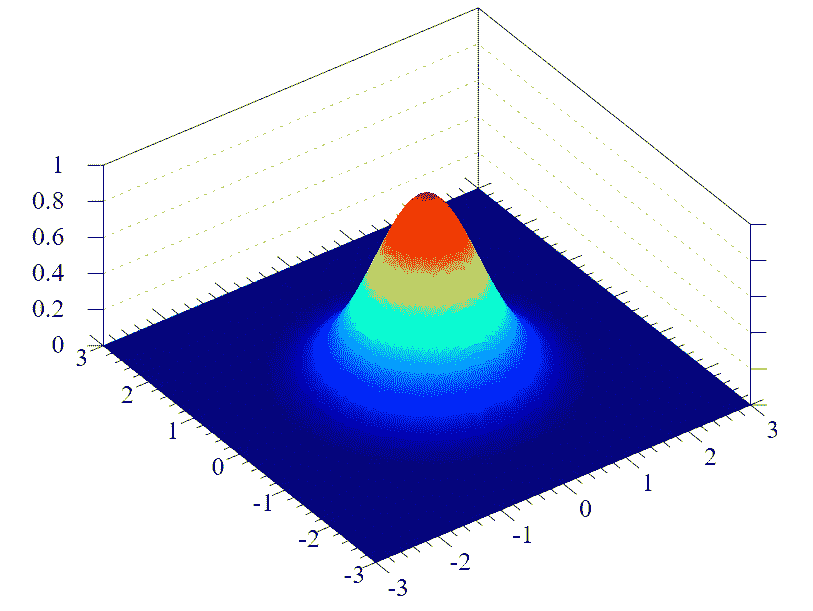

# 理解高斯分类器

> 原文：<https://medium.com/swlh/understanding-gaussian-classifier-6c9f3452358f>

Normal Distribution (Wikipedia)

> 经验是我们秃顶时大自然给我们的梳子。~谚语

# 概观

正态分布也许是常用的统计分布函数之一。基本上无处不在。很可能我们已经直接或间接地使用过它了。在这篇文章中，我们讨论一元和多元正态分布，以及我们如何能得到一个 ***生成*** …