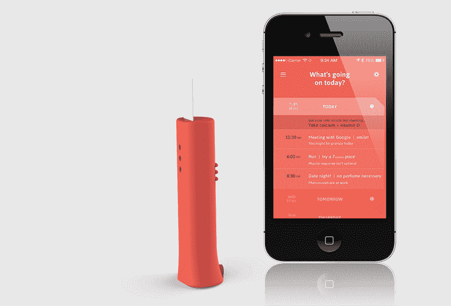

# 了解更年期:科技如何帮助？

> 原文：<https://medium.com/swlh/understanding-menopause-how-can-technology-help-a7f5c00d3e4f>

Image credit: [@ryanmoreno](https://unsplash.com/@ryanmoreno)

去年，我接受了一项不同寻常的任务:寻找帮助围绝经期女性的创业公司。目的是展示太空中最令人兴奋的技术。然而，一开始只是一个简单的市场调查，最终却成为对女性科技行业最大差距之一的洞察。进一步的研究证实:有一个很大的机会来解决有更年期症状的妇女的需求，迄今为止很少有企业家认真考虑过。继续读下去，深入了解这个问题，看看一些初创公司是如何开始应对这一挑战的，如果你正在寻找，为你的下一个商业想法获得一些灵感。

我在说什么？为什么它很重要？

首先，让我们从这样一个事实开始，尽管我是女性，但我不知道什么是围绝经期。多亏了我最好的朋友谷歌，快速搜索证实了[围绝经期是](https://www.nice.org.uk/guidance/ng23):

> *“妇女排卵和月经周期不规则导致绝经的时期，持续到最后一次月经后 12 个月。围绝经期也被称为绝经过渡期或更年期。*

从更人性化的角度来说，这是一个过渡时期，女性可以经历更年期症状，但不会进入更年期。大约 10 个女性中有 8 个会在月经停止之前或之后的一段时间里经历这样的症状，有些甚至提前了 10 年。

考虑到规模，没有人谈论这个问题似乎很奇怪。当我与之交谈的一些女性善意地指出，即使是那些经历这种症状的人也常常不知道他们的症状意味着什么时，事情变得有点清楚了。想象你是一名 40 多岁的女性，开始出现相关症状:情绪波动、睡眠困难、肌肉疼痛、性欲低下等。你不知道你的身体发生了什么，决定去看医生。你列出了你的一些症状，得到了意想不到的回应，“听起来你好像很抑郁。”

*Image credit: @yrss*

如果没有关于女性激素的额外测试/数据，这些症状只会显示表面图像，使得常见的围绝经期症状类似于精神健康问题。令人担忧的是，不知情的医院来访者会被开抗抑郁药。对许多人来说，这可能导致多年的无效治疗。然而，如果处理得当，症状可以完全消失。很明显，我们需要一种工具，能够为女性提供正确的数据，让她们能够将这些数据带给医生，甚至是能够立即识别出症状的专家。

令我惊讶的是，尽管绝大多数女性都会以这样或那样的方式经历这种情况，但只有少数初创公司直接解决了这个问题。此外，甚至没有人谈论它。女性和男性似乎都觉得这个话题太尴尬、不舒服，甚至被污名化。我与几位女性交谈，她们告诉我她们感到多么尴尬，当她们经历热潮红和令人虚弱的偏头痛(可能是最常见的更年期症状)时，她们要求休假一天。

Image credit: @davidfanuel

那么技术能帮上什么忙呢？

识别有这种症状的女性并找到她们日常生活中的接触点并不是一件容易的事。通常情况下，它需要用户预先存在的意图，理解某些事情可能是不对的，并且可以通过数字手段找到帮助。直到人们对技术有充分的信心还有很长的路要走，但是对于那些有兴趣了解它如何帮助的人来说，有几个选项可供选择。

例如，当人们下载 [B-Wom](https://www.b-wom.com/en/) ，一个女性健康和幸福的数字教练，他们的主要目标可能只是改善他们每天的感觉。然而，应用程序内的用户之旅意味着每个女性都从一份详细的问卷开始体验。这样，即使那些对自己的症状不确定的人也可以了解他们的身体发生了什么，并得到有益的指导。B-Wom 有可能识别处于围绝经期的妇女，即使她们最初认为她们的症状与其他疾病有关。

同样， [Adia Health](https://adiahealth.com/) 帮助女性进行诊断和持续治疗，但就她们的情况而言，首先是为女性提供家庭手指穿刺激素测试。然后，通过他们的平台，结果被用于通知专业生育专家的治疗。两者都很棒，因为它们符合现有的用户旅程，帮助那些已经在寻求解决方案但可能没有完全意识到其感受背后的原因的妇女——这是围绝经期妇女的常见体验。

了解你的荷尔蒙对找出治疗方法非常重要。验血是目前最常见的方法，但可以理解的是，许多人不喜欢定期刺破自己来测试雌激素或孕酮水平。还有其他选择，尽管在这一点上我们开始转向更间接的解决方案。例如， [Yono Labs](https://www.yonolabs.com/) 、 [DuoFertility](https://www.duofertility.com/) 和 [Temp Drop](https://tempdrop.xyz/) 都是追踪基础体温(BBT)的可穿戴设备——你的最低体温可以作为你体内雌激素水平的代表。最大的使用案例是在计划生育中，但 BBT 也可以是一种跟踪周期及其规律性的方法，这反过来可以是围绝经期的指标。

Source: [Link.](http://www.yonolabs.com)

事实上，在我的研究中，我发现了许多相当多样的诊断解决方案:[health . io](https://healthy.io/)用于尿检， [cue.me](https://www.cuehealth.com/) 用于唾液， [Kenzen](https://www.kenzen.com/) 用于汗液分析等等。所有这些都以这样或那样的方式让人们了解自己的身体。然而，如果 BBT 开始偏离我们需要的用例，这些解决方案甚至更加间接。这些公司代表了一些最复杂和最令人兴奋的解决方案，但不幸的是，它们的目标是其他健康问题(例如，肾病、压力、一般运动表现等)。).技术是存在的，但它根本不是为了解决女性的健康需求。

我也遇到过大量的周期跟踪应用程序，但在大多数情况下，它们在女性科技世界中占据了一个未定的位置:当然有用，但不是为了解决任何复杂的挑战。出于这个原因，我将跳过它们，但如果你感兴趣，你可以在这里找到一些好的选项。

谁是最受欢迎的？

那么还剩下什么呢？许多令人印象深刻的研究和设计的解决方案，但在其旅程的早期。 [Grace 腕带](https://www.gracecooling.com/)就是其中之一，它是一种手镯的原型，旨在通过在手腕周围发送局部冷却感来缓解热潮红。Grace 手镯中的传感器将允许连续收集数据，这将有助于更深入地了解最常见的围绝经期症状之一。我喜欢 Grace 融入女性生活的方式:它是独立的，用户不必做任何事情就能从佩戴配饰中获得价值。这也是我见过的唯一一家不仅能在症状出现时就与之对抗，甚至能在潮热发生前预测和管理它的初创公司。

Peter from Grace talking about his product.

[Simi](https://www.globalgradshow.com/projects/simi/) 是这个早期创业子类别中另一个有趣的例子，它被认为是一个端到端的解决方案，包含一个基于唾液的激素追踪器、一个应用程序和一个分析工具，以帮助女性管理她们的健康。西米非常强调便利性:给女性一个便携式荷尔蒙追踪器，让她们能够随时监控自己的健康状况。这似乎是面向要求更高的观众，他们希望随时了解情况，更加独立，而不一定需要去看医生才能获得结果。虽然 Simi 只是一个概念，但我喜欢它给用户多少控制权——由个人决定他们是否监控自己的激素，多频繁，是否分享结果等。

Source: [Link.](https://www.globalgradshow.com/projects/simi/)

Grace 和 Simi 这两个最受关注的解决方案来自有设计背景的学生，这可能不是巧合。改变想法并不容易，但将一些经常被误解的东西变成一个精心制作的产品，把用户的需求放在第一位，是良好设计的基石，也是鼓励正确对话的重要一步。

面向 40 岁以上女性的 femtech 解决方案市场仍有很长的路要走。任何想要控制症状的人都需要找到一系列间接的途径和脱节的解决方案来做到这一点，这似乎是倒退了。然而，这不仅仅是连接用户旅程的碎片部分:我们还可以做更多的事情来改变看法，帮助人们在我们现在尴尬沉默的地方培养开放的对话。如果幸运的话，这将导致更大的同理心，并鼓励新一波实用、相关和有效的解决方案，让女性控制自己的健康。