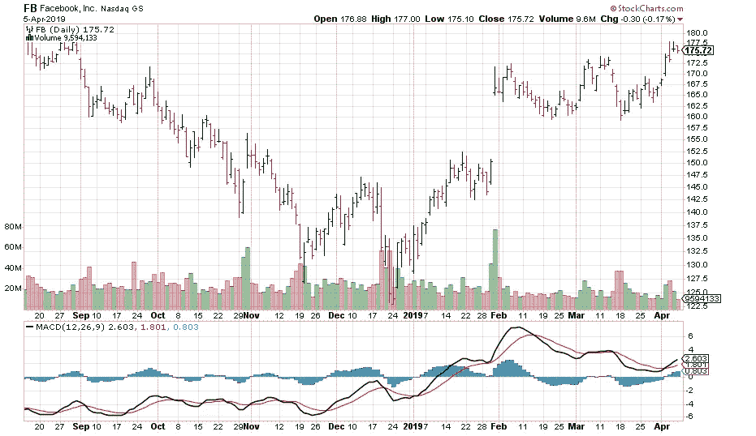

# 如何找到下一只像特斯拉或 Chipotle 这样的动量股，并知道何时退出？

> 原文：<https://medium.com/swlh/understanding-momentum-indicators-macd-8a1077c8ab09>

承认吧，你点击这篇文章是因为你一直想早点买入并持有像特斯拉(Tesla)、Chipotle 或 Lululemon 这样的股票，并获得迄今为止的巨额收益。但是，你已经被股票的波动吓到了，不知道什么时候进场，什么时候出场。当这些股票着火时，它们真的会推动你的收益，让投资变得有趣。在这篇文章中，我将讨论如何找到下一个动量股票，并持有它，直到趋势强劲。我也会解释何时知道趋势已经改变，何时退出你的头寸。

动量指标与趋势指标密切相关。尽管主要是用来评估当前趋势的强度，动量指标也可以指示趋势何时放缓，何时可能要改变。

在这篇文章中，我将讨论一个最广泛使用的动量指标来衡量股票的动量，称为**移动平均收敛发散(MACD)** 。

不用担心，虽然是技术指标，但你不需要成为极客也能看懂。

让我们开始吧。

Source: [Momentum](https://www.dukeofdollars.com/guest-posts-and-features/we-guest-posted-chris-takes-on-the-momentum-series-interview/)

# 什么是 MACD？

移动平均收敛/发散(MACD)振荡器是最简单和最广泛使用的动量指标之一。读作“Mac-Dee”，这个指标结合了两个世界的精华:**趋势跟踪和**。MACD 指标使用指数移动平均线(EMA ),当移动平均线交叉、收敛和发散时，它围绕零线振荡。

# 事实是:它是如何计算的？

MACD 线是 12 天指数移动平均线(EMA)小于 26 天 EMA。给定一天的收盘价用于这些移动平均线。

一条**信号线**是用指标绘制的 MACD 线的 9 日均线来表示的，用来标识转弯。MACD 和 9 日均线的区别，代表了 MACD 柱状图。当 MACD 线高于它的信号线时，意味着柱状图为正，当 MACD 线低于它的信号线时，意味着柱状图为负。

根据你的交易风格和目标，不同的价值可以在你的交易平台上替代和使用。广泛使用的典型设置有 **12、26 和 9** 。

# 你如何解读这个指标？

正如你现在所知道的，你正在处理两条均线的收敛和发散。当均线相向移动时，代表它们正在收敛。当均线相互背离时，意味着它们在背离。

较短的移动平均线(12 天)更快，是大多数 MACD 移动的原因。较长的移动平均线(26 天)速度较慢，对标的股票的价格变化反应较弱。

MACD 线在零线上下波动，零线也被称为中线。这些交叉标志着 12 日均线已经穿过了 26 日均线。方向取决于均线交叉的方向。当 12 日均线高于 26 日均线时，表明 MACD 为正。当较短的均线与较长的均线背离越大，正值越大。这意味着上涨动力正在增加。当 12 日均线低于 26 日均线时，表明 MACD 为负。当较短的均线背离到较长的均线之下时，负值会增加。**这意味着下行动能正在增强。**

> “高买高卖”

# 交叉:信号线和中心线

信号线交叉是最常见的 MACD 信号。信号线是 MACD 线的 9 日均线。作为指标的移动平均线，它跟随 MACD，更容易发现 MACD 转弯。当 MACD 上涨并穿过信号线时，出现**多头交叉**。当 MACD 向下穿过信号线下方时，就会出现看跌交叉。根据移动的力度，交叉可以持续几天或几周。

中线交叉是下一个最常见的 MACD 信号。一个**看涨** **中线交叉**发生在 MACD 线移动到零线上方转正的时候。当基础证券的 12 日均线高于 26 日均线时，就会发生这种情况。当 MACD 移动到零线以下变成负值时，就会出现**看跌中线交叉**。当 12 日均线低于 26 日均线时，就会发生这种情况。

中线交叉可以持续几天或几个月，取决于趋势的强度。只要有持续的上升趋势，MACD 将保持正值。当趋势持续下降时，MACD 将保持负值。

# 分歧

当 MACD 背离了标的股票的价格行为，背离就形成了。当股票创下更低的低点，MACD 形成更高的低点时，就形成了**看涨背离**。该股的较低低点证实了当前的下跌趋势，但 MACD 的较高低点显示下跌动力较小。尽管下降，但只要 MACD 仍处于负值区域，下跌势头仍超过上涨势头。下跌势头放缓有时可能意味着趋势逆转或大幅反弹。

当股票创下更高的高点，MACD 线形成更低的高点时，就会形成看跌背离。股票的较高高点对于上升趋势来说是正常的，但是 MACD 的较低高点显示上升势头较小。即使上涨势头可能会减弱，但只要 MACD 为正，上涨势头仍会超过下跌势头。上升势头放缓有时可能意味着趋势逆转或大幅下跌。

应该谨慎对待分歧。熊市背离在强劲的上升趋势中很常见，而牛市背离经常出现在强劲的下降趋势中。上涨趋势通常以强劲的上涨开始，上涨势头会猛增(MACD)。尽管上升趋势仍在继续，但速度较慢，导致 MACD 从高点下跌。上涨势头可能没有那么强劲，但只要 MACD 线在零以上，上涨势头就会继续超过下跌势头。相反的情况发生在强势下跌的开始。

> “趋势是你的朋友。”

# 在脸书的 6 个月日线图上使用 MACD

让我们把你到目前为止学到的东西应用到实际的股票中。考虑脸书(股票代码:FB)从 2018 年 9 月到 2019 年 3 月的 6 个月日线图。

Source: [StockCharts.com](https://stockcharts.com/)

在上面的技术图中，黑线代表较快的 12 日均线，红线代表较慢的 26 日均线。正如你在 2019 年 2 月的第一周看到的那样，12 日均线穿过 26 日均线，并进一步远离 26 日均线，表明势头不断增长，并持续更新到 2019 年 2 月的接下来 3 周，脸书的股价从 130 美元上涨到 147 美元。此外，在 2019 年 3 月 11 日左右，12 天均线向下穿过 26 天均线，表明 2019 年 3 月接下来的 3 周势头下降，脸书的股价从 172.5 美元跌至 162.5 美元，证实了这一点。

# 底线

MACD 指标提供了趋势和动量的独特组合，可以应用于日线图、周线图或月线图。MACD 的典型设置是 12 日和 26 日指数移动平均线(EMA)之差。

最后，记住 MACD 线是用两条均线的实际差值计算的。这意味着 MACD 价值取决于标的股票的价格。

请继续关注我的下一篇文章，我将讨论另一个动量指标来评估基础股票价格运动的速度和变化。

*如果你喜欢读这篇文章，请留下你的评论或点击下面的拍手图标来表达你的感谢。如果你想让其他人从这篇文章中受益并帮助传播，请在你最喜欢的社交媒体平台上分享。谢谢你的时间。*

# 放弃

*以上文章的内容仅用于信息和教育目的。它无意成为投资建议。此外，我与这篇文章中提到的股票或 ETF 的任何公司都没有业务关系。请在投资前考虑所涉及的风险和您的个人财务状况，或寻求正式许可的金融专业人士的投资建议。*

# 我的其他文章:

*   *动量投资:做秘书处:*[https://medium . com/swlh/Momentum-Investing-Be-Like-The-Secretariat-5d 27521 ba 10](/swlh/momentum-investing-be-like-the-secretariat-5d27521ba10)
*   *股票投资:利用利润表进行基本面分析:*[https://medium . com/@ amrut . Patil 88/Stock-Investing-Fundamental-Analysis-Using-companies-Income-Statement-37 b0d 80531 f1](/@amrut.patil88/stock-investing-fundamental-analysis-using-companys-income-statement-37b0d80531f1)
*   *使用关键比率的基本面分析:*[https://medium . com/@ amrut . Patil 88/stock-investing-Fundamental-Analysis-Using-Key-Ratios-ed 02 f 32 e 88 AE](/@amrut.patil88/stock-investing-fundamental-analysis-using-key-ratios-ed02f32e88ae)

# 关于我

Amrut 是一名全栈软件工程师，他热衷于设计和开发 web 和移动应用程序。他喜欢写关于技术、编码、投资、交易、金融和经济的文章。业余时间，阿姆鲁特喜欢了解上市公司的商业模式，并分析它们的财务报表。他坚信通过高质量的工作为人们的生活增加价值，并赋予人们掌控个人财务的权力。

## 这篇文章发表在 [The Startup](https://medium.com/swlh) 上，这是 Medium 最大的创业刊物，拥有+441，678 名读者。

## 在这里订阅接收[我们的头条新闻](https://growthsupply.com/the-startup-newsletter/)。

