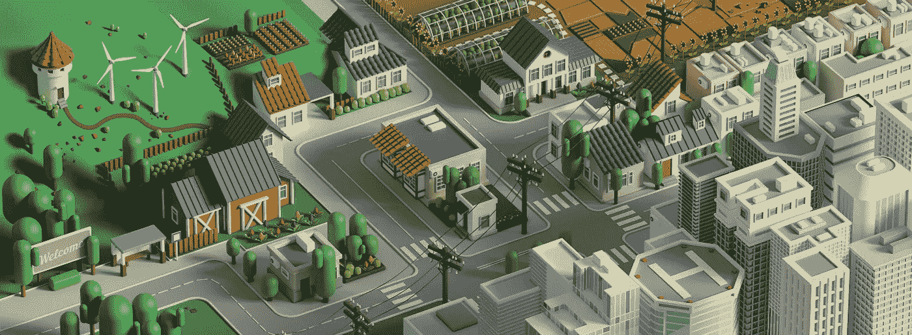
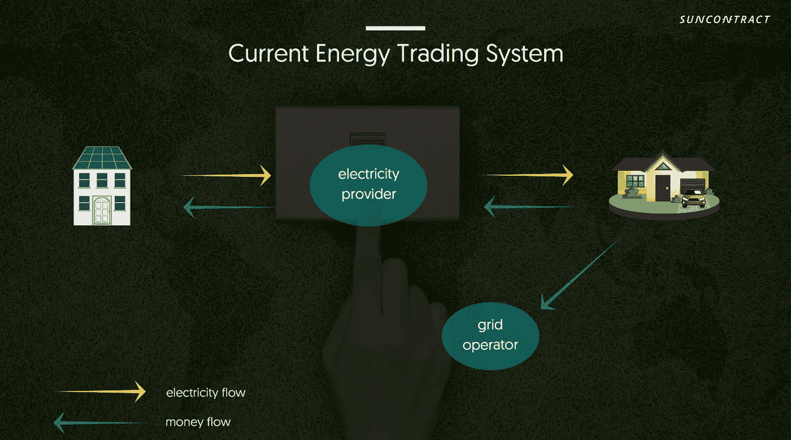
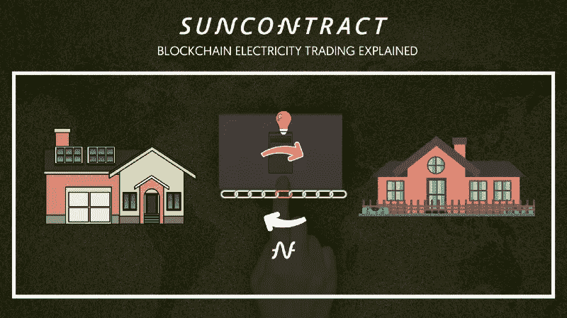
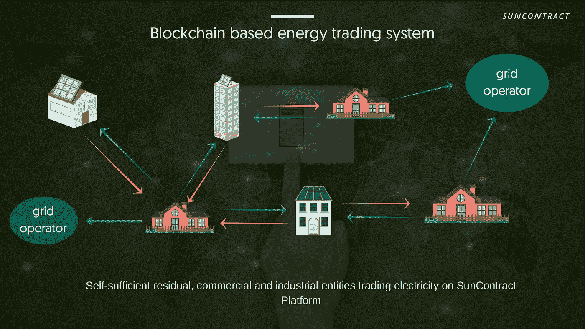
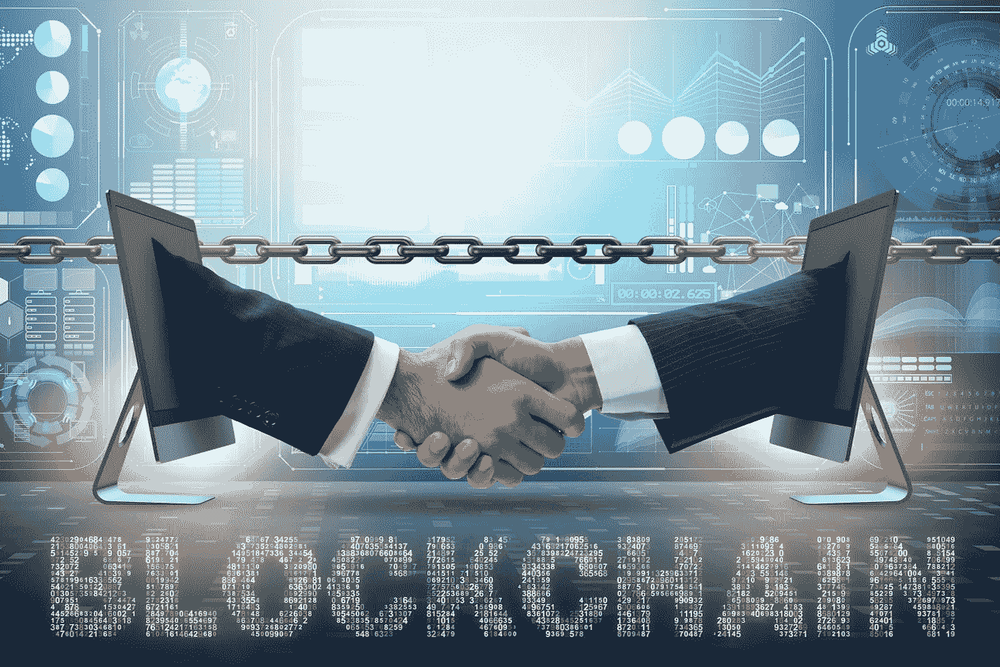

# 了解 P2P 能源交易

> 原文：<https://medium.com/swlh/understanding-p2p-energy-trading-a477eb7b55e0>

## SunContract 使用案例

对等能源交易是一个概念，其基础在于对等经济的思想。简而言之，共享经济。随着太阳能和电池存储系统的增加，P2P 能源交易系统的概念变得越来越流行。这个系统允许消费者利用其他用户生产的超过他们需要的能量。

[SunContract](https://suncontract.org) —我们今天关于 P2P 能源交易的文章的使用案例是一个能源市场，它利用区块链技术透明、不可改变的特性来优化电力分配。

虽然大多数市场不鼓励垄断，但能源部门的情况完全不同，该部门仍然高度集中，严重依赖垄断。SunContract 的愿景是开放能源市场，允许更大的总能源产量，并为能源客户提供多种选择。

在该平台上，用户可以自由选择他们喜欢的能源选项，选项范围从太阳能到水电、沼气、风能以及热电联产。虽然可再生能源经常被认为是破坏能源市场稳定的坏名声，但 SunContract 团队坚信，可再生能源实际上可以通过增加能源生产来源的更多选择来促进市场健康和稳定。

## 那么 P2P 能源交易到底是怎么运作的呢？

P2P 能源交易是我最喜欢讨论的事情之一，因为这是一个我身处其中的行业。上图向你展示了许多欧洲国家的现行制度。

以前，生产商会以低于最优价格的价格将能源出售给一家中间商公司，然后中间商公司会通过将能源以更高的价格出售给最终消费者来获利。在 SunContract 中，生产者和消费者直接就价格达成一致。协议的结果是消费者的价格较低，而生产者的价格高于他卖给中间商的价格。通过这种方式，消费者节省了电力成本，而生产商利润更高，甚至可以更快地收回生产资产的成本。

在 [SunContract 交易平台](https://suncontract.org)上的任何生产者都可以成为交易者，将他们多余的电力提供给其他人。这使得其他消费者更容易购买基于他们选择的可再生能源的电力。此外，电力价格可能低于传统能源供应商的价格。

P2P 能源交易的主要优势是:

*   **没有中间人——人们根据自己的条件进行交易**
*   每个人都节省了资金—运营成本降至最低
*   直接与其他消费者进行透明交易

## 电力作为一种商品

一种新的观点认为电是一种商品。人们可以选择如何使用，卖给谁。P2P 能源交易是在批发市场中保持竞争性电价的有效方式。

我是说，谁愿意做一个被动的受市场规则支配的消费者呢？随着新技术的出现，社会继续识别潜在的卖家或买家。这已经发生了。想想像 Gumtree 和易贝这样的网站，用户根据自己的条件与他人进行交易。

## P2P 能源交易允许玩家:

*   将他们的能源产品免费或打折卖给朋友和家人
*   选择[从邻居那里购买太阳能，](https://suncontract.org)或者支持当地的风力或太阳能发电场
*   选择从分布式屋顶太阳能系统或家庭电池组，甚至邻居那里获取尽可能多的能源

对于一个符合“点对点太阳能”定义的项目来说，**用户设定他们自己的条款是主要的好处。**最重要的是价格。消费者设定他们的价格限制，例如任何来源的价格不超过 25c/kWh。

在这种情况下，任何生产商都可以选择以该价格或更低的价格出售电力。然而，如果在给定时间内卖方很少，用户将不得不退回到 SunContract 平台电价。与其他能源供应商相比，这一价格仍然具有竞争力，并为平台上的用户提供保证，他们的家庭永远不会没电。为了提供这种备用能源，SunContract 与斯洛文尼亚的能源公司 SONCE 合作，该项目目前正在全面展开。

Zoomed out look at P2P on SunContract’s platform

## 那么区块链和 P2P 能源交易有什么关系呢？

传统上，为了购买或出售电力，交易者需要起草合同并直接相互沟通。许多合同可能会变得复杂。交易者互相打电话、发电子邮件或使用即时通讯工具。这是一个耗时、低效且昂贵的过程。

然而，随着区块链的推出，SunContract 平台上的交易者能够直接交易，对电力进行竞价，并让卖方将其转化为交易，反之亦然。这是通过实施智能合同实现的，不需要中央零售商。

智能合约本质上是仅在满足特定条件后才完成的交易。例如，如果我想以每千瓦时 15 英镑的价格购买电力，智能合同只有在卖方愿意满足这一条件并交付电力时才会激活。此外，每天还会向平台上的剩余电力卖家付款。

区块链技术为 SunContract 这样的公司提供了大幅节约成本和提高流程效率的机会，在这个能源行业效率低下的时代，这一点太有吸引力了，不容忽视。

多亏了区块链，我们现在可以提高效率，降低购买和销售电力的成本。更具革命性的是区块链将智能电表整合到区块链中的能力，计算机可以实时自动调节需求和供应，以更好地平衡电网。虽然这项技术仍处于起步阶段，但很明显可以看到区块链的巨大潜力。

这就是了。P2P 能源交易 101。

[*Winfred k . Mandela*](https://www.linkedin.com/in/winfred-k-mandela/)*是区块链领域卓有成就的营销人员和业务开发人员。她负责将各公司产品团队的创新与业务部门以客户为中心的运营联系起来，以建立区块链品牌，在实施项目的地区创造消费者意识，并每天通过他们的渠道推动客户对品牌的偏好。Winfred 喜欢在户外骑自行车，喜欢分析市场，并且总是喜欢读一本好书！*

## 这篇文章发表在 [The Startup](https://medium.com/swlh) 上，这是 Medium 最大的创业刊物，拥有+446，678 名读者。

## 订阅接收[我们的头条新闻](https://growthsupply.com/the-startup-newsletter/)。

