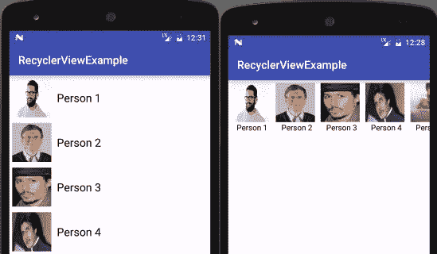

# 了解回收器视图

> 原文：<https://medium.com/swlh/understanding-recycler-view-831c9c338959>

This is how recycler view looks like

随着 Android Lollipop(即 Android 5.0)的出现，**回收查看**正式开始。在 Android 中，**recycle view**是 ListView 和 GridView 的高级灵活版本。它是一个用于显示大量数据集的容器，通过保持有限数量的视图，可以非常有效地滚动这些数据集。

在 API 级别 21 (Android 5.0，即棒棒糖)的材料设计中引入了 RecyclerView