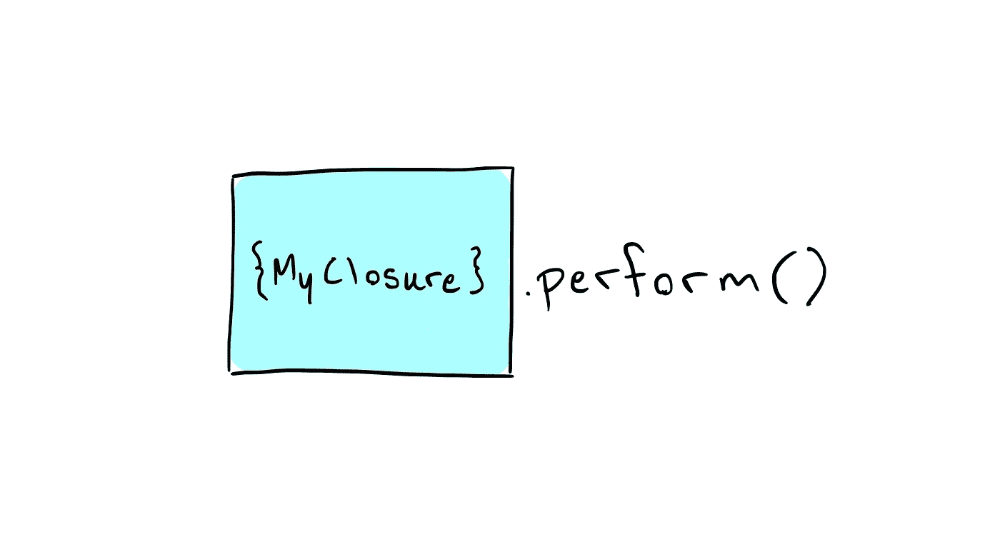

# 理解快速关闭

> 原文：<https://medium.com/swlh/understanding-swift-closures-8f6aa4ca3163>

在前一篇文章中，我们讨论了面向协议的编程以及它给我们带来的好处。今天，我们来看看 Swift 闭包，问问自己如何利用它们简洁明了的语法来改进我们的代码。

# 什么是闭包？

> *"闭包*是自包含的功能块，可以在你的代码中传递和使用…