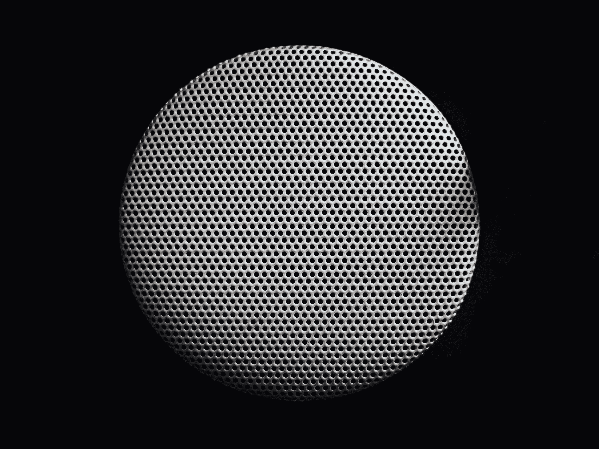

# 我们的技术用来与我们交流的哔哔声和嗡嗡声的隐藏语言…

> 原文：<https://medium.com/swlh/understanding-the-hidden-language-of-beeps-and-buzzes-our-technology-uses-to-communicate-with-us-8c50e9562f4a>

## 从你醒来时笔记本电脑播放的朗朗上口的音乐，到开着的冰箱门发出的尖锐的咩咩声。我们的技术不断与我们交流。但是我们真的了解它们的全部用处吗？

The hundreds of beeps your technology makes to communicate with you often go unnoticed | Photo by [Kyle Johnston](https://unsplash.com/photos/NaG0G9Wi7nI?utm_source=unsplash&utm_medium=referral&utm_content=creditCopyText) on [Unsplash](https://unsplash.com/search/photos/sound?utm_source=unsplash&utm_medium=referral&utm_content=creditCopyText)