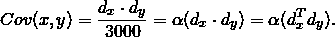
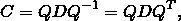
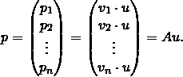

# 理解面部识别降维背后的数学原理(1)

> 原文：<https://medium.com/swlh/understanding-the-math-behind-dimension-reduction-in-facial-recognition-1-cb18368d23c0>

## 阅读我的初学者友好的证明，探索线性代数的应用

降维是计算机科学中的一种常见技术，你们大多数人可能都以某种方式遇到过，但并不是每个人都理解它是如何从数学上推导出来的。在这一系列文章中，我将通过一个简单的面部识别示例向您介绍降维背后的线性代数。除了理解数学，你还将看到降维如何有助于简化图像识别的任务。特别是，我将谈论特征向量/特征值，频谱定理和主成分分析。

## 为什么需要降维

为了重新唤起你对降维的记忆，让我们从一个假设的例子开始。米德尔伯里学院的通信部门存储了从每个米德尔伯里学院学生那里拍摄的 3000 张照片。系主任最近在当地报纸上发现了一张学生的照片，她想知道这个学生是否属于米德尔伯里。

由于图像的多维性质，设计一个有效的面部识别模型是很困难的。如果把我们讨论的范围限定在黑白图像上，我们可以把一幅 m × n 像素的图像想象成一个矩阵，矩阵中填充了 0(黑)到 255(白)之间的实数。每个矩阵的维数为 m × n，每个像素代表一个维数。

如果我们假设每张学生照片的尺寸为 1，600 × 1，200，然后我们将新图像与 3，000 张照片中的每张照片逐个像素地进行比较，我们将需要进行 3，000 × 1，600 × 1，200 = 5，760，000，000 次比较。我们的目标是减少学生照片的尺寸，而不丢失(或最小化丢失)照片中捕捉到的差异。在深入研究具体步骤之前，我想先介绍一下方差的基本概念。

## 方差的直观概述

方差是平均值的平方差的平均值。例如，给定一列实数`x_1...x_n`，我们将方差定义为:

在这个应用中，差异是区分一个人的塌鼻子和另一个人的鹰钩鼻的标准。我们希望米德尔伯里学生的 3000 张照片之间的差异尽可能高，因为高差异会提高识别的准确性。直观上，方差随着维数的增加而增加。如果给你一张完整的照片，而不仅仅是鼻子周围的像素，你会更容易识别你朋友的照片。然而一些维度可能是重复的。例如，彼此相邻的像素可能具有非常相似的值，因为它们捕捉了面部的相同种类的变化。

回想一下，在我们的例子中，导演从 1600×1200 = 1920000 维开始。在本文的剩余部分，我将演示基的改变如何帮助我们将维数缩减到 t < 1，920，00，而不损失任何方差。在下一篇文章中，我将演示主成分分析如何进一步将维数减少到 m ≪ t，同时保留大部分方差。

## 协方差矩阵的构造

让我们从构建一个包含所有学生图像的真实向量空间开始。我们通过逐行连接像素，将学生图像的每个矩阵转换为行向量。例如，如果`K₁`表示学生 1 的图像，则:

接下来，我们将行向量`k₁ … k₃₀₀₀`组合在一起，形成一个 3000×1920000 的矩阵`K_all`。`K_all`的每一列代表一个维度(对应一个像素)，每一行代表一个面向量`kᵢ`。所有`K_all`的行向量一起形成了我们的面部空间ℝ ⁹ ⁰⁰⁰⁰:

为了强调图像之间的差异并简化未来的计算，我们首先计算平均人脸向量`k̄`，即所有 3000 张人脸图像中每个像素的平均值。然后，我们通过从这个矢量中减去平均人脸矢量`k̄`来归一化每个人脸矢量`kᵢ`。设`vᵢ`为归一化后的 iᵗʰ人脸差向量，则:

类似地，我们组合面部差异向量`v₁ … v₃₀₀₀`以形成方差矩阵 A。A 的每一列代表一个维度，每一行代表一个面部差异向量:

为了用最少的维度最大化方差，我们希望每个维度都是独立的，即在维度 x 中捕获的方差不应与在维度 y 中捕获的方差重叠。在数学中，协方差是衡量两个维度的联合可变性的概念。协方差公式表明:

equation 1

在我们的例子中，由于我们已经归一化了我们的面部向量`x̄ = ȳ = 0`，我们可以通过方差矩阵 a 的 x 和 y 列的点积直接计算维度 x 和 y 之间的协方差。让`d_x`和`d_y`表示 a 的 xᵗʰ和 yᵗʰ列(对应于像素 x 和 y)。还设α是⅟3000，是 a 中行数的倒数，则:

equation 2

为了展示矩阵 a 中每两维之间的协方差，我们构造协方差矩阵 c。让`dᵢ`表示矩阵 a 的 iᵗʰ列:

equation 3

结合等式 2 和 3，我们得到:

equation 4

协方差矩阵 C 是对称的，我们可以从等式 2 中推断出:

C 的对角线表示每个维度上的方差。

## 改变正交基:谱定理

一旦我们构建了协方差矩阵 C，我们希望找到一个新的正交基，对于新基中表示的任何 x 和 y 以及 x ≠ y，Cov(x，y) = 0。这个新基是最佳的，因为每个维度上方差的效用将最大化，因为跨维度的方差没有重叠。由于我们已经展示的谱定理和 C 的对称性，我们可以对 C 进行基变换:

equation 5

其中 D 是实对角矩阵，Q 是正交矩阵。C 的特征值出现在 d 的对角线上，Q，`q₁, q₂, …, q₁₉₂₀₀₀₀`的列是对应的标准正交特征向量，它们组成了我们想要的新的标准正交基。

通过基的变换，`q₁, q₂, …, q₁₉₂₀₀₀₀`现在形成了我们人脸空间的一个新的正交基，这个基中任意两维之间的协方差为 0。根据谱定理，这个正交基恰好是本征基。我们可以验证这个特征基是正交的，因为 D 是对角矩阵，这使得 Cov(x，y) = 0，对于基中表示的任何 x 和 y，x ≠ y。

到目前为止，我们已经消除了维度之间的协方差。然而，细心的读者可能会注意到，我们仍然有相同数量的维度，因为新的正交基由 1，920，000 个特征向量组成，每个特征向量跨越一个维度。如果是这样，构造正交本征基如何帮助我们降维？事实证明，如果这些特征向量对应于零特征值，我们可以安全地从正交特征基中移除所有特征向量，因为它们对总方差没有贡献。为了验证这一说法，我将继续证明每个特征向量所跨越的维度上的方差等于与该特征向量相关联的特征值(*引理 1* )，因此零特征值表示零方差。如果不想看详细的证明，可以跳到[下一节](#2668)。

> *引理 1:设 u 是矩阵 C= α AᵗA 的正交本征基的一个本征向量，其中α是 a 中行数的倒数.设λ是 u 对应的本征值.设* `v_1...v_n` *是 a 的归一化行向量.设σᵤ是* `v_1...v_n` *在 u 跨越的维数上的方差.我们称σᵤ = λ.*

为了证明*引理 1* ，根据正交投影公式，在欧几里得内积下，设 pᵢ是 vᵢ在 u 所跨越的维度上的投影权重:

设 p 为包含`p_1...p_n`的投影测量向量:

equation 6

由于`v_1...v_n`已经正常化，`v_1 + ... + v_n = 0`。因此:

equation 7

根据方差公式:

equation 8

结合等式 6 和等式 8，我们得到:

equation 9

回想一下，对于任意两个相同长度矢量 v 和 w:

equation 10

结合等式 9 和 10，我们得到:

equation 11

结合等式 9 和 11，我们得到:

在证明了*引理 1* 之后，我们现在确认移除具有零特征值的特征向量不会影响方差。此外，在面部空间中捕获的总方差是 c 的所有特征值的和。

## AᵗA 和 AAᵗ之间的转换

到目前为止，我们已经证明了具有零特征值的特征向量对方差没有贡献。如果我们从 C 的特征基中移除具有零特征值的 T 个特征向量，由剩余特征向量形成的子空间 T 将仅具有维度`1,920,000 — t`，但是 T 将捕获与我们的原始面部空间相同量的方差，其具有 1，920，000 的维度。问题是:我们如何最大化 t，从而减少尽可能多的维度？

让 Cᵗ = αAAᵗ.我们注意到 Cᵗ只有 3000 × 3000 的维数，明显小于 C = αAᵗA.的维数，因此我们继续研究 Cᵗ和 c 之间的关系。根据谱定理，Cᵗ也具有正交本征基，因为很明显 Cᵗ是对称的:

如果我们能证明 c 中每一个具有非零特征值的特征向量在 Cᵗ中有一个对应的具有相同特征值的特征向量，我们就能证明 c 中的特征值之和与小得多的 Cᵗ.中的特征值之和相同根据[引理 1](#7910) ，我们可以证明 Cᵗ的本征基与 c 的本征基具有相同的方差。因此，我们可以将 t 最大化到 1，920，000–3，000 = 1，917，000。因此，我们可以形成 3，000 维的子空间 T，它携带与我们原始的 1，920，000 维的面部空间相同的方差。

我们继续证明上述主张，即 c 中具有非零特征值的每个特征向量在 Cᵗ中具有相同特征值的对应特征向量:

> 引理 2:若 q 是α AᵗA (α ≠ 0)的一个特征值λ非零的特征向量，则 Aq 是α AAᵗ的一个特征值λ相同的特征向量。

为了证明*引理 2* ，设 q 为α AᵗA 的一个特征向量，对应一个非零特征值λ:

我们还需要证明 Aq ≠ 0。如果 Aq = 0，则:

然而，q 是具有非零特征值λ的特征向量的事实意味着 q ≠ 0 且λ ≠ 0。因此出现了矛盾。所以，Aq≠ 0。证明是完整的。

同样的逻辑，如果 q 是 Cᵗ的一个特征向量，那么 Aᵗq 就是 c 对应的特征向量，因为(αAᵗA)Aᵗq = Aᵗ(αAAᵗ)q = Aᵗλq = λ(Aᵗq).现在让`x₁ … x₃₀₀₀`成为小得多的 Cᵗ.的本征基根据 [*引理 2*](#8d80) ，我们可以通过将`x₁ … x₃₀₀₀`与 Aᵗ.相乘，将它们转换回 c 中的特征向量设 tᵢ是 c 中与 Cᵗ的 xᵢ共享相同特征值的特征向量，则:

Equation 12

结果，`t₁ … t₃₀₀₀`形成了我们之前引入的子空间 T，它捕获了与我们的原始人脸空间相同的方差。如果我们的目标是在不损失任何方差的情况下降低维数。我们可以停在这里，让 T 成为我们最终的特征脸子空间。我们称每个特征向量`t₁ … t₃₀₀₀`为特征脸。

## 下一篇文章的总结和预览

在本文中，我们的目标是保持面部空间的整体方差。作为一种折衷，我们仍然需要包含变化相对较小的维度，这增加了计算的难度。如果我们愿意牺牲较小的方差损失来换取计算效率的较大提高，我们可以通过仅选择具有最大方差的维度来进一步降低特征脸子空间的维度。在下一篇文章中，我将介绍如何通过主成分分析(PCA)来实现这一点。和这篇文章一样，我将把重点放在 PCA 的数学证明上。为了结束这个系列，我还将讨论如何将原始学生照片投影到我们将通过 PCA 创建的特征脸子空间。

参考:

*【1】j2kun。特征脸，用于面部识别。***。**

**【2】彼得·奥尔弗和谢尔扎德·沙基班。应用线性代数。斯普林格，2006 年**

**[3]马修·特克和亚历克斯·彭特兰。用于识别的特征脸。第 71-86 页。认知神经科学杂志，1991 年。**

**【4】封面照片记入【https://yutsumura.com/】**