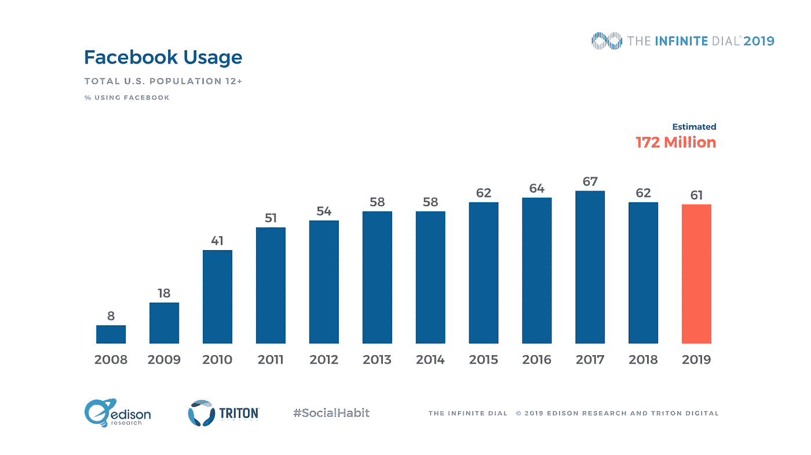

# 解除对脸书的友谊:关于人们为什么不喜欢脸书的新研究

> 原文：<https://medium.com/swlh/unfriending-facebook-new-research-on-why-people-like-facebook-less-74894b927a0>

在最近由 Edison Research 和 Triton Digital 进行的无限拨号研究中，我们发现美国的社交媒体增长似乎已经停滞，特别是脸书的使用量已经下降。现在，让我们明确一点:不管衰落与否，脸书仍然是美国第一大社交媒体网络，而且不是一点点。然而，自 2017 年以来，脸书的使用情况…