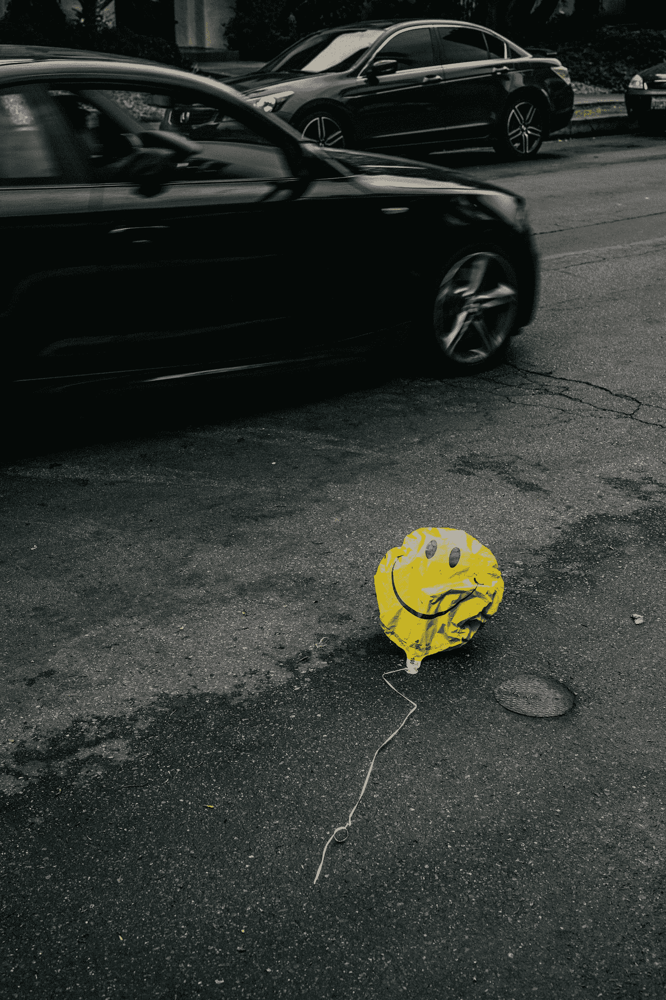

# 不快乐可能只是你看待世界的方式

> 原文：<https://medium.com/swlh/unhappiness-may-just-be-the-way-you-see-the-world-4363800dffcc>

## 调整你的观点来调整世界

Photo by [Nathan Dumlao](https://unsplash.com/@nate_dumlao?utm_source=medium&utm_medium=referral) on [Unsplash](https://unsplash.com?utm_source=medium&utm_medium=referral)

闹钟响了，我不想起床。那是一个让你感觉无法休息的夜晚。你躺在床上，闭上了眼睛，但是任何可以恢复你身体的休息机制都没有发挥作用。