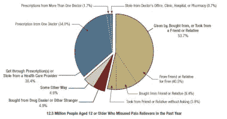
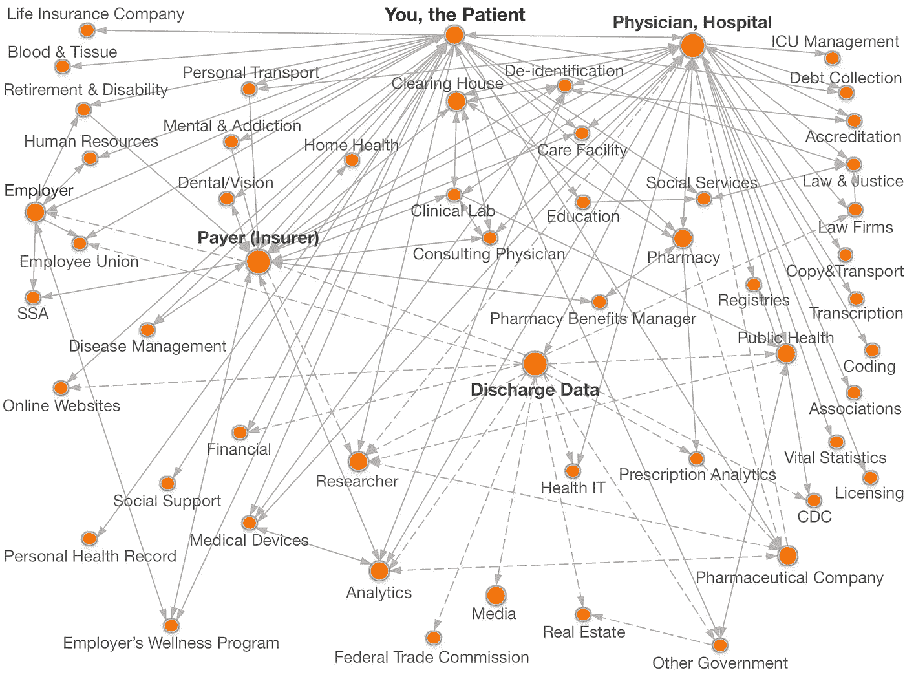

# 美国公民的独特身份号码:隐私的致命一击

> 原文：<https://medium.com/swlh/unique-identification-numbers-for-u-s-citizens-a-death-blow-for-privacy-b713f6537dd5>

## 如果你关心隐私，现在就行动吧…

Photo by [JR Korpa](https://unsplash.com/@korpa?utm_source=unsplash&utm_medium=referral&utm_content=creditCopyText) on [Unsplash](https://unsplash.com/?utm_source=unsplash&utm_medium=referral&utm_content=creditCopyText)

患者的唯一标识符的主题已经被重新讨论。多年来，业内许多人一直在抱怨美国如何需要这些唯一的标识符来完善电子健康记录系统或 EHR，并抱怨健康保险便携性和责任法案(HIPAA)如何要求它，但国会在 1998 年因隐私和其他问题而取消了这一要求。那些反对这一决定的人的不满终于得到了回报:

“国会已经批准解除一项禁令，禁止给病人一个唯一的标识符，作为防止医生购买成瘾止痛药和减少医疗混淆的努力的一部分。”[1]

# “医生购物”有多普遍？

“购医”是“拜访多位医生以获得非法药物的多种处方或一个人想听到的医学意见的行为。”

[SAMHSA](https://www.samhsa.gov/data/sites/default/files/NSDUH-FFR2-2015/NSDUH-FFR2-2015.htm)

大约 1.7%的情况下，患者会从多个医生处获得多个处方，这并不一定意味着他们在“购买医生”这是一个假设，也是一个真的不应该做的假设，因为我们根本不知道为什么一些患者可能会造成这一比例的原因。

无论哪种方式，这都不是一个需要联邦政府全力干预的百分比，增加了许多做法面临的管理负担，并引入了新的严重的隐私问题。电子健康记录的强制要求已经存在隐私问题，这些问题是数字时代发展的结果，比我们的监管机构发展得更快，现在联邦机构正以前所未有的方式滥用监管机构来满足自己的议程。

# 隐私和数字时代

自 HIPAA 通过以来:

美国在推动电子健康记录(EHR)的采用方面进行了有史以来最大的资本投资。然而，300 多亿美元的资本投资并没有兑现其更高质量、更具成本效益的医疗保健的承诺。为什么？一个重要的原因是缺乏一个独特的患者标识符系统，而且没有这个系统，就很难将不同的数据联系起来，以获得任何一个患者医疗保健经历的全面情况。[2]

《新英格兰医学杂志》称,“当准确的信息被附在正确的患者身上时，用于临床、管理、质量改进和研究目的的数据访问更加及时；减少了不适当的护理、多余的检查和医疗差错；健康信息交流变得更加容易。[2]

除此之外，政府和行业追求的可能不是“更高质量、更具成本效益的医疗服务”。联邦政府本质上已经在“公共健康”的幌子下授予他们自己(以及那些与他们合作的人)获取和研究美国人私人健康信息的全权。“质量改进和研究目的”肯定与健康监测有关，我之前在标题为[联邦机构有权访问您的私人数据](/swlh/federal-agencies-have-access-to-your-private-data-b1d7df52b2b2)的文章中对此进行了概述。如果你还没有读过，我鼓励你去读一读。医疗保健行业最近发生的变化是前所未有的，它们导致了美国历史上最严重的公共卫生灾难之一。

# 医学监督模式

哈佛大学数据隐私实验室的拉坦亚·斯威尼“记录了美国 2000 多份个人健康信息的数据共享协议。”[3]

以下是哪些实体可以访问您的私人信息的直观表示:

theDataMap [3]

所有这些信息都可以通过患者保护与平价医疗法案(ACA)要求的 EHR 来访问。ACA 只不过是众所周知的小型实践和隐私棺材上的另一颗钉子，这是有意的，比它应该被允许的走得更远。巴拉克·奥巴马总统的医疗改革副手们写了一篇关于医生如何在 ACA 下取得成功的文章，内容如下:'[4]

为了实现患者保护与平价医疗法案的全部好处，医生需要接受而不是抵制变化。该法案推动的经济力量可能会导致医疗服务提供者的纵向组织，加速医院对医生的雇佣，并加速医生群体的聚合。“最成功的医生将是那些最有效地与其他提供者合作以改善结果、护理效率和患者体验的人。”[5]

什么是‘垂直组织’？垂直组织结构是指依靠经理来指挥和控制员工的工作。企业主通常位于垂直指挥链的顶端。[6]这实质上是医疗保健的缓慢国有化，虽然我们已经知道 ACA 是社会化医疗，并已通过成为法律，但尚不清楚大多数人是否认识到该法案的广度，也不清楚随着更多公共卫生倡议的开发和推出，它将如何影响他们，这很重要，因为有一种趋势是将公共卫生与医疗保健行业合并。

在 EHR，只有大约 5%的患者记录不匹配，然而，国会已经解除了对唯一患者标识符的禁令，其前提是手动匹配记录的成本太高，造成了管理负担，并且如果没有它们，行业就不能充分利用 EHRs 的功能。哦，对了，还有“鸦片危机”我在一个名为[CDC 如何欺骗这个国家](https://blog.usejournal.com/how-cdc-duped-the-nation-with-artificially-inflated-data-part-1-3f72251f360f)的系列文章中就这个所谓的危机写了很多。该系列是任何关注公共卫生或卫生政策的人的必读之作。

就某些类别的药物而言，天并没有真的塌下来，病人和医生从未要求被迫进入一个医学监督模型，但这正是 ACA 引领我们的方向。利用这些类型的危机来进一步巩固糟糕的公共卫生政策是一种恶劣的滥用，不应该被容忍。虽然 ACA 帮助了许多美国人，但实际上它把更多的人扔进了狗窝。目前的医疗保健配给制肯定会在任何一天影响到更多的人群，并且由于其实施而导致的隐私滥用也肯定会继续发生。

正如负责患者隐私权的首席技术官阿德里安·格罗珀(Adrian Gropper)在谈到这些唯一标识符时说的那样:“实施唯一的患者标识符除了强制监控之外，不会给我们的医疗保健系统增加任何东西。它会在我们不同意甚至不知情的情况下收集我们的信息，就像美国国家安全局(National Security Agency)对电话记录所做的那样。[7]

在你否定这个理论之前，有很多人已经谈论这个很长时间了:“行业内支持国家病人身份的人比比皆是。据洛杉矶县自动疾病监测系统主任 Raymond D. Aller 医学博士说，“缺乏统一的患者标识符是这个国家的头号临床信息学问题。”75 更确切地说，“这是使[数据]系统具有互操作性的关键，”76 医学博士 J. Mark Tuthill 说

正如美国内科和外科医生协会指出的:“记录中的有害信息甚至可能不是你的。一个匆忙的数据输入人员可能会在下拉菜单中点击错误的项目，甚至从另一名患者的电子健康记录中剪切并粘贴某些内容。

别搞错了。公民健康自由委员会主席、《T2》《T3》《诊室里的老大哥》《T5》的作者 Twila Brase[警告说，“病人标识符将是隐私的终结，也是国家健康数据系统的基础。”[9]](https://www.healthcaredive.com/news/house-votes-to-overturn-decades-old-ban-on-national-patient-identifier/556859/)

Photo by [Matthew Henry](https://unsplash.com/@matthewhenry?utm_source=unsplash&utm_medium=referral&utm_content=creditCopyText) on [Unsplash](https://unsplash.com/?utm_source=unsplash&utm_medium=referral&utm_content=creditCopyText)

唯一的患者标识符将是对隐私的又一次致命打击，也是对大数据的又一次重击。电子病历已经成为国家在美国公民不知情或不同意的情况下监视他们的工具，并摧毁了那些跟不上 EHR 法案强加给他们的财政和行政负担的医生的私人诊所。这些标识符将进一步统一 EHR，并使联邦、州和其他行为者的监控更加容易。

我们还有其他方法可以有效地将正确的数据与正确的个人进行匹配，但是，正如过去十年的历史事实所展示的那样，这似乎不是政府和行业的唯一动机。趋势一直在朝着使私人执业成为不可能的方向发展，将医生聚集在公司化、国有化的医学模式中工作，并在数字时代进一步破坏隐私。

重要的是要记住，仅仅因为我们有办法做某事，并不意味着我们应该这样做，这一事实似乎被思想领袖忽略了，而公众意识中似乎存在对这些趋势的普遍冷漠，因为媒体并没有真正以对他们的观众有意义的方式报道这些类型的问题。

简单地说，如果你在乎隐私，现在就是行动的时候了。允许这些趋势扩散的时间越长，越多的公民将被为此目的而建立的制度所利用。请在为时已晚之前参与到民主进程中来。

你发现这篇文章的价值了吗？您可能也会发现这种材料的价值:

 [## 联邦机构有权访问你的私人数据

### 联邦监管机构没有跟上数字时代发生的快速演变

medium.com](/swlh/federal-agencies-have-access-to-your-private-data-b1d7df52b2b2)  [## 文化掠夺&机器——第一部分

### 媒体在社会中的角色已经发生了巨大的变化，但它仍在腐败的外壳中四处招摇…

blog.usejournal.com](https://blog.usejournal.com/cultural-predation-the-machine-part-i-b1f6b6435323)  [## 疾控中心如何用人为夸大的数据欺骗国家

### 我们都见过挑衅性的标题，一再声称“阿片类药物危机”是“处方阿片类药物…

blog.usejournal.com](https://blog.usejournal.com/how-cdc-duped-the-nation-with-artificially-inflated-data-part-1-3f72251f360f) 

*参考文献:*

*【1】美国众议院批准防止“医生购物”措施*[*https://www . the center square . com/national/u-s-House-approves-measure-to-prevent-doctor-shopping/article _ 708906 a2-9785-11e 9-b017-279 c 2900 BDA 1 . html*](https://www.thecentersquare.com/national/u-s-house-approves-measure-to-prevent-doctor-shopping/article_708906a2-9785-11e9-b017-279c2900bda1.html)

*[2]美国患者唯一标识符的时代到来了吗？*[*https://catalyst . nejm . org/time-unique-patient-identifiers-us/*](https://catalyst.nejm.org/time-unique-patient-identifiers-us/)

*【3】健康数据图*[*https://thedatamap.org/map2013/index.php*](https://thedatamap.org/map2013/index.php)

*[4]平价医疗法案和电子健康记录的推动:小型医疗机构受到挤压了吗？*[*https://www . MD edge . com/obgyn/article/76304/practice-management/affordable-care-act-and-drive-electronic-health-records-are/page/0/1*](https://www.mdedge.com/obgyn/article/76304/practice-management/affordable-care-act-and-drive-electronic-health-records-are/page/0/1)

*[5]柯彻 R，伊曼纽尔·EJ，德帕尔娜。平价医疗法案与临床医学的未来:机遇与挑战。安实习医生。2010;153(8):536–539*

*【6】垂直组织架构*[*https://your business . az central . com/Vertical-Organization-Structure-1469 . html*](https://yourbusiness.azcentral.com/vertical-organization-structure-1469.html)

*【7】专家争论唯一患者标识符的好处、陷阱*[*https://www . stat news . com/2016/01/28/Experts-辩-唯一-患者标识符*](https://www.statnews.com/2016/01/28/experts-argue-unique-patient-identifier/) */*

*【8】政府卫生监督第一卷*[*https://www . CCH freedom . org/files/files/Final _ UPI _ Report-Use(1)。pdf*](https://www.cchfreedom.org/files/files/Final_UPI_Report-Use(1).pdf)

*【9】为什么不想要唯一的医疗 ID*[*https://AAP sonline . org/Why-You-dont-Want-a-Unique-Medical-ID/*](https://aapsonline.org/why-you-dont-want-a-unique-medical-id/)

D.S. Nelson 是人权和残疾倡导者，国家倡导意识诊所(NAAC)的创始人，药典项目的所有者和编辑，《邪恶》的作者，前环境健康&安全专家。你可以在推特[这里](http://www.twitter.com/process_x?source=post_page---------------------------)关注她。

D.S. Nelson &国家倡导意识诊所 2016–2021 版权所有。内容不构成医学咨询或法律建议。请向认证的医疗专家寻求医疗建议，或向律师咨询法律建议。