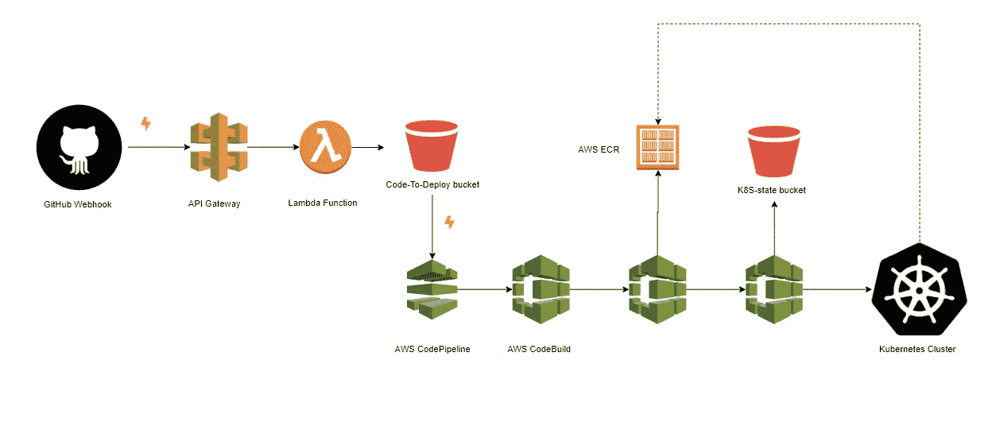
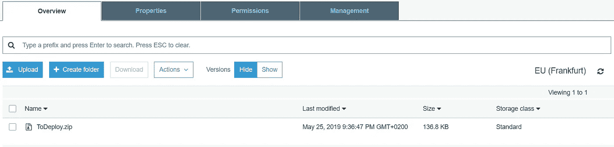
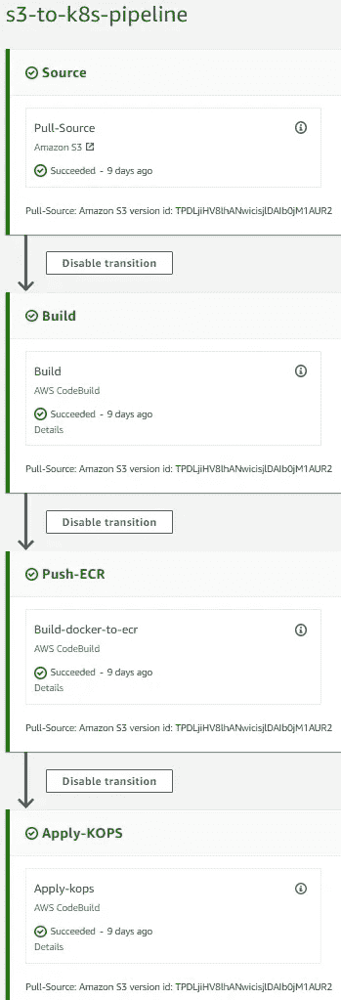
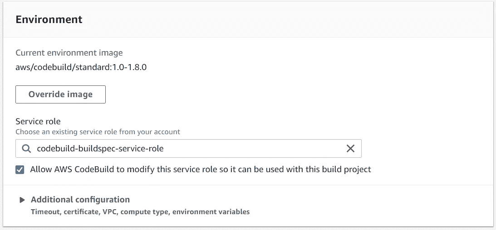
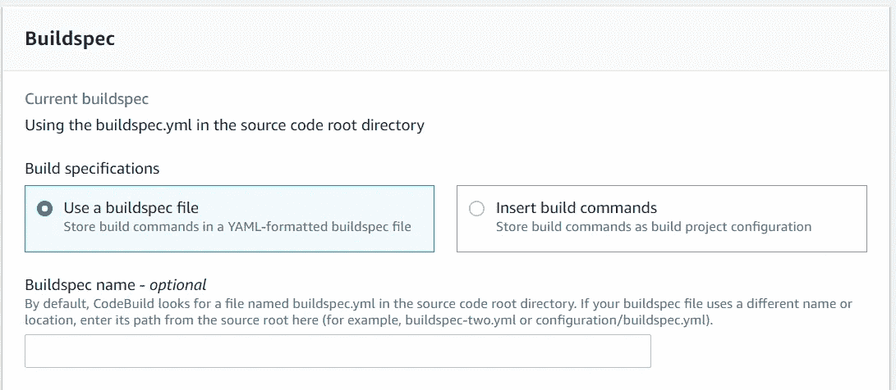
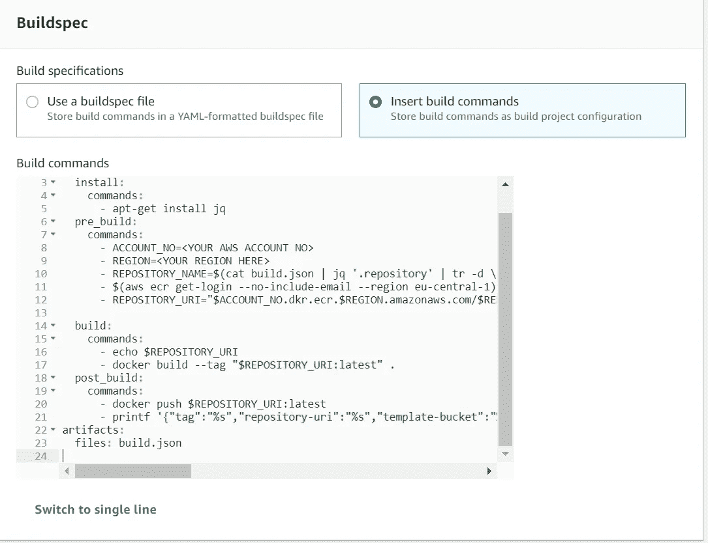
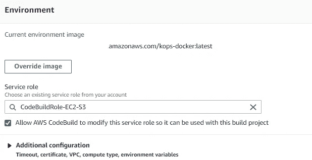

# AWS 上 K8S 的通用 CICD 管道

> 原文：<https://medium.com/swlh/universal-cicd-pipeline-on-aws-and-k8s-7b4129fac5d4>

> 在抽象的层面上，部署管道是将软件从版本控制交付到用户手中的过程的自动化表现。

CI/CD 这个术语现在在行业中被广泛使用。您可能听说过持续集成、持续交付或持续部署。这是一个有很多名字的概念，但是包含了一些基本的思想。简而言之，它概述了保持代码更易维护、更易测试以及更快到达用户手中的实践。最终，它为用户和消费者创造价值。

乍一看，它似乎最适合企业或一些风险投资。但是通过理解它的价值，你会发现 CICD 是有价值的，无论你是在构建可伸缩的企业应用程序，还是只是让你的个人项目开始运行。

## 去耦基础设施

> 开发系统，而不是软件

*微服务*在我们的行业中是一个广泛使用的术语。它有许多形状和定义，取决于你问谁或你想讨论的细节程度。但是我们都同意一件事:您的应用程序的智能解耦是我们要走的路。无论是基于有界的上下文还是应用程序类型，您都有在项目中分离服务的标准。

因此，尽早考虑这一点是个好主意。许多开发人员从一开始就设计了一定程度的解耦。这需要一些前瞻性的思考，因为您需要决定解耦标准和您将用于这个范围的工具。这些工具代表基础架构(AMQP、数据库、存储等)。

除了这篇关于解耦技术和工具的文章，我还可以继续写下去。但是在这里，我将提到我在这个例子中使用的工具，并回到 CICD 管道。

## 输入 AWS 和 K8S

维护基础设施的一种通用(快速)方法是通过云系统，因为它们提供了大量的抽象工具。我使用 AWS 的各种工具。具体来说:

*   CICD 管道建设代码管道
*   用于在管道步骤中运行构建命令的代码构建
*   ECR(弹性容器注册表)作为构建结果图像的存储库。
*   用于存储的 S3

Kubernetes (K8S)是一个 Docker 容器编制器。它应用 IaC(基础设施即代码)模式来提供进一步的抽象。通过将 YAML 格式文件应用到 K8S，我们可以更新它的状态，部署容器或其他对象。

我将使用托管在 AWS 上的 K8S。这可以用 *kops 来完成。* [这里的](/containermind/how-to-create-a-kubernetes-cluster-on-aws-in-few-minutes-89dda10354f4)是一篇解释如何做的好文章。

## 环球 CICD

是的，很好。但是 CICD 在这一切中扮演什么角色呢？好吧，我从解释解耦开始，以奠定需要由上下文划分的几个服务的想法。我们开发的服务可能有不同的部署需求。运行环境可能因端点、依赖关系等而有所不同。

出于这个原因，我们通常为每个项目准备一条 CICD 管道。

基础设施的抽象(由 K8S 提供)在这里非常有用，因为它允许我们在代码库的 YAML 文件中设置环境需求。

继续这个概念，我们可以抽象出 CICD 管道本身。使得它不知道项目类型、构建和部署需求。

通过在我们的解决方案中包含这 3 个组件:

*   生成命令文件。(AWS 代码构建的 Buildspec.yml)
*   正在运行的应用程序的 Dockerfile 文件映像
*   K8S 对象 YAML 文件，用于部署需求。

我们拥有关于如何构建、测试和部署任何服务的所有信息。

## CICD 模式演示

> 作为开发人员，我们拥有的最强大的工具是自动化

CICD Schema

每次提交时都必须触发管道。它应该提取源文件，而不使用任何存储库的特定信息。

为了实现这一点，管道将由 GitHub webhook 触发。这允许不同项目的多种用途。

通过 API Gateway，webhook 将调用 AWS Lambda 函数。这个函数将提取 git 存储库并将其压缩到一个 S3 桶中。

每当 S3 对象更新时，都可以触发 AWS 代码管道。它“监视”我们的 zip 文件，每当它被更新时就触发管道。

CodeBuild 使用解决方案中的 buildspec.yml 文件来生成和运行测试。

接下来，将构建一个 Docker 映像并将其推送到 AWS ECR。

最后，解决方案中的 YML 文件将应用于 AWS 上现有的 K8S 集群。通常，这会导致从 ECR 中提取 Docker 映像，并将其部署到 K8S 中的容器中。

概括地说，管道可以构建和部署任何项目，只要它提供

*   包含构建环境必备条件和命令的 Buildspec.yml 文件
*   order 文件图像，以便将其推送到 ECR
*   “/k8s”文件夹下的 Kubernetes 部署文件

所以让我们一步一步来。我使用一个 SCALA PLAY 项目作为例子。你可以在这里找到项目所需的[文件。](https://github.com/hasael/hello-play)

## AWS Lambda 和 API 网关

我们可以使用 API Gateway 公开 AWS Lambda 函数的端点。在我们的 GitHub 项目中将这个端点设置为 webhook。

Lambda 函数在 GitHub 发送的 json 文件上找到 GitHub URL，将解决方案拉到一个临时目录中，创建一个 zip 文件，并将其上传到 S3 bucket。这将在每次提交时触发。

产生的 zip 将被更新到 S3 桶，这将触发管道。

在 AWS Lambda 上，我使用 NodeJs 版。

你可以在这里找到 Lambda 函数**，*写成 NodeJs *。**

*非常感谢 Enki 使用 lambda-git 的这个 [*hack*](https://blog.enki.com/using-git-on-aws-lambda-f365a2db706b) 。*

## *管道*

*以下是 AWS CodePipeline 中的管道概述。*

**

*第一步由特定对象上传到 S3 触发。这个对象将由前面的 lambda 函数更新。这一步生成“源工件”，它是一个包含源文件的. zip 文件。*

*“源工件”被发送到构建步骤。解决方案被编译、测试，并生成作为“构建工件”的构建结果文件。*

*这个工件被发送到 Push-ECR 步骤。docker 文件是使用“构建工件”文件构建的，并被推送到 ECR。*

*最后，Apply-KOPS 步骤使用 kubectl 应用 K8S 上的“源工件”上的 YAML 文件。此外，它将 K8S YML 文件保存到 S3 存储桶中。这存储了关于当前基础设施的信息。*

## *连续累计*

*构建步骤是这里概述的 AWS 代码构建项目。为了配置 CodeBuild 项目，我们指定一个构建环境和构建命令。*

**

*构建环境是 CodeBuild 标准 1.0 -1.8.0。*

*在幕后，AWS CodeBuld 创建了这些 Docker 映像作为构建环境。更多信息，你可以查看这些图片[这里](https://github.com/aws/aws-codebuild-docker-images)。*

**

*该项目将从源代码中获取 Buildspec.yml 文件。YAML 文件包含要执行的构建命令。*

*下面是 SCALA PLAY 中一个项目的 buildspec 文件。*

*项目将开始编译并运行测试。如果一切都是绿色的，将会创建一个 zip 文件作为构建工件。它将包含运行应用程序所需的所有文件。*

## *推送 Docker 图像*

*在这个阶段，会创建一个 Docker 映像并将其推送到 ECR。这也是由代码构建项目完成的。*

**

*我们将 buildspec 命令直接插入到项目中。这些命令要求在源根目录上有一个 Dockerfile。这需要构建工件文件来创建运行应用程序的映像。构建映像并将其推送到 AWS ECR。*

*Dockerfile 映像运行应用程序，假设它是构建的。*

*下面是一个 Dockerfile 文件，用于在 SCALA 的 PLAY 框架中运行一个项目。它解压缩构建结果，并使用提供的密钥运行它。*

*构建环境是相同的标准 1.0 -1.8.0。*

## *部署到 K8S*

*假设“k8s”文件夹下的所有 YML 文件都是 Kubernetes 对象(通常是部署和服务)。这些文件被提取并应用到 Kubernetes 集群。为了做到这一点，我们需要 kubectl。我使用这个 Docker 映像作为 CodeBuild 的定制构建环境。*

*Docker image with kops and kubectl*

*将这个映像推送到 ECR 存储库中，并将其设置为构建环境。*

**

*这个项目的构建规范如下*

*kops apply buildspec*

*文件夹下的所有 K8S 对象”。/k8s/”被应用，然后被保存到 S3 桶，以存储当前集群状态供将来参考。Kubectl 使用“export kubecfg”命令获取 K8S 集群配置。*

*例如，这些是 SCALA PLAY 中项目的 K8S 对象。*

*Kubernetes yaml files to apply*

*通过 K8S，这将导致部署 Docker 容器。此外，AWS 将创建一个指向容器的负载平衡器。*

## *结论*

*对于开发人员来说，能够仅通过代码来部署服务是一个强大的工具。通过这样做，您可以在几个服务上工作，并以一种分离的模式部署它们的基础设施。同时保持 CICD 的优势，而不必担心其具体实施。*

*实现抽象的下一步可能是在解决方案中使用 bash 命令，而不是特定于 CodeBuild 的 Buildspec。使其与 Jenkins 或其他构建工具兼容。*