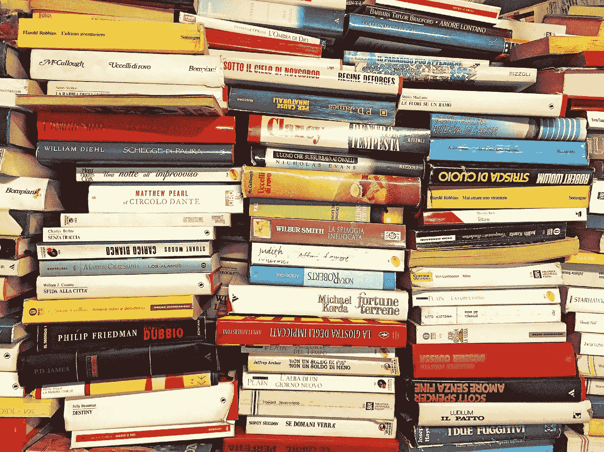

# 在文学巨著上释放机器学习

> 原文：<https://medium.com/swlh/unleashing-machine-learning-on-literatures-great-works-1dcd664d4a59>

## 我的 ML/text 创业梦想一点点向现实靠近。

Credit: Pixabay/Sarah_Loetscher

作为一名主要关注科技的作家和编辑，当 OpenAI 宣布它已经创建了一个“大规模无监督语言模型”(名为 GPT-2)，能够…