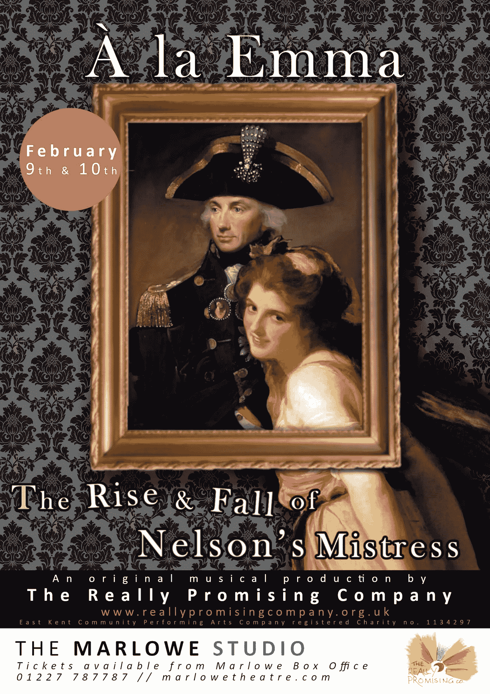

# 从业余戏剧中学到的不太可能的产品管理

> 原文：<https://medium.com/swlh/unlikely-product-management-learnings-from-amateur-dramatics-ce086dada309>

那是一个美丽的星期六，我的妻子在工作，而我在工作了一个星期后却无所事事。几个月前，一些朋友参加了一个音乐剧，他们要去参加一个当地表演教练的研讨会。这听起来像是一个有趣的，不同的度过几个小时的方式…我不知道这是一个月的承诺的开始。

Flyer for A La Emma. Courtesy of The Really Promising Company

如果你在那个夏天告诉我，我会穿着一件碎花礼服大衣，在坎特伯雷马洛剧院的舞台上跳舞，我会告诉你不要再取笑我了，但这正是我在 2019 年 2 月 9 日和 10 日的三场演出“A La Emma”中的位置，这是关于纳尔逊的情妇[艾玛·汉密尔顿](https://en.wikipedia.org/wiki/Emma,_Lady_Hamilton)的故事。我扮演了讨厌的、厌恶女人的哈里·费瑟斯顿霍先生(发音为 Fan-shaw 或简称为哈里·F)和有爱心的报纸编辑詹姆斯·佩里。对于那些不知道这个故事的人，我真的建议去看看——这是一部伟大但悲惨的从贫穷到富有的史诗，背景是当时一些最著名的事件，包括尼罗河战役，当然还有特拉法尔加。

Picture: Gareth Winters. Featuring the cast of A La Emma by the Really Promising Company, Canterbury.

站在灯光下是一次奇妙的经历。在等待演出开始的时候，我们安静地坐在舞台边上，全神贯注地思考着我们的台词和前方的演出，等待观众们安静下来。在接下来的几周排练之前，这是一段美好的反思期，在此期间，我反思了我作为产品经理的日常工作和制作方式之间的相似之处。

# 精益音乐剧

我们很幸运有一位专业的导演帮助我们，那就是出色的萨莉·埃尔克顿。她带我们去表演的方法感觉很熟悉，但我想不起来，直到我在指导一个人精益创业的艺术。我们在排练时尝试了一些我们认为行不通的东西。角色被调整以帮助整个故事，我们中的一些人完全改变了角色，这是精益实验的伟大例子，帮助我们完善我们的最终产品。制作本身只涉及最少量的道具和装饰。整场演出的服装基本上是一样的，道具很少，如果它们分散了注意力或在舞台上造成了问题，就会被无情地削减。灯光计划是在彩排时处理的，以免分散演员们对真正的魔法将会发生的地方的注意力，一切都设置在一个普通的黑色布景上。

# 场景故事

直到演出前几周，我们才真正全面了解了《爱玛》的情节，那是我们第一次看完整部音乐剧。剧本被分成几个部分，而不是从头开始排练或通读剧本。一开始感觉怪怪的，好像我们遗漏了整个故事的脉络，但久而久之就说得通了。有了这些小部分，我们就可以专注于在小组中的每个部分传达的关键信息。每次排练都不需要演员，我们可以多次检查各个部分，比我们在排练更长的表演时要详细得多。

写好的用户故事和将任务分成小部分的相似之处是显而易见的，但是它真的帮助我理解了为什么它们比长的需求文档工作得更好。小的工作单元允许我们限制正在进行的工作，在我们的例子中，有助于减轻学习行的负担。它还帮助我们更敏锐地理解了我们场景的价值，我可以很快地将场景摘要写成一个用户故事

> **作为一名观众**，**我想**展示哈里·F .**爵士控制欲强、以自我为中心和厌恶女性的本质，这样**我们就能理解他对艾玛·汉密尔顿的拒绝和她的绝望状态

随着产品的开发，我们获得了更多的上下文，这给了我们更多的想法，我们可以通过排练来尝试。可能会添加新的道具，例如，詹姆斯·佩里需要眼镜来帮助他区分讨厌的哈利·f。我还发现它帮助我在角色之间切换，并改变我的动作和态度。

# 平衡的演员阵容

我经常与团队谈论平衡团队的概念，即团队的所有成员都有自己的角色和专长，但所有人都是平等的，在产品方向上有平等的发言权。例如，我们过去开发的一些最好的用户功能来自集体头脑风暴会议，而不是来自单独工作的设计师。从这个角度来看，参加 La Emma 感觉非常熟悉。导演全面负责该剧的导演，但它融入了演职人员的想法。简，我们了不起的剧作家，精心准备了我们要说的话，但接受了全体演员的修改和建议来完善它。当我们用我们的声音将简的话和刘易斯的配乐结合起来时，甚至音乐也变成了一种协作体验！每个角色都受到尊重，但这并不意味着我们不能参与或贡献想法。

# 下一步是什么？

戏剧的世界让我看到了隐喻的力量。我总是发现，当我使用人们熟悉的不相关的东西时，解释复杂的概念会更容易。与《艾玛》剧组合作给了我新的隐喻来解释我每天使用的一些核心产品管理工具的价值。我很想知道你使用或经历过哪些隐喻来帮助你建立你的实践和工具集！