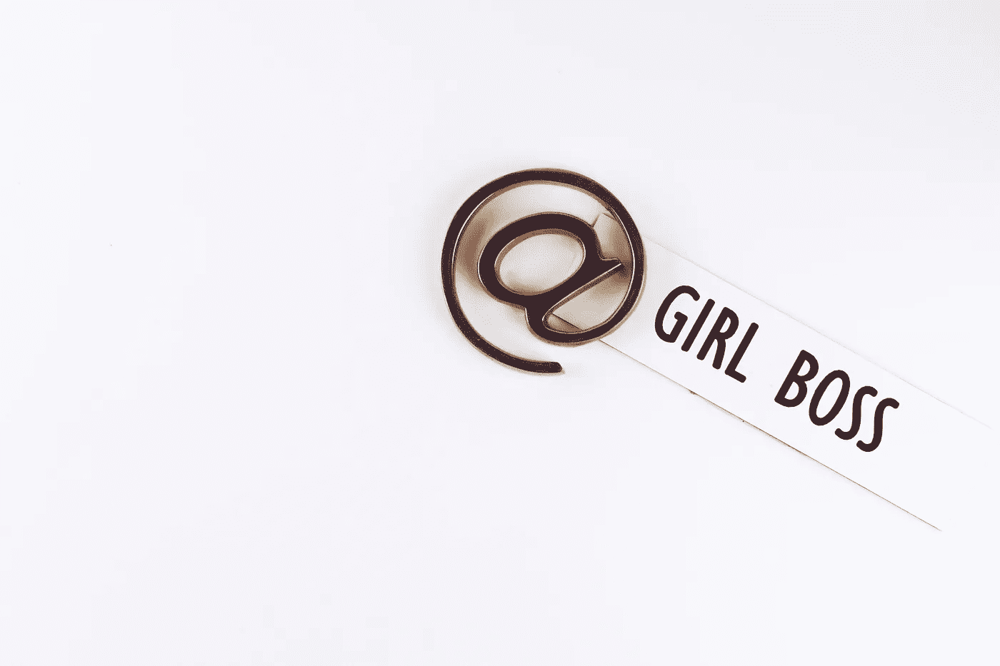

# 冷门观点:能不能不要再讨厌#Girlboss 了？

> 原文：<https://medium.com/swlh/unpopular-opinion-can-we-stop-hating-on-girlboss-18d1e06430d9>

我理解对“女老板”这个词的分歧。

对于任何不熟悉的人来说，#Girlboss 这个词最早是由 Nastygal 的创始人索菲亚·阿莫鲁索推广开来的。#Girlboss 是她畅销回忆录《变身网飞》系列的书名。

Girlboss 这个词受到了很多抨击。许多女性认为这是幼稚的。许多男人问“你怎么能指望被带走……