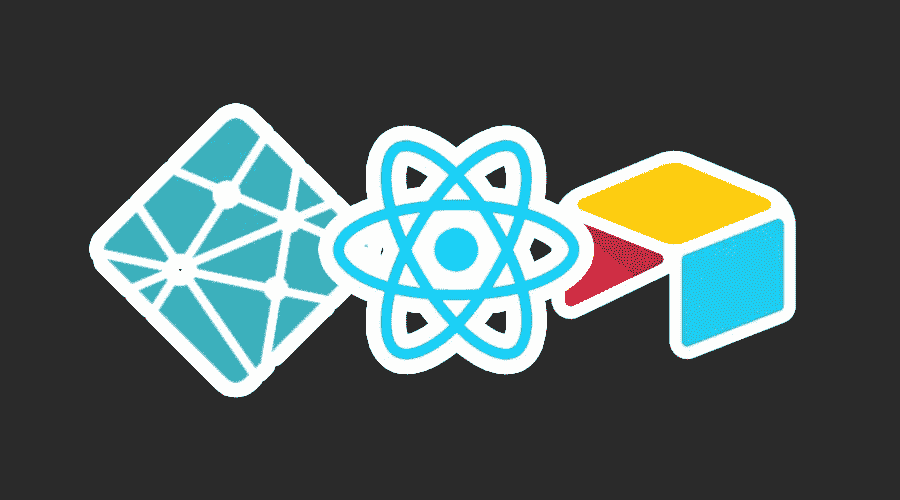

# 启动并运行 Netlify、Airtable 和 React

> 原文：<https://medium.com/swlh/up-and-running-with-netlify-airtable-and-react-428959473cf0>

如果您想要一个免费且相对容易的堆栈来快速构建和部署投资组合项目，Netlify、Airtable 和 React 是一个很好的三重奏。我目前正在使用这些工具构建一个寻找当地独立咖啡馆的网络应用程序。因为我找不到一个好的教程来教我如何设置这三个工具一起工作，所以我正在写一个。