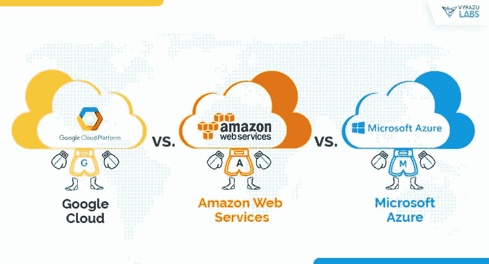

# 在云端

> 原文：<https://medium.com/swlh/up-in-the-clouds-32d74f2ac22b>

在这个数据驱动的时代，云计算已迅速成为寻求削减成本和提高灵活性的企业的福音。云计算供应商提供一系列技术解决方案和服务，允许公司通过互联网(“云”)外包其所有的信息技术需求。该市场目前由 3 大提供商主导，AWS(亚马逊)、Azure(微软)和谷歌的云平台。

