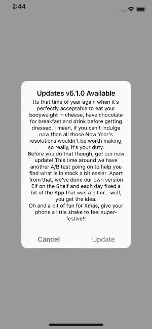

# 将用户更新到最新版本的 iOS 应用程序

> 原文：<https://medium.com/swlh/updating-users-to-the-latest-app-release-on-ios-ed96e4c76705>

## 在需要时将用户过渡到最新应用程序更新的挑战


当紧急情况发生时，有一个适当的机制将用户温和地过渡到最新的应用程序更新是有益的。然而，这种机制可能需要一个后端解决方案来让应用程序用户知道何时发布更新，这在开发开销和维护方面都可能是昂贵的。如果要在开发这样的解决方案或向用户提供新功能之间做出选择，后者很可能会胜出，这意味着在最坏的情况下，大多数应用程序很少或根本没有迁移用户的手段。

当谈到将用户迁移到最新版本的应用程序时，我们很幸运，iOS 为我们做了大部分的跑腿工作。App Store 的默认设置是通宵自动下载应用程序更新，这意味着大多数用户通常会在几天内收到最新的应用程序版本。

但是如果几天之内还不够快呢？如果一个我们无法控制的 API 发生意外变化，导致所有功能丧失，该怎么办？或者用于 SSL 固定的证书意外过期？与 web 开发不同，不可能轻松地将用户回滚到软件的早期版本，因此不难想象，有时能够将用户迁移到包含最新错误修复等的最新版本的应用程序可能是有用的。应用程序开发人员显然会尽量避免这种情况，但如果我们未能预测到这些情况的发生，那么当紧急情况出现时，采取行动就为时已晚。

除了例外情况，在很多情况下，让用户知道有新的应用程序版本可用可能会很好——例如，如果新的应用程序功能在最新发布的版本中可用，该版本已被广泛宣传，或者针对用户遇到的非关键但令人讨厌的问题发布了修复程序。

## 放弃对旧版本 iOS 的支持

苹果非常成功地创造了一个吸引因素，鼓励用户更新到最新版本的 iOS。此外，iOS 本身通过标记和通知让用户清楚地知道新版本的操作系统已经推出。因此，大多数 iOS 用户倾向于运行最新或以前版本的 iOS。对于开发者来说，这意味着我们很少需要非常旧版本的操作系统。就让用户更新到我们应用程序的最新版本而言，让大多数设备都拥有最新版本的 iOS 显然是一个很大的帮助——特别是如果我们的应用程序只支持两个最新发布的 iOS 版本。

然而，考虑一个支持旧版本 iOS 的应用程序，开发团队希望放弃对它的支持。如果团队放弃对旧版本 iOS 的支持，那么应用程序更新将不再由 App Store 自动提供给该版本操作系统的用户，直到他们更新。此外，如果用户访问应用商店中的应用页面，他们将只能看到他们的设备有资格获得的最新更新。让用户知道，一旦他们更新了 iOS 的更高版本，他们就可以使用新版本的应用程序，这可能是值得的，这样他们就不会认为应用程序的开发已经结束。

# 更新

[更新](https://github.com/rwbutler/Updates)是一个开源框架，它会自动检查你的应用程序是否有新版本。当发布更新时，Updates 能够向用户提供新的版本号和附带的发行说明，让他们选择更新。选择继续的用户可以无缝地看到应用商店的应用程序，这样更新就变得轻松了。



Screenshot showing Updates in automatic configuration

能够自动处理这些的框架是有益的，因为开发团队通常更关注开发新的功能来为用户提供价值，而不是实现更新用户的功能，这些功能可能永远都不需要使用。

Updates 使用 [iTunes 搜索 API](https://developer.apple.com/library/archive/documentation/AudioVideo/Conceptual/iTuneSearchAPI/index.html) 从商店中检索最新版本的应用程序的版本号。除此之外，还会为您的应用获取发行说明和数字应用商店标识符，这意味着当发布新版本时，Updates 能够告诉您的用户更新的版本号以及新增内容。

该框架能够自动解析用户的设备区域设置，确保应用程序更新针对相关的应用程序商店区域以及详细信息，例如用户的设备是否有资格接收更新。

使用数字应用商店标识符，如果用户选择更新，那么更新可以使用[skstoreprodiviewcontroller](https://developer.apple.com/documentation/storekit/skstoreproductviewcontroller)呈现应用商店，允许用户无缝更新，而不必离开应用。

如果您希望手动设置这些信息(而不是让更新为您检索)，您可以通过将必要的信息指定为 JSON 配置文件的一部分来实现。此外，拥有一个 JSON 配置文件允许您指定是自动还是手动检查更新——您可以稍后远程切换此设置。也可以通过编程来配置所有设置。

## 自动检查更新

要让更新自动检查应用程序的新版本，您可以使用 JSON 配置文件来配置框架。您需要通过指定如下配置 URL，让更新知道在哪里查找该文件:

```
let url = "https://exampledomain.com/updates.json"Updates.configurationURL = URL(string: url)
```

或者，URL 可以使用文件 URL 引用您的应用捆绑包中的本地文件，例如

```
Updates.configurationURL = Bundle.main.url(forResource: "Updates", withExtension: "json")
```

一个简单的配置文件可能如下所示:

```
{
    "updates": {
        "check-for": "automatically",
        "notify": "once"
    }
}
```

注意，Updates 寻找一个名为`updates`的顶级键，这意味着可以添加到一个现有的 JSON 文件中，而不是创建一个全新的文件。

上面的配置告诉 Updates 解决所有需要的信息，以确定您的应用程序的新版本是否可以通过最少的配置自动获得。它还表明，用户应该只被通知一次特定的应用程序更新，以避免困扰他们。该属性的可选值为`twice`、`thrice`、`never`和`always`。

部署应用程序后，拥有远程 JSON 配置可以提供最大的灵活性，因为这使得从自动模式远程切换到手动模式成为可能，然后如果您愿意，可以自己提供应用程序最新更新的详细信息。

如果需要，您可以放弃远程 JSON 配置，而简单地以编程方式配置更新，如下所示:

```
Updates.updatingMode = .automaticallyUpdates.notifying = .once
```

这相当于上面 JSON 代码片段中的配置。

## 手动通知用户更新

要手动通知用户应用程序的更新，请按如下方式配置 JSON 文件:

```
{
    "updates": {
        "check-for": "manually",
        "notify": "always",
        "app-store-id": "123456",
        "comparing": "major-versions",
        "min-os-required": "12.0.0",
        "version": "2.0.0"
     }
}
```

*   `check-for`指定更新应该自动还是手动检查更新。
*   `notifying`参数允许开发者指定用户被提示更新的次数。
*   `app-store-id`参数指定 App Store 中应用程序的数字标识符。只有当您希望使用`UpdatesUI`组件来显示允许用户更新的`SKStoreProductViewController`时，才需要该参数。如果开发自定义用户界面，可以省略该参数。
*   `comparing`确定通知用户通知版本所需的版本号增量，例如`major-versions`表示仅当应用的主版本号增加时才会通知用户。这里其他可能的值是`minor-versions`和`patch-versions`。
*   `min-os-required`属性确保如果你的应用程序的新版本不支持以前支持的 iOS 旧版本，那么不能利用更新的用户不会得到关于新版本的通知。
*   `version`属性指示可从应用商店获得的新应用版本。

如果您选择不承载远程配置文件，则可以通过编程方式获得相同的配置:

```
Updates.updatingMode = .manuallyUpdates.notifying = .alwaysUpdates.appStoreId = "123456"Updates.comparingVersions = .majorUpdates.minimumOSVersion = "12.0.0"Updates.versionString = "2.0.0"
```

# 检查更新

无论您是否已将更新配置为自动或手动检查更新，请在您的应用中调用`checkForUpdates`以获得新应用更新的通知，如下所示:

```
Updates.checkForUpdates { result in // Implement custom UI or use UpdatesUI component}
```

下一节中描述的`UpdatesUI`组件可以与该方法调用结合使用，以在应用程序中呈现应用商店(在无法加载前者的情况下使用`SKStoreProductViewController`或`SFSafariViewController`),从而允许用户无缝更新。或者，您可以选择在回调中实现您自己的自定义 UI。

回调返回一个指示更新是否可用的`UpdatesResult`枚举值:

```
public enum UpdatesResult { case available(Update) case none}
```

在更新可用的情况下，当使用自动配置时，提供更新的版本号以及发行说明的`Update`值是可用的:

```
public struct Update { public let newVersionString: String public let releaseNotes: String? public let shouldNotify: Bool}
```

注意，JSON 配置中的`notify`属性的值用于确定`shouldNotify`是`true`还是`false`。在编写自定义 UI 时，开发人员需要尊重`shouldNotify`的值。如果使用`UpdatesUI`组件，该属性将自动生效。

# UI 组件

UpdatesUI 组件独立于核心更新框架，允许开发人员在需要时创建自定义 UI。对于不需要自定义 UI 的开发者来说，`UpdatesUI`让用户更新尽可能简单。用户将看到一个`UIAlertController`，询问是更新还是取消。如果用户选择更新，那么将显示一个`SKStoreProductViewController`，允许在应用程序内启动更新。

为了显示 UI，只需将更新检查返回的`UpdatesResult`值传递给 UI，如下所示:

```
Updates.checkForUpdates { result in UpdatesUI.promptToUpdate(result, presentingViewController: self)}
```

# 摘要

无论是在紧急情况下，还是作为计划更新的一部分，如放弃对旧版本 iOS 的支持，开发人员都应该谨慎地计划将用户迁移到最新版本的应用程序。Updates 是一个旨在帮助开发人员完成这项任务的框架，它可以自动检测 App Store 中哪里有新版本的应用程序，并向用户提供一个可选的预配置 UI 组件，轻轻推动他们进行更新。

如果要在开发新功能以向用户交付价值和开发功能以将用户迁移到最新版本的应用程序之间做出选择，前者可能会胜出，从而使开发开销最小的迁移解决方案受益。

# 挑战

*   不像在网络上，开发者不能回滚应用部署。相反，他们必须尝试将用户迁移到最新版本的应用程序上，以便解决问题。
*   如果停止对旧版本 iOS 的支持，旧版本 iOS 的用户将不会收到 App Store 的应用程序更新通知(直到他们有资格通过更新 iOS 来下载它们)。开发者可能希望用户知道，一旦他们更新，新版本的应用程序就可用了。
*   托管后端系统以让用户知道有应用程序更新可用并手动保持更新可能很麻烦。

# 优势

*   更新可以自动查询应用程序的新版本是否可用，并以最少的配置向用户显示提示。
*   提供的 UI 组件允许用户无缝更新，而不必离开应用程序。
*   可用于仅向设备上有资格接收更新的用户显示更新消息，或者仅向需要更新 iOS 才能接收更新的用户显示更新消息。
*   自动处理挑战，例如查询正确的 App Store 区域。

*更新可以在麻省理工学院许可下的* [*GitHub*](https://github.com/rwbutler/updates) *上找到，并且兼容*[*Cocoapods*](https://cocoapods.org/pods/Updates)*和 Carthage。*

