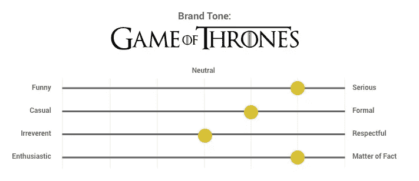
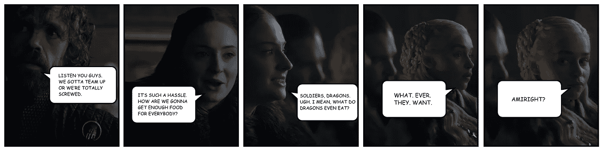

# 利用《权力的游戏》来提升你的品牌形象

> 原文：<https://medium.com/swlh/use-game-of-thrones-to-help-your-brands-tone-of-voice-a85a7c31198c>

(Image via [Game of Thrones Meets Seinfeld](https://www.youtube.com/watch?v=KgU-wN_a2F8))

语气是你品牌的重要组成部分。你的语气会影响你与顾客的每一次沟通。如果它与客户的期望不一致或不一致，它会毁掉你与他们建立联系的任何机会。

音调的有趣和具有挑战性的地方在于，我们通常可以感觉到它何时产生共鸣或不产生共鸣，但我们并不总能清楚地说出原因。

不过，在一点结构的帮助下，很容易为你的品牌基调创建清晰、可分享的指导方针。这将意味着你和你的团队生产的所有东西会感觉更加一致。如果有什么不对劲，你将有一个机制来讨论并提供建设性的反馈。

如果你需要这方面的指导，我们开发了两个简单的练习来帮助品牌定义他们的语气。[你可以在这里阅读更多关于这个过程的信息](https://mapandfire.com/blog/two-easy-exercises-that-will-strengthen-your-brands-tone-of-voice/?utm_source=blog&utm_medium=article&utm_campaign=game-of-thrones)。

为了将这个概念付诸实践，并展示语气对内容的影响力，我们将做一个快速实验。

# 《权力的游戏》的基调

即使你不是粉丝，也不可能逃脱《权力的游戏》的魔爪。超过 1700 万人[观看了最后一季的首播。](https://ew.com/tv/2019/04/15/game-of-thrones-ratings-season-8/)

对于那些没看过的人来说，这是使用上面链接中的音调维度练习后，这个节目的音调看起来的样子。

(节目的粉丝可以让我知道他们是否同意这些价值观。)

现在想象一下，如果有一个奇怪版本的音调在这些维度上向另一个方向倾斜。

感觉会有多奇怪？当观众听到的与节目的故事和外观如此不一致时，他们会有多困惑？

为了突出语气错误的影响，下面是《权力的游戏》第八季首播的几个场景。首先你会得到实际对话的音调，然后你会得到我们的 bizarro 音调的相同场景。

注: ***非常*** 小剧透如果你一直很忙或者在山洞里，还没有看首映，这里就有。

**原文:**

**比扎罗:**

**原文:**

**比扎罗:**

**原文:**

**比扎罗:**

希望你的品牌基调不会偏离轨道这么多。关键是，即使你的沟通只是在一个维度上中断了，你会有一个简单的方法来识别它吗？

更好的是，不要等着对问题做出反应，花些时间预先确定你的语气。创建您自己的指南，为您的内容提供信息，并帮助避免这些问题。

# 想要更多关于您品牌的帮助吗？

查看[地图&消防网站，了解品牌指南流程](https://mapandfire.com/?utm_source=blog&utm_medium=article&utm_campaign=game-of-thrones)或获取一些品牌和营销战略工作表。

*原载于 2019 年 4 月 25 日*[*【https://mapandfire.com*](https://mapandfire.com/blog/use-game-of-thrones-to-help-your-brands-tone-of-voice/)*。*

## 这篇文章发表在 [The Startup](https://medium.com/swlh) 上，这是 Medium 最大的创业刊物，拥有+446，678 名读者。

## 在此订阅接收[我们的头条新闻](https://growthsupply.com/the-startup-newsletter/)。

