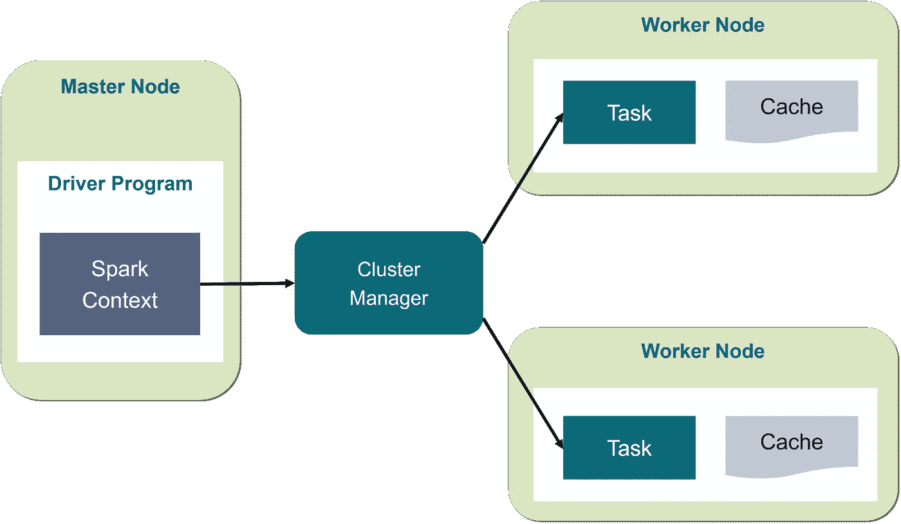
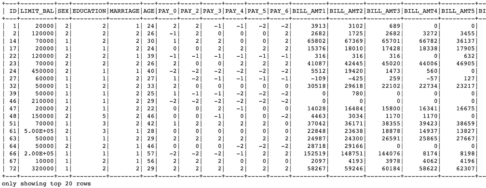

# 使用 PySpark 解决您的下一个大问题

> 原文：<https://medium.com/swlh/use-pyspark-for-your-next-big-problem-8aa288d5ecfa>


Photo by [NASA](https://unsplash.com/@nasa?utm_source=unsplash&utm_medium=referral&utm_content=creditCopyText) on [Unsplash](https://unsplash.com/search/photos/big-data?utm_source=unsplash&utm_medium=referral&utm_content=creditCopyText)

## 利用大数据的力量

大数据正成为所有商业领域的热门词汇，因为它能够更完整地回答更多问题，并让人们对数据质量更有信心。问题是你如何利用这种力量解决你的下一个问题？

Spark 是一个集群计算平台。群集是一组松散或紧密连接的计算机，它们一起工作来执行相同的任务。Spark 允许您在具有多个节点的集群上传播信息和计算(将每个节点想象成一台不同的计算机)。分割数据使处理大型数据集变得更加容易，因为每个节点只处理少量数据。



Simple Cluster Computing Architecture

每个节点处理自己的全部数据子集，还执行所需的部分全部计算，因此数据处理和计算都是在集群中的节点上并行执行的。并行计算可以使某些类型的编程任务更快。

然而，随着计算能力的增加，处理数据和创建有意义的解决方案的复杂性也增加了。决定 Spark 是否是您的问题的最佳解决方案并不总是一目了然的，但是可以问一些有用的问题:

*   我的数据是否太大，无法在单台机器上处理？
*   我的计算很容易并行吗？

连接到集群是使用 Spark 的第一步。通常，集群将被托管在一个链接到所有其他节点的远程机器上。将会有一台被称为主机的计算机管理数据和计算的分割。主计算机连接到群集中的其余计算机，这些计算机称为从计算机。主机将数据发送给，并将计算结果发送给从机运行，然后从机将结果发送回主机。当您刚刚开始使用 Spark 时，在本地运行集群更简单——尽管原理是相同的。

Spark 的核心数据结构是弹性分布式数据集(RDD)。这是一个底层对象，它允许 Spark 通过在集群中的多个节点上分割数据来发挥其魔力。然而，rdd 很难直接使用，所以在本文中，我将使用构建在 rdd 之上的 DataFrame 抽象。

Spark 数据帧的设计行为很像 SQL 表(列中有变量，行中有观察值的表)。与 rdd 相比，Spark 数据帧更易于理解和操作，并且在复杂操作中得到更好的优化。

当您开始修改和组合数据的列和行时，有许多方法可以达到相同的结果，但有些方法通常比其他方法花费的时间长得多。当使用 rdd 时，由数据科学家来找出优化查询的正确方法，但是使用 Spark DataFrame 实现的美妙之处在于它内置了很多这种优化。

您总是可以使用`.toPandas()`将 Spark 数据帧转换成 pandas 数据帧，反之亦然,`.createDataFrame()`方法获取 pandas 数据帧并返回 Spark 数据帧。然而，在 PySpark 中工作很容易，根本不用熊猫。

在这篇文章中，我将使用 UCI 机器学习公司提供的默认信用卡客户数据集。该数据集包含从 2005 年 4 月到 2005 年 9 月台湾信用卡客户的违约付款、人口统计因素、信用数据、付款历史和账单等信息。

首先，我们需要在我们的环境中建立一个 SparkSession。

现在，我们将数据导入我们的环境。您可以使用`.read`阅读 csv 文件和其他格式



对 SQL 的基本理解将有助于管理 Spark 数据帧，因为操作是类似的。

```
# Add column to DataFrame
data = data.withColumn("colname",new_column)# Filter data with a SQL string
filtered_data = data.filter("colname > value")# Filter data with a boolean column
filtered_data2 = data.filter(data.colname > value)# Select the first set of columns
selected1 = data.select("colname1", "colname2", "colname3")# Group by column
grouped_data = data.groupBy("colname")# Join the DataFrames
joined_data = data1.join(data2, on=”common_colname”, how=”join_type”)
```

现在我们有了数据，下一步是构建模型以从数据中获得洞察力。这里首先要注意的是，PySpark 需要数值数据来执行机器学习。为了将数据转换成数字形式，可以使用 cast 函数来创建所需数据类型的新列。

对于本文，我不会做任何数据预处理，所以我将跳到管道中的最后一步——将包含我们的特性的所有列合并到一个列中。这必须在建模之前完成，因为每个 Spark 建模程序都希望数据是这种形式。可以通过将列中的每个值存储为 vector 中的一个条目来实现这一点。然后，从模型的角度来看，每一个观察都是一个向量，包含了关于它的所有信息和一个标签，告诉建模者这个观察对应于什么值。

`pyspark.ml.feature`子模块包含一个名为 VectorAssembler 的类。这个转换器接受您指定的所有列，并将它们组合成一个新的向量列。

Pipeline 是 pyspark.ml 模块中的一个类，它结合了您已经创建的所有估算器和转换器。通过将建模过程包装在一个简单的对象中，您可以一遍又一遍地重复使用相同的建模过程。

根据数据类型，管道中需要包含不同的方法。PySpark 有处理内置在`pyspark.ml.features`子模块中的字符串的函数。您可以创建“一次性向量”来表示无序的分类数据。独热向量是一种表示分类特征的方式，其中每个观察值都有一个向量，其中所有元素都为 0，除了最多一个元素的值为 1。向量中的每个元素都对应于功能的一个级别，因此可以通过查看向量中的哪个元素等于 1 来判断正确的级别。

对分类特征进行编码的第一步是创建一个 StringIndexer。该类的成员是估计器，它们采用带有一列字符串的数据帧，并将每个唯一的字符串映射到一个数字。然后，估计器返回一个转换器，该转换器接受一个数据帧，将映射作为元数据附加到该数据帧上，并返回一个新的数据帧，该数据帧带有一个对应于字符串列的数字列。

第二步是使用 OneHotEncoder 将这个数字列编码为一个 hot vector。这与 StringIndexer 的工作方式完全相同，先创建一个估计器，然后创建一个转换器。最终结果是一个列，它将您的分类特征编码为一个适合机器学习例程的向量！

```
# Create a StringIndexer
string_indexer = StringIndexer(inputCol=”inputCol”, outputCol=”outputCol”)# Create a OneHotEncoder
one_encoder = OneHotEncoder(inputCol=”inputCol”, outputCol=”outputCol”)
```

现在使用将数据分成训练和测试，然后创建您选择的 ml 模型的实例。

现在我们拟合模型，然后在测试集上测试它。

就是这样，您已经使用 PySpark 对某人是否可能拖欠信用卡付款进行了分类，使用了一个框架，该框架允许您扩展该项目以使用更大的数据集，这可能会提供更准确的结果。

## **结论**

PySpark 是一个很好的工具，用于在大型数据集上执行机器学习，这些数据集太大，无法在单台机器上运行，并且计算可以很容易地并行化。工作流和代码与任何其他 python 库非常相似，并允许您利用大数据和集群计算的力量。

## **关键词汇**

pyspark——Apache Spark 的 Python 实现

群集—一组松散或紧密连接的计算机，它们一起工作以执行相同的任务

节点—用作执行任务的服务器的计算机

并行计算—一种计算类型，其中许多计算或流程的执行同时进行。

RDD —弹性分布式数据库