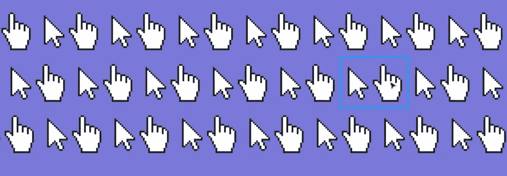

# 使用手形光标

> 原文：<https://medium.com/swlh/use-the-hand-cursor-f9d86722be68>

## 不使用它是不合理的设计弹性💪

[亚当·席尔瓦](https://medium.com/u/6cc11c4547f4?source=post_page-----f9d86722be68--------------------------------)提出了一些关于为什么按钮(和其他组件)不应该伴随着手光标的观点；然而，我不认为他的《T2》三部曲《T3》足以让我停止这种司空见惯的做法。