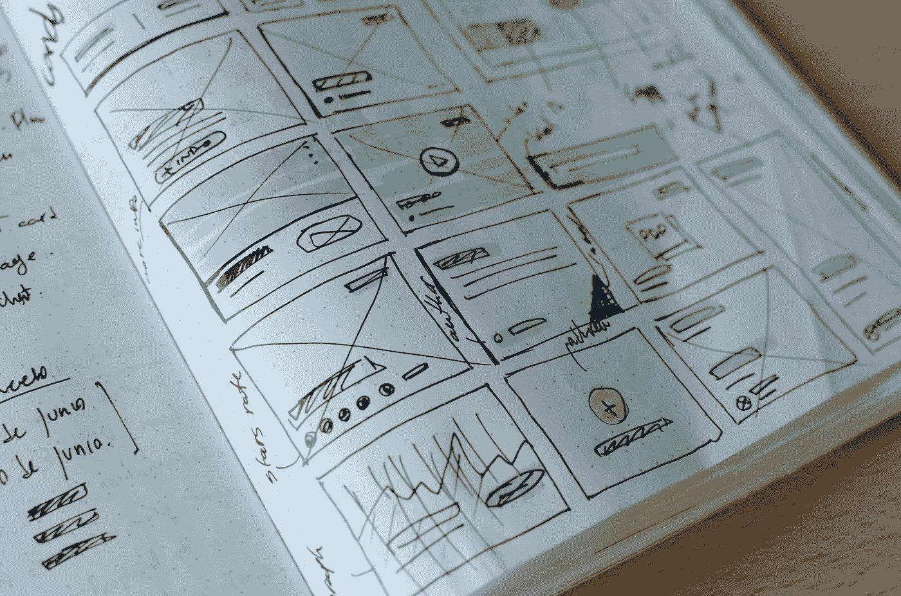

# 用户体验(UX)与用户界面(UI)设计——流程与趋势

> 原文：<https://medium.com/swlh/user-experience-ux-v-user-interface-ui-design-process-trends-cbc4c70b750a>

## 设计师之战——哪个更重要？

没有什么比*数据驱动*用户体验【UX】和*视觉刺激*用户界面(UI)设计的完美平衡更让我对产品设计感到满意的了。真是个书呆子，对吧？！

但是如果这两个人进入拳击场，你认为谁会赢呢？虽然我们希望 18 轮和两者的完美融合，但最终，**用户体验比视觉设计更重要**。

# 用户体验价值主张

如果不是因为一个简单的原因，如果某个东西没有功能，那么它有多漂亮也没有关系，那么让我们看看用户体验设计的重要性以及我们将在 2019 年继续看到的发展趋势。

## 数字讲故事

用户体验就是讲故事。移除字体、颜色和图形，并找到一种方法来引导用户完成一次旅程。当他们登陆一个网页时，他们应该有什么感觉？你想让他们知道什么？你希望他们采取什么行动？这就像一个数码杂货店。我们引导用户到乳品区，这样他们在路上就可以传递面包和麦片。如果你有一个重要的信息要表达，或者有一个行动要让人们采取，不要让视觉设计阻止你坚持基本原则。

## UX 推动商业

用户体验被普遍认为是企业在线成功的关键。亚马逊？Ebay？谷歌？阿雅-呼呼？这些公司花费数百万来测试按钮的大小和位置，以最大化用户体验和优化他们的关键漏斗。用户体验是好品牌与电子商务中的独角兽科技公司的区别，如 [AllBirds](https://www.allbirds.com/) 、 [MeUndies](https://www.meundies.com/) 、[Harry’s](https://www.harrys.com/en/us)和 [Dollar Shave Club](https://www.dollarshaveclub.com/) 。

> “设计不仅仅是一种感觉；这是首席执行官对增长和长期业绩的优先考虑。”—麦肯锡设计公司

## UX 作家的崛起

用户体验和在线讲故事已经成为公司营销计划中不可或缺的一部分，以至于品牌都在寻找“用户体验作家”，使用数据驱动的方法来撰写文案。就像你 A/B 测试在线广告一样，品牌雇佣用户体验作家来确保广告文案在品牌上，同时针对搜索引擎和点击率进行优化。不相信我？[自己看](https://www.indeed.com/jobs?q=Ux+Writer&l=United+States&_ga=2.65552238.1918252086.1545238184-1382413180.1523617971)。

# 视觉设计之美

但是不要被愚弄了。我是一个有创造力的人，视觉设计是我的强项，这可能是为什么我对用户体验如此感兴趣——它是陌生的。如果你能在视觉刺激和数据驱动的设计之间找到平衡，那么你就是最棒的。如果你能在此基础上做一些前端开发，那么你就是一只独角兽。这些技能在数字前沿非常有价值，你应该走出自己的舒适区去磨练它们。

> “好的设计上天；糟糕的设计无处不在。”—米克·格里岑

[José Aires @ Unsplash](https://unsplash.com/@alecuffia)

# 第二部分:用户体验设计流程

在开始一个项目之前，以及在项目执行的每一个时刻，你都需要提醒自己这个项目的主要目标。如果你的目标不包括用户采取行动，而是拥抱一种感觉，那么让你的右脑向所有突触开火。发挥创造力！然而，如果你定义你的目标是产生更多的线索，增加现场时间，或增加收入，良好的 UX 设计是这些目标的答案。

1.  **定义**:用户体验的第一步是了解你希望设计解决的问题。为了做到这一点，我建议调查业务的利益相关者，了解不同的用户和他们的需求。

*   **用户角色**:一类客户的代表。
*   **用户故事**:人物角色可能需要的特征的自然例子。
*   **用例/用户流:**用户完成这个任务的路径。

> " UX 的经验法则:更多的选择，更多的问题."—首席产品官斯科特·贝尔斯基

2.研究:设计工作流程中自然的下一步是收集一些灵感。这是关键的一步，可以节省你很多时间。好的研究确实能激发你的想法。

*   研究你的竞争对手
*   了解你的行业
*   从竞争对手和类似行业的其他公司获得灵感

> “好的艺术家临摹，伟大的艺术家偷窃”——毕加索(……以及所有人，永远)

*资源:*[*Behance*](https://www.behance.net/)*，*[*Dribbble*](https://dribbble.com/)*，*[*Pinterest*](https://www.pinterest.com/)*，*[*awwwwards*](https://www.awwwards.com/)

3.草图:一旦你有了清晰的目标和灵感，就该做一些基本的模型了。一个选择永远不够。首先用笔&纸画出一些基本的流程，然后转到一个原型软件，如 Sketch 或 InVision。产生一些想法进行测试和验证，并从利益相关者那里获得反馈。

> "数字设计就像绘画，只是颜料永远不会干."—内维尔·布罗迪

4.**设计**:草图完成后，所有利益相关者都喜欢哪些用户体验线框图，是时候为项目做完整的 UX 线框图了。使用[草图](https://www.sketchapp.com/)&工艺与[视觉](https://www.invisionapp.com/) app 集成，构建一个原型供人们使用。这使得开发人员能够使用 [Inspect](https://www.invisionapp.com/feature/inspect/) 轻松地用代码实现这一点。

> **“设计不仅仅是它看起来和摸起来的样子。设计就是它的工作方式。”—史蒂夫·乔布斯**

5.**测试&评估**:现在产品已经上市，使用 Google Analytics 之类的分析工具测试并评估用户体验是否成功。通过表格获得客户反馈，这样您可以看到产品的有效性，并不断提高整体 UX。

> “好的设计就像一台冰箱——当它工作时，没有人会注意到，但当它不工作时，它肯定会发臭。”-艾琳·欧

# 感谢阅读！如果您对视觉设计的用户体验有任何问题或反馈，请告诉我！我很想听听你的想法。

## 这篇文章发表在 [The Startup](https://medium.com/swlh) 上，这是 Medium 最大的创业刊物，拥有+411，714 名读者。

## 在这里订阅接收[我们的头条新闻](http://growthsupply.com/the-startup-newsletter/)。

