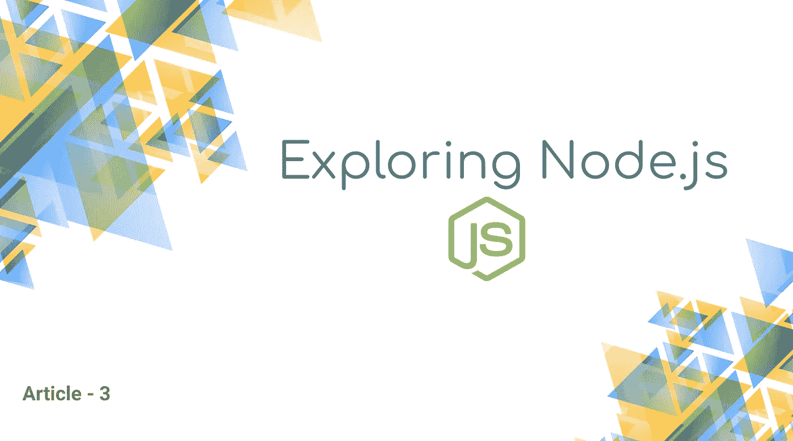

# 在 Node.js 中使用 Babel 和其他依赖项

> 原文：<https://medium.com/swlh/using-babel-and-other-dependencies-in-node-js-18f74973c1f0>

## 安装完成工作所需的依赖项

这篇文章将帮助你掌握 [Node.js](https://nodejs.org/) 背后的不同概念，并使你能够创建生产就绪的应用程序。

Node.js 本身非常轻量级。您需要安装完成工作所需的依赖项。这些依赖关系是…