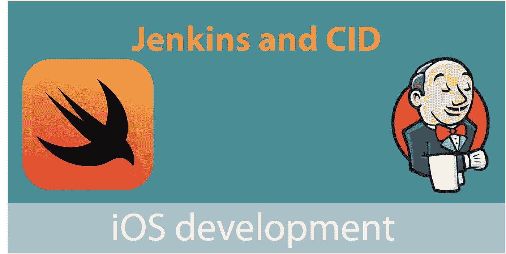

# 使用 Jenkins 从头开始运行 CI 和 CD

> 原文：<https://medium.com/swlh/using-jenkins-to-run-ci-and-cd-from-scratch-ecb353ff0077>

## 简化 iOS 开发

持续集成(CI)和持续交付(CD)一起工作，意味着您提交给存储库的代码更改会被快速验证，并被部署到测试服务器(或任何您需要的地方)。

先决条件:

*   饭桶
*   在 Xcode 中测试