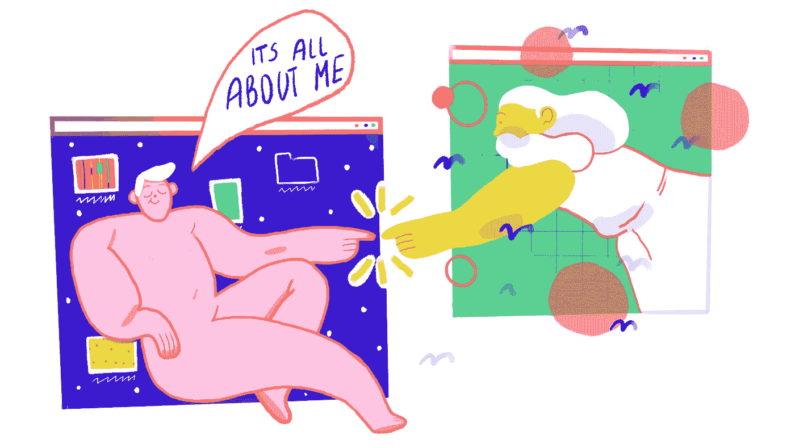

# 使用人物角色创建以用户为中心的设计

> 原文：<https://medium.com/swlh/using-personas-to-create-user-centric-design-89396a975aa9>

awesome illustration by [magicksecrets](https://www.behance.net/magicsecret)

如果你最近读过关于 UX 和交互设计的书，你可能听说过人物角色的概念。大约 20 年前，艾兰·库伯在一本名为《囚犯们正在经营精神病院》的书中介绍了人物角色，人物角色很快被广泛采用，现在，我认识的几乎每个团队都在他们的设计过程中使用它们。

# **什么是人物角色？**

一个*角色*是一个虚构的角色，代表你的应用程序的一个典型用户。而且非常详细。它描述了用户的背景、上下文、任务和目标。

以下是您通常在角色简介中包含的内容:

## **姓名、照片、地点**

为此用户编造一个名称和位置。你可以在网上找一张照片，贴在人物角色描述上，在脑海中形成这个人物的画面。

## **性格**

你不需要在这里陷得太深，但是添加一些个性细节来帮助你建立对这个角色的共鸣。也许想想他们引以为豪的事情，或者他们上一次度假的情形。

## **影响**

用户的动机是什么？他们为什么每天去上班？他们的老板是谁？他们尊重谁？

## **技术专长**

用户对现代技术的精通程度如何？他们会尝试市场上的每一种新设备，还是更喜欢使用模拟通信方式？

## **目标**

他们想达到什么目的？你可以用五个为什么的方法来挖掘用户行为背后的真正原因。例如，人们买昂贵的衣服不是因为他们需要穿的东西。如果你一直问为什么，你会得出这样的结论:他们买那些衣服是因为他们想显示他们的地位。

大多数情况下，您希望创建一个角色来探索每个用户角色的所有这些特征。

# **为什么需要人物角色？**

人物角色在 UX 的研究、设计和原型阶段之外非常有用，它允许你设计一个以用户为中心的产品。通过与特定的受众建立共鸣，你可以回答一个基本问题:你在为谁建设？这个答案将引导你去创造一个人们喜爱的产品。

你需要它们的更多原因:

## **描述研究结果**

如果你正在实施一个客户开发过程，你应该有很多关于潜在客户的信息。在面试过程中，你很有可能能够看出与你交谈的人的类型。您可以通过将不同类型的人聚集在一起并描述他们的共同特征来创建人物角色。

## **沟通用户行为背后的推理**

在产品的生命周期中，你必须将你的理想客户的形象传达给很多人。创建一个人物角色描述可以让你做出更好的设计决策，这些决策背后都有推理。当有人问你为什么要在应用程序中创建大按钮时，你可以告诉他们你的一个角色是一个 35 岁左右的视力有问题的男人。因此，按钮应该很大。

## **创建用户段**

你描述的人物角色基本上就是你的用户群。你可以在公关或营销活动中使用它们，也应该在设计阶段使用它们。每个客户群都有不同的目标，因此需要在应用程序中采取不同的行动和途径。

# **如何创建人物角色**

有几种方法可以创建人物角色。首先，你可以自己编。这是最不准确的方法，因为你的人物角色仅仅基于你的假设。因为您将使用这些来制定所有的应用程序设计决策，所以如果您的假设是错误的，那么设计也将是错误的。

创建人物角色的另一种方法是直接与人交谈。如果你进行了客户开发访谈，那么你已经知道你有什么类型的用户。如果你没有，你需要找到可以交谈的人，尽可能多地了解你的用户。

此外，您可以使用用户代理告诉您关于您的用户的更多信息。一个*用户代理*是一个离你的目标用户足够近的人。当你无法直接接触到你的听众时，它们非常有用。

最后，你可以使用竞争对手研究来识别用户角色。查看社交媒体上的竞争对手账户，阅读论坛和博客上的竞争对手评论，了解撰写这些评论的人。在你收集的信息中找出模式和重叠部分。

# **以用户为中心的设计**

以用户为中心的设计将用户提升到王者地位。这种设计围绕着人，而不是产品及其功能。以用户为中心开发产品会让你有不同寻常的想法和设计选择——这就是创新的方式。

当你为一个特定的目标开发一个产品时，你的团队不再需要猜测是什么让用户想要某个应用程序的某些功能。一旦你为团队设定了一个明确的目标，产品开发过程就会变得更加高效。

以用户为中心的设计是精益方法论中的基本方法；你采取的每一步都是为了改善用户的生活，这也是最终让你的产品成功的原因。

# **正确使用人物角色**

为了充分利用这些有用的工具，你需要在整个产品生命周期中使用人物角色，而不仅仅是在设计阶段。你需要购买一整套用户研究方法来创建人物角色——客户开发、原型，以及在开发过程中获得用户反馈。为了真正有用，人物角色必须代表真实的用户，而不仅仅是你想象出来的虚构人物。这样，每个人都不会怀疑这些人是否存在。

## 这篇文章发表在 [The Startup](https://medium.com/swlh) 上，这是 Medium 最大的创业刊物，拥有+440，678 名读者。

## 订阅接收[我们的头条新闻](https://growthsupply.com/the-startup-newsletter/)。

